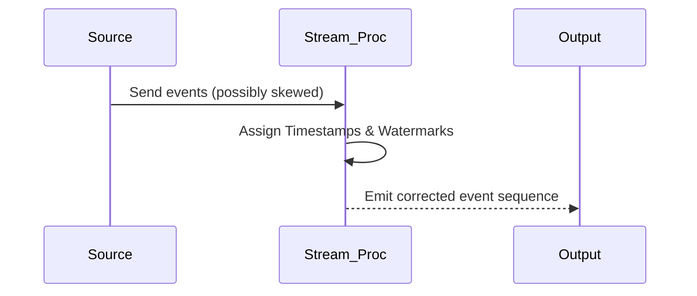

## Introduction

Handling skewed event times is a crucial design pattern in stream processing systems, focusing on adjusting and correcting event timestamps. Skewed event times can occur due to a range of issues including clock drift, misconfigured time settings, or network delays, leading to inaccurate event ordering and processing. This pattern emphasizes ensuring data integrity and throughput in systems that rely on accurate time-based analysis.

## Pattern Explanation

In distributed systems where event timestamps are crucial for processing accuracy, ensuring that event times are correctly aligned with processing times is indispensable. This pattern involves techniques to correct skewed event times by applying adjustments such as time windowing, time correction heuristics, or combining data from multiple sources to infer the true sequence of events.

### Architectural Approaches

1. **Time Synchronization**: 
   - Use protocols like NTP (Network Time Protocol) to synchronize clocks across devices.
   - Implement logical clocks or vector clocks for distributed systems.

2. **Time Windowing**:
   - Introduce processing windows (tumbling, sliding, or session windows) which allow some buffering to absorb minor clock skews.
   - Adjust window sizes dynamically based on observed latencies.

3. **Event Time Adjustments**:
   - Calculate skews using historical data or known device behaviors and apply adjustments programmatically.
   - Utilize metadata or additional event attributes for more accurate timestamp approximations.

4. **Hybrid Solutions**:
   - Combine various time correction strategies depending on the dependency of the application on precise timing.

### Example Code

Using Apache Flink, a stream processing framework that inherently supports event-time processing, you can address skewed event times with the following example:

```java
import org.apache.flink.streaming.api.TimeCharacteristic;
import org.apache.flink.streaming.api.datastream.DataStream;
import org.apache.flink.streaming.api.environment.StreamExecutionEnvironment;
import org.apache.flink.streaming.api.windowing.time.Time;
import org.apache.flink.streaming.api.windowing.assigners.TumblingEventTimeWindows;
import org.apache.flink.streaming.api.windowing.time.TimeWindow;
import org.apache.flink.streaming.api.functions.timestamps.BoundedOutOfOrdernessTimestampExtractor;

public class SkewHandlingExample {

    public static void main(String[] args) throws Exception {
        final StreamExecutionEnvironment env = StreamExecutionEnvironment.getExecutionEnvironment();
        env.setStreamTimeCharacteristic(TimeCharacteristic.EventTime);
        
        DataStream<MyEvent> stream = // Source of MyEvent
        
        DataStream<MyEvent> correctedStream = stream
                .assignTimestampsAndWatermarks(
                    new BoundedOutOfOrdernessTimestampExtractor<MyEvent>(Time.seconds(5)) {
                        @Override
                        public long extractTimestamp(MyEvent element) {
                            return element.getEventTimestamp();
                        }
                });

        DataStream<MyEvent> windowedStream = correctedStream
                .keyBy(event -> event.getKey())
                .window(TumblingEventTimeWindows.of(Time.minutes(1)))
                .reduce((event1, event2) -> combineEvents(event1, event2));
        
        windowedStream.print();
        
        env.execute("Handling Skewed Event Times");
    }

    // Define MyEvent class and combineEvents method here
}
```

### Diagram



### Related Patterns

- **Outlier Detection**: Identify events that exhibit unusual timestamps and separate them for individual review or correction.
- **Time Windowing**: Use time window techniques to manage and process event data efficiently while handling skews.
- **Event Deduplication**: Removes duplicate records that might be a result of incorrect timestamp positioning.

### Additional Resources

- Google Cloud Platform - [Event Time vs. Processing Time](https://cloud.google.com/pubsub/docs/event-based-processing#event-time-v-processing-time)
- Apache Flink Documentation - [Event Time Processing](https://www.flink.apache.org/event-processing.html)
- Confluent Kafka - [Managing Event Time Skew in Streams](https://www.confluent.io/blog)

## Final Summary

Handling skewed event times in streaming applications is fundamental to maintaining data integrity and operation efficiency. By incorporating methods for timestamp corrections, synchronization, and event-time windowing, systems can more accurately reflect true event sequences and maintain operational efficiency. This pattern is applicable across multiple domains, from IoT device monitoring to real-time analytics, ensuring the reliability of outcomes in time-sensitive applications.


