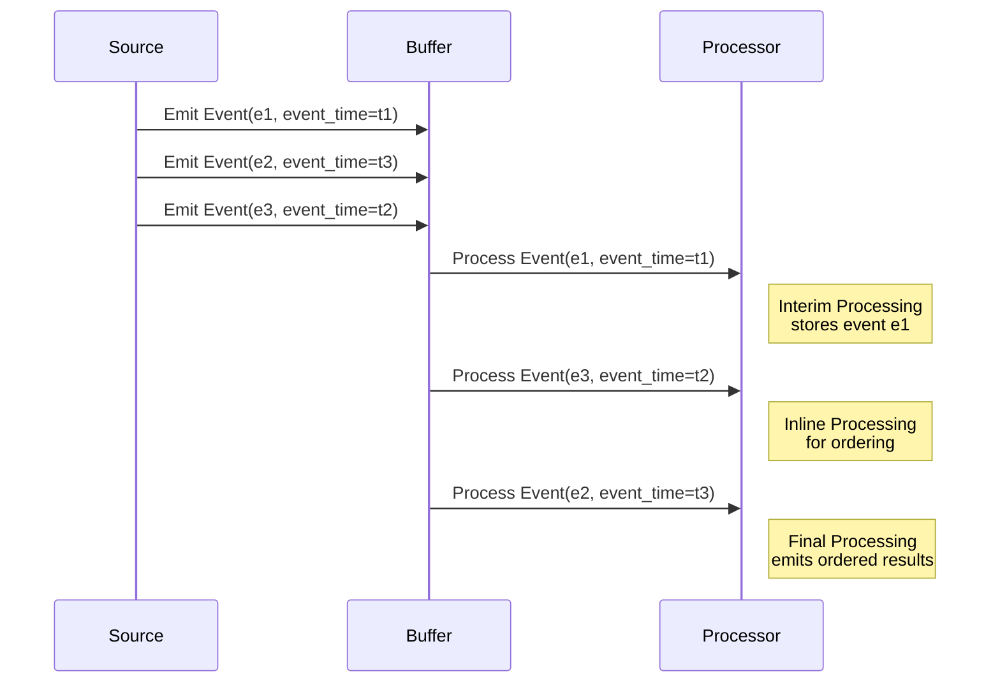

## Introduction

In distributed systems, particularly in streaming data platforms, handling events that arrive out of order poses a significant challenge. Using out-of-order event handling patterns, systems can ensure that these events are accurately incorporated into computations such as aggregations, joins, and patterns detection, thereby maintaining the integrity of data analysis and reporting.

## Architectural Approach

### Handling Out-of-Order Events

1. **Event Time vs. Processing Time**:
   - **Event Time**: The timestamp indicating when an event actually occurred.
   - **Processing Time**: The timestamp indicating when the event was processed by the system.

   In an ideal scenario, events are processed in the order of their event time. However, network latencies and system buffering can cause events to arrive out of order.

2. **Buffering and Watermarks**:
   - **Buffering**: Temporarily holding events to wait for late arrivals to maintain order. This can be configured with a timeout, ensuring that an event will only wait so long before being processed to avoid increasing latency indefinitely.
   - **Watermarks**: Markers that indicate progress in event time; they help determine when it's safe to compute the results and emit downstream outputs reliably.

3. **Tolerance Window**:
   - Define a window of tolerance within which events can be reordered. Events arriving after this window might be ignored or might trigger a re-output operation.

## Best Practices

- **Choosing the Right Buffer Size**: 
  Evaluate the trade-offs between memory usage and latency. A larger buffer may handle more out-of-order events correctly but at the cost of higher memory consumption and delayed processing.

- **Setting Watermark Strategies**: 
  Optimize watermarking mechanisms based on application requirements, adjusting their frequency and accuracy to balance between processing delay and the correctness of late arrival handling.

- **Monitoring and Tuning**: 
  Continuously monitor the metrics of stream processing jobs to identify any lag or delays in handling out-of-order events, enabling proactive tuning of configurations. 

## Example Code

Here's a simple example in Apache Flink—a popular stream processing engine—that demonstrates setting a watermark strategy to manage out-of-order arrival:

```java
import org.apache.flink.api.common.eventtime.WatermarkStrategy;
import org.apache.flink.api.common.eventtime.Watermark;
import org.apache.flink.streaming.api.environment.StreamExecutionEnvironment;

public class OutOfOrderEventHandling {
    public static void main(String[] args) {
        final StreamExecutionEnvironment env = StreamExecutionEnvironment.getExecutionEnvironment();

        WatermarkStrategy<Event> watermarkStrategy = WatermarkStrategy
            .<Event>forBoundedOutOfOrderness(Duration.ofSeconds(5))
            .withTimestampAssigner((event, timestamp) -> event.getEventTime());

        DataStream<Event> eventStream = env
            .addSource(new EventSource())
            .assignTimestampsAndWatermarks(watermarkStrategy);

        // Further processing
        eventStream.keyBy(Event::getId).process(new EventProcessFunction());
    }
}
```

## Diagrams

### Out-Of-Order Event Handling Sequence Diagram



## Additional Resources

- Apache Flink Documentation on [Time and Watermarks](https://nightlies.apache.org/flink/flink-docs-release-1.14/docs/dev/datastream/event-time/)
- Google Cloud's [Stream Processing Solutions](https://cloud.google.com/stream-analytics-solutions)

## Related Patterns

- **Windowed Operations**: Handling windows of data for processing batches like tumbling and sliding windows.
- **Late Data Processing**: Strategies designed explicitly for managing data arriving after the watermark has progressed.
  
## Summary

Out-of-order event handling is crucial in real-time data processing systems to ensure accurate data representation and decision-making. Leveraging buffering, watermarks, and windowed operations, systems can effectively manage data integrity across distributed components and varying network conditions to deliver reliable and timely insights.
