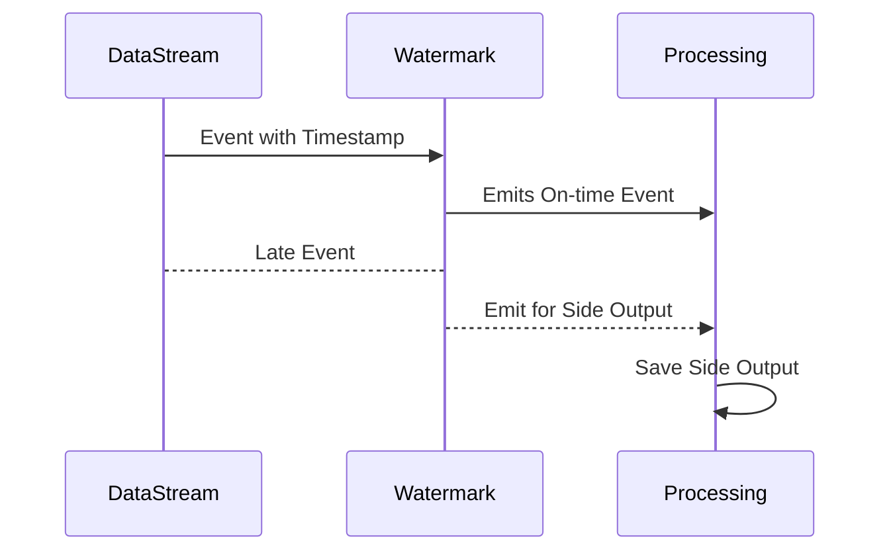

## Overview

In stream processing systems, handling late-arriving data is crucial. Events are often delayed due to network latency, out-of-order data, or slow data sources. The Late Data Handling pattern defines strategies to either process or discard these events based on their lateness, with the aim of maintaining system efficiency while ensuring data accuracy.

## Architectural Approaches

### 1. Defining Watermarks
Watermarks are thresholds that signal when late data is expected. Implementing watermarks helps the system decide how late data can be before starting processes that finalize results.

### 2. Allowed Lateness
Determining a fixed duration after the event time up to which late data is still accepted. For instance, configuring a 5-minute allowed lateness ensures events arriving within this window are included in computations.

### 3. Side Outputs
Routing late data to a separate "side output" for separate handling simplifies the main processing logic while preserving these events for later auditing or approximate analysis.

### 4. Late Event Identification
Tagging late events or using a status flag allows applications to distinctly handle late data or merge them back into prior results if permissible.

## Best Practices

- **Benchmark Latency**: Regularly measure the typical lateness in your system to adjust the allowed lateness and optimize accuracy versus resource usage.
  
- **Adjust Watermarks Dynamically**: Use machine learning models to predict event latencies and adjust watermarks according to known patterns.

- **Audit Late Events**: Maintain logs of late events to inform adjustments in system configurations or business policies.

- **Use Stateful Processing**: Where the business case permits, use stateful processing to maintain context for data streams; allowing more informative late-event integrations.

## Example Code

Here's how late data handling might be configured in a stream processing framework like Apache Flink:

```java
DataStream<Tuple2<String, Long>> dataStream = // obtain data stream
    dataStream
        .assignTimestampsAndWatermarks(new BoundedOutOfOrdernessTimestampExtractor<Tuple2<String, Long>>(Time.minutes(5)) {
            @Override
            public long extractTimestamp(Tuple2<String, Long> element) {
                return element.f1; // extracting timestamp
            }
        })
        .keyBy(value -> value.f0)
        .window(TumblingEventTimeWindows.of(Time.minutes(10)))
        .allowedLateness(Time.minutes(5))
        .sideOutputLateData(lateOutputTag)
        .apply(new WindowFunction<...>());
```

## Diagrams



## Related Patterns

- **Out-Of-Order Event Handling**: Manages events that arrive unexpectedly out of the intended sequence.
- **Windowing Patterns**: Defines how to slice streaming data into finite chunks for processing.
- **Event Sourcing**: Retains all incoming events in durable storage, allowing historical reconstruction.

## Additional Resources

- [Apache Flink Documentation: Event Time](https://flink.apache.org/features.html#event-time)
- [Streaming Systems: The Why, What, and How of Late Data Handling](https://relevantlink.com)

## Summary

Late Data Handling in stream processing is vital for balancing data accuracy with system efficiency. By using strategies such as watermarks, allowed lateness, and side outputs, applications can effectively manage late events. Implementing these patterns helps to ensure comprehensive and realistic stream processing, which is instrumental in domains demanding real-time analytics.
