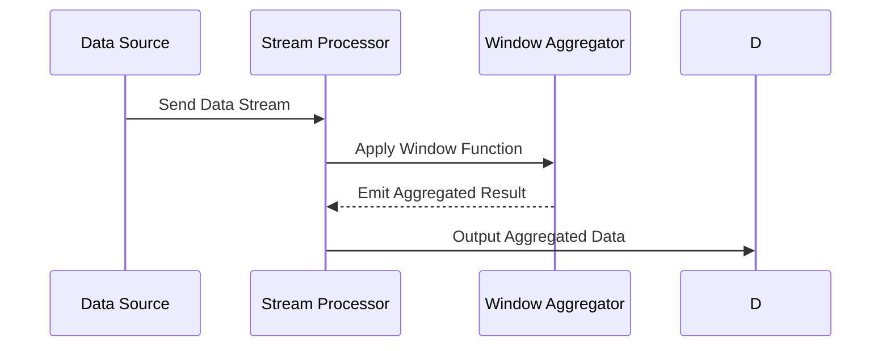

## Overview

### Description
Windowed Aggregation is a design pattern used in stream processing to apply aggregation functions over specific time windows within a stream of data. This technique enables the computation of metrics such as averages, sums, and counts within defined intervals, allowing for real-time analytics and monitoring.

### Example
A common usage of Windowed Aggregation is in monitoring systems, where you might want to calculate the average CPU usage of servers every minute. This allows operators to identify performance issues quickly and respond appropriately.

## Architectural Approach

In a stream processing architecture, data is continuously ingested from one or more sources. Windowed Aggregation processes this data in near real-time by:

1. **Window Definition**: Defining the size and type of the window (e.g., sliding, tumbling, session).
2. **Data Grouping**: Grouping data by key and time window.
3. **Aggregation Functions**: Applying user-defined or built-in aggregation functions.
4. **Output Emission**: Emitting the aggregated results for further use or analysis.

## Types of Windows

1. **Tumbling Windows**: Non-overlapping fixed-sized windows. Each event belongs to exactly one window.
   
2. **Sliding Windows**: Overlapping windows with a fixed duration; windows slide over the time axis, allowing events to belong to multiple windows.
   
3. **Session Windows**: Defined by periods of activity separated by gaps of inactivity; duration is dynamic and determined by the data.

## Example Code

Here is an example using Apache Flink for a sliding window aggregation:

```java
DataStream<Event> stream = ...

DataStream<Result> windowedAggregation = stream
    .keyBy(Event::getKey)
    .window(SlidingEventTimeWindows.of(Time.minutes(5), Time.minutes(1)))
    .aggregate(new AggregateFunction<Event, Accumulator, Result>() {
        @Override
        public Accumulator createAccumulator() { return new Accumulator(); }
        
        @Override
        public Accumulator add(Event value, Accumulator accumulator) { 
              // Aggregation Logic
              return accumulator;
        }
        
        @Override
        public Result getResult(Accumulator accumulator) { return new Result(); }
        
        @Override
        public Accumulator merge(Accumulator a, Accumulator b) { 
            // Merge Logic
            return a;
        }
    });
```

## Diagram



## Related Patterns

- **Event Sourcing**: Allows replaying events to recalculate state.
- **Event-Driven Architecture**: Supports systems architecture where actions are triggered by events.
- **Complex Event Processing**: Allows detection of complex patterns among events with temporal windows.

## Additional Resources

- [Apache Flink Documentation](https://flink.apache.org)
- [Kafka Streams Guide](https://kafka.apache.org/documentation/streams/)
- [Beam Programming Guide](https://beam.apache.org/documentation/programming-guide/)

## Summary

Windowed Aggregation is crucial for real-time data processing, enabling efficient computation of metrics over defined time intervals. By selecting appropriate window types and aggregation functions, organizations can achieve real-time insights and responsive monitoring, making it a valuable pattern in many cloud-native and data-intensive applications.
