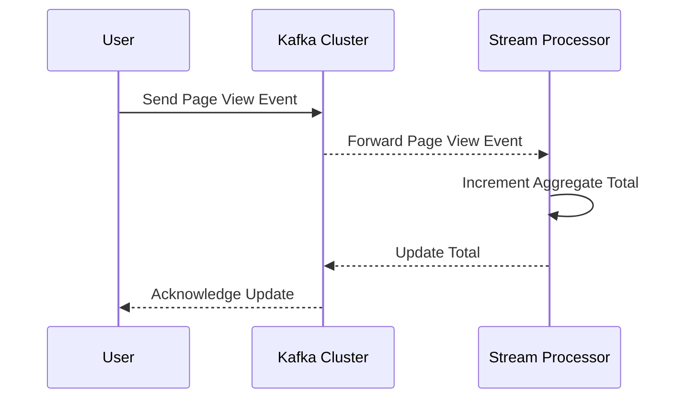

### Incremental Aggregation

Incremental Aggregation is a powerful design pattern in stream processing systems, where aggregates are updated incrementally with each new piece of data, rather than recalculating all data from the beginning. This approach is particularly useful in scenarios where real-time processing and quick response times are crucial.

#### Architectural Approaches

1. **Windowing**: Segment streams into finite sets over time (e.g., tumbling, sliding windows). With each window update, process incoming events only, thus updating aggregates efficiently.
   
2. **Micro-batching**: Process data in small groups, accumulating or combining updates into batches to be processed collectively, which can reduce computation load and latency.

3. **Stateful Stream Processing**: Maintain state within a stream processor (e.g., using Apache Flink or Kafka Streams) to allow incremental updates as new events are consumed.

#### Paradigms & Best Practices

- Use idempotent operations to ensure that incremental updates remain consistent even if some events are processed more than once.
- Apply partitioning strategically to manage state scalability and efficiency in distributed systems. 
- Choose the right level of granularity for aggregation to balance between latency and resource consumption.
- Leverage event time over processing time to account for out-of-order data.

#### Example Code

Let's consider an example using Kafka Streams to implement incremental aggregation for a running total of page views:

```kotlin
val builder: StreamsBuilder = StreamsBuilder()

// Source KStream from Kafka topic
val views: KStream<String, Long> = builder.stream("page-views")

// Incrementally aggregate total page views count
val totalViews: KTable<String, Long> = views
    .groupByKey()
    .aggregate(
        { 0L },  // Initializer
        { _, newView, currentTotal -> currentTotal + newView },  // Aggregator
        Materialized.`as`("page-views-store")
    )

totalViews.toStream().to("total-page-views", Produced.with(Serdes.String(), Serdes.Long()))

val streams = KafkaStreams(builder.build(), properties)
streams.start()
```

#### Diagrams

Here's how the workflow for Incremental Aggregation might look using a sequence diagram:



#### Related Patterns

- **Event Sourcing**: Capture and store each state-changing event to reconstruct current state.
- **CQRS (Command Query Responsibility Segregation)**: Separate read and write operations to optimize data processing.
- **Lambda Architecture**: Combine batch processing with streaming data for resilient and real-time analytics.

#### Additional Resources

- [Stream Processing with Apache Kafka](https://kafka.apache.org/documentation/streams)
- [Stateful Data Processing with Apache Flink](https://flink.apache.org/)
- [Scalable Realtime Aggregation with those designs](https://developers.google.com/articles/realtime-aggregation)

#### Final Summary

Incremental Aggregation is vital for efficient stream processing, enabling systems to provide real-time data insights with minimal latency and resource use. By processing only new events and maintaining state within the stream processors, this pattern ensures scalable, responsive, and fault-tolerant system performance. Combining incremental aggregation with other complementary patterns can optimize the system for varied real-time data processing needs.
