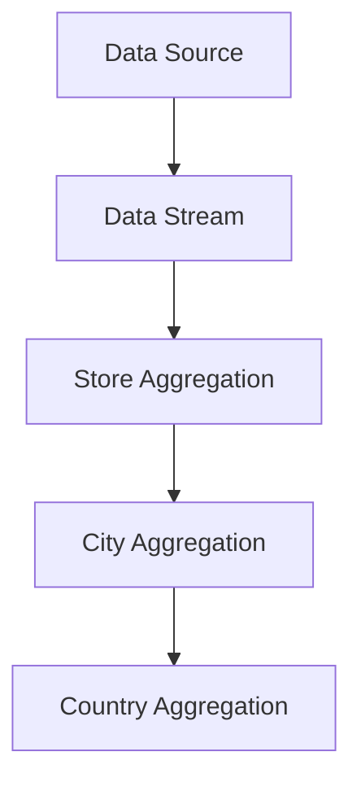
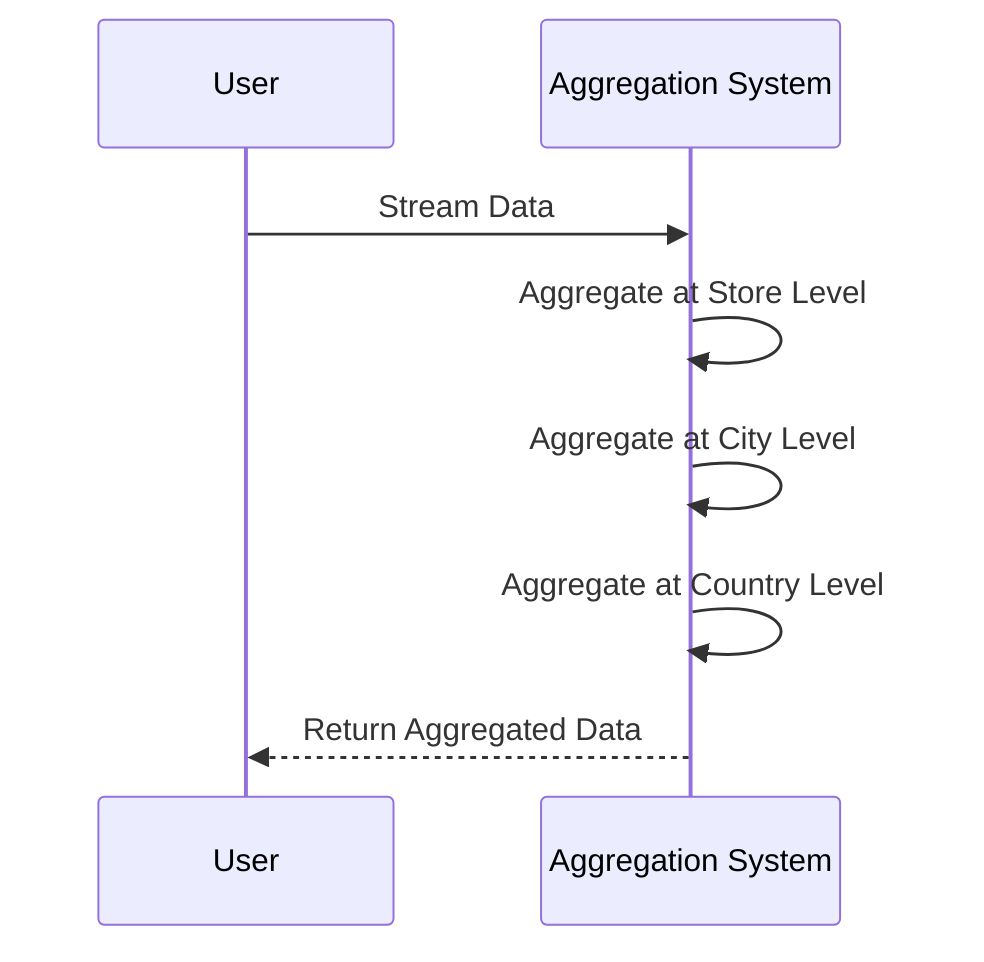

## Description

Hierarchical Aggregation involves aggregating data at multiple levels of a predefined hierarchy. This approach is particularly useful when dealing with structured organizational data or categorized systems where insights at various aggregation levels can significantly enhance decision-making processes. For example, a retail chain might need to aggregate sales data not only at individual stores but also regionally and nationally to gain deeper insight into performance metrics.

### Key Principles

- **Multi-level Aggregation**: Collection of data at different granularity levels, leveraging hierarchical structures such as organizational hierarchies, product categories, or geographical distributions.
- **Incremental Computation**: Efficiently computing aggregates by incrementally updating results as new data arrives, reducing overhead and improving performance.

## Architectural Approaches

Hierarchical Aggregation can be efficiently implemented using various architectural paradigms, particularly in distributed systems and cloud-based environments. Consider the following approaches:

1. **Lambda Architecture**: Simultaneously processes large volumes of data with batch and real-time processing layers.
2. **Kappa Architecture**: Focuses purely on stream processing, efficiently managing real-time hierarchical aggregation via immutable logs.
3. **Microservices Architecture**: Employs services to independently handle various levels of aggregation for scalability and reliability.

## Example Code

The following is an example in Java using Apache Flink, a powerful stream processing platform.

```java
DataStream<Sale> salesStream = ...;

// Aggregate sales data at different levels of hierarchy
// Aggregation by store
DataStream<AggregateResult> storeAggregation = salesStream
    .keyBy(Sale::getStoreId)
    .sum("amount");

// Aggregation by city
DataStream<AggregateResult> cityAggregation = storeAggregation
    .keyBy(store -> store.getCityId())
    .sum("amount");

// Aggregation by country
DataStream<AggregateResult> countryAggregation = cityAggregation
    .keyBy(city -> city.getCountryId())
    .sum("amount");
```

## Diagrams

### Architectural Diagram



### Sequence Diagram



## Related Patterns

- **Batch Aggregation**: Focuses on aggregating large datasets in batches, useful for periodic processing.
- **Real-time Aggregation**: Similar to Hierarchical Aggregation but without multi-level hierarchy focus.
- **Materialized Views**: Using pre-computed views to enable quick access at different aggregation levels.

## Additional Resources

- [Apache Flink Documentation](https://flink.apache.org/): A robust framework for stateful stream and batch processing.
- [Designing Data-Intensive Applications by Martin Kleppmann](https://dataintensive.net/): Comprehensive insights into building scalable and maintainable applications.
- [Microservices: A Practical Guide](https://microservices.io/patterns/index.html): Patterns and best practices related to microservices architecture.

## Summary

Hierarchical Aggregation is a strategic design pattern for managing and processing data at multiple hierarchical levels. This pattern excels in scenarios where organized, multi-layered insights are fundamental to operational decision-making. By leveraging distributed computing patterns, organizations can enhance their analytics capabilities, thus driving informed business strategies. This pattern is a key component for businesses aiming to scale their data aggregation processes efficiently in the realm of modern cloud computing environments.
