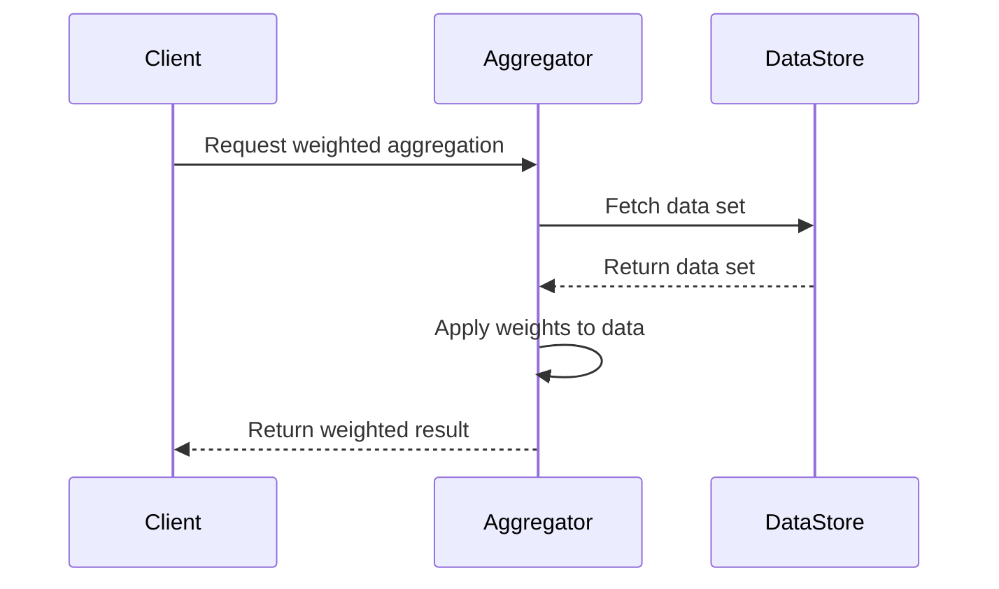

## Overview

Weighted Aggregation is a design pattern used to assign different levels of importance to specific observations while aggregating data. This method proves vital in contexts where the most current data is more relevant than older data, like real-time analytics or financial data evaluation.

### Use Cases

- **Time-sensitive Calculations**: Utilize in scenarios where recent data should overshadow older events for making timely decisions.
- **Financial Transactions**: To prioritize market values closer to the current day for stock price evaluations.
- **Customizable Analytics**: Users can tweak the weight distribution according to their business logic or seasonal changes.

## Architectural Approach

Weighted Aggregation can be effectively implemented within various architectures, including:

- **Microservices**: Deploy a microservice specifically designed to handle weighted aggregation tasks, ensuring scalable and isolated computation.
- **Event-Driven Systems**: Integrate into systems that process continuous data streams, such as Kafka, to maintain responsive and real-time analysis.

## Best Practices

1. **Dynamic Weight Assignment**: Allow flexibility in weight allocation to adapt to changing business needs and trends.
2. **Caching Mechanisms**: Implement caching strategies to store intermediate results for efficiency (e.g., Redis, Memcached).
3. **Latency Considerations**: Ensure that the aggregation doesn't introduce significant latency in real-time systems, using in-memory computations when necessary.

## Example Code

Here’s a simple implementation using Java to demonstrate calculating a weighted average:

```java
public class WeightedAggregation {

    public static double calculateWeightedAverage(double[] values, double[] weights) {
        double sumWeightedValues = 0;
        double sumWeights = 0;

        for (int i = 0; i < values.length; i++) {
            sumWeightedValues += values[i] * weights[i];
            sumWeights += weights[i];
        }

        return sumWeightedValues / sumWeights;
    }

    public static void main(String[] args) {
        double[] values = {10, 20, 30, 40};
        double[] weights = {1, 1.5, 1.5, 2}; // Higher weight to more recent data
        System.out.println("Weighted average: " + calculateWeightedAverage(values, weights));
    }
}
```

## Sequence Diagram



## Related Patterns

- **Temporal Aggregation**: Aggregates data within a specific temporal window.
- **Delta Aggregation**: Computes the difference between consecutive data points.

## Additional Resources

- **Books and Publications**: "Designing Data-Intensive Applications" by Martin Kleppmann for a comprehensive understanding of data stream processing.
- **Online Course**: Coursera & edX offer in-depth courses on Real-Time Analytics and Stream Processing.

## Summary

Weighted Aggregation is an essential pattern for scenarios demanding time-sensitive data evaluations. With its use, businesses can significantly improve their analytics accuracy and decision-making processes, ensuring they stay responsive to the ever-evolving data landscape. Consider leveraging popular tools and frameworks like Apache Flink or Beam for sophisticated implementations in distributed environments.
