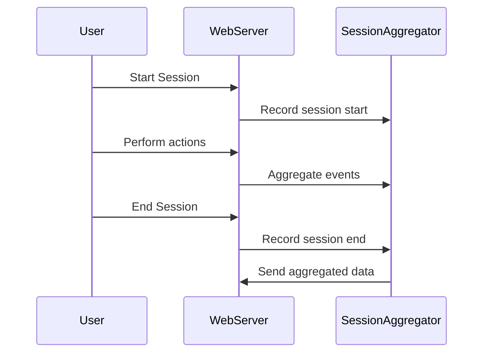

## Introduction
The Session-Based Aggregation pattern is a powerful technique in stream processing that allows applications to aggregate events associated with user sessions. This is particularly useful for analyzing user behavior patterns and deriving insights from real-time data streams.

## Description
Session-Based Aggregation involves grouping and processing data that occurs during a user's session—a sequence of events performed by a user on a particular application or website. Typically, a session starts when a user logs in or accesses the website and ends when they log out or reach a timeout period due to inactivity. This pattern enables the analysis of various user metrics such as session duration, actions performed, and engagement levels.

### Use Cases
- E-commerce websites tracking the sequence of user actions during a shopping session.
- Streaming platforms analyzing viewership details within a single viewing session.
- Online education platforms understanding the engagement levels of students during a course module.

## Architectural Approaches
- **Stateful Stream Processing**: Utilize stream processing frameworks like Apache Kafka with Kafka Streams or Apache Flink to maintain state across incoming data streams and aggregate data over session windows.
- **Event Time Processing**: Use event timestamps instead of processing times to accurately reflect the session sequences in the user's journey.

## Best Practices
1. **Define Session Boundaries**: Clearly define how sessions start and end to ensure accurate aggregation.
2. **Handle Time Zone Differences**: Consider user's time zone differences while computing the session boundaries.
3. **State Management**: Efficiently manage state to ensure scalability and fault tolerance especially when handling large volumes of user session data.

## Example Code
Here is a simple example using Apache Kafka Streams to perform session-based aggregation:

```java
StreamsBuilder builder = new StreamsBuilder();
final String storeName = "session-store";

KTable<Windowed<String>, Long> sessionCounts = builder.stream("user-events")
    .groupByKey()
    .windowedBy(SessionWindows.with(Duration.ofMinutes(30)))
    .count(Materialized.<String, Long, SessionStore<Bytes, byte[]>>as(storeName)
           .withKeySerde(Serdes.String())
           .withValueSerde(Serdes.Long()));

sessionCounts.toStream().foreach((key, value) -> 
    System.out.println("User: " + key.key() + " Session count: " + value)
);
```

## Diagrams
Below is a Mermaid sequence diagram representing a user's session and how events are aggregated.



## Related Patterns
- **Windowed Aggregation**: Useful for fixed-time window aggregated analysis, often paired with Session-Based Aggregation in comprehensive data analysis workflows.
- **Event Sourcing**: Storing all changes to an application state as a sequence of events, which can be useful for reconstructing session data.

## Additional Resources
- [Apache Kafka Documentation](https://kafka.apache.org/documentation/)
- [Apache Flink Documentation](https://ci.apache.org/projects/flink/flink-docs-stable/)
- [Session-Based Analysis with Flink](https://flink.apache.org/2021/05/04/flink-sessions.html)

## Summary
Session-Based Aggregation enables real-time analysis of user session data, offering valuable insights into user behavior. By using techniques such as stateful stream processing and event-time processing, it can deliver accurate and comprehensive analytics crucial for many online businesses and applications. By incorporating best practices and leveraging modern stream processing tools, organizations can efficiently harness the power of this pattern to gain actionable insights.
