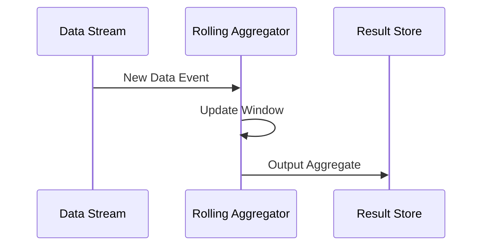

## Rolling Aggregation

Rolling Aggregation is a stream processing design pattern that allows for continuously updating aggregates over a moving time window. It is an essential pattern for processing real-time data streams where the goal is to compute summaries or insights over data that continuously flows through the system. Common implementations use sliding windows to maintain these aggregates with each new data point or event.

### Use Case

Consider the need to maintain a rolling 10-minute average of network latency for monitoring purposes. With Rolling Aggregation, the system would continuously calculate the average latency over the latest 10-minute interval, updating the result as new latency data becomes available.

### Architectural Approach

- **Sliding Windows**: Implementations of Rolling Aggregation often use sliding windows, where the window slides forward by a set granularity (e.g., each minute for a 10-minute window). Each new data input updates the aggregate by adding the new element and removing the oldest element from the previous calculation.

- **Data Streams**: Suitable data streaming frameworks like Apache Kafka, Apache Flink, or Apache Spark Streaming can be used to implement rolling aggregations efficiently, taking advantage of their inherent support for event time processing and window management.

- **Stateful Processing**: The process requires stateful stream processing to keep track of the current accumulator state that is updated with incoming data and when windows move.

### Best Practices

1. **Window Size and Sliding Interval**: Choose window sizes and sliding intervals that match your real-time processing requirements, balancing responsiveness with performance.
   
2. **Handling Late Arriving Data**: Consider how late-arriving events are handled to maintain the accuracy of results. Some frameworks allow configuring allowable lateness.

3. **Performance Optimization**: Use compact and efficient data structures to store intermediate state and perform updates.

4. **Fault Tolerance**: Use frameworks that provide fault tolerance capabilities to ensure robust state management.

### Example Code

Here is a simplified example featuring Apache Flink:

```scala
val env = StreamExecutionEnvironment.getExecutionEnvironment

val dataStream = env
  .socketTextStream("localhost", 9999)
  .map(_.toDouble)

val result = dataStream
  .window(slidingEventTimeWindows(Time.minutes(10), Time.minutes(1)))
  .reduce(_ + _) // assuming simple sum as aggregation

result.print()

env.execute("Rolling Aggregation Example")
```

### Diagrams

Below is a Mermaid UML Sequence Diagram to illustrate the process.



### Related Patterns

- **Fixed Window Aggregation**: Unlike Rolling Aggregation's moving windows, Fixed Window Aggregation computes aggregates over distinct, non-overlapping windows.

- **Session Window Aggregation**: Similar to Rolling Aggregation but uses variable-sized windows based on user activity sessions rather than fixed time slots.

### Additional Resources

- [Stream Processing with Apache Flink: Principles and Best Practices](https://flink.apache.org/resources/)
- [Designing Elastic Stream Processing with Apache Kafka and Apache Flink](https://kafka.apache.org/documentation/streams/)
- [Best Practices for Using Window Functions in Streaming with Apache Spark](https://spark.apache.org/docs/latest/structured-streaming-programming-guide.html)

### Summary

Rolling Aggregation provides a powerful method to continuously derive insights from streaming data by keeping aggregates updated over a moving window. This design pattern is particularly valuable in real-time analytics tasks where timely data summaries are crucial for operational and strategic decisions. Implementing Rolling Aggregation effectively requires selecting appropriate frameworks and configurations to handle windowing behavior, data consistency, and system efficiency.
