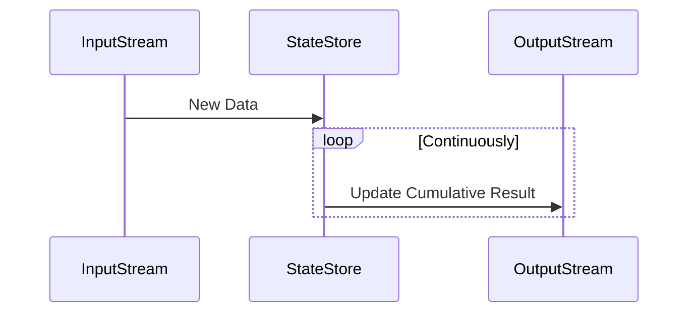

### Overview

Cumulative Aggregation is a design pattern employed in stream processing systems to compute aggregate functions continuously over a stream of data up to the current point. Its primary advantage is the ability to provide real-time updates of cumulative statistics, which can be invaluable in scenarios where decisions need to be made based on the total data received so far.

### Use Cases

- **Financial Reporting**: Track cumulative sales, profits, or expenses over a fiscal period.
- **Monitoring & Alerts**: Sum total errors or warnings in a monitoring system.
- **Customer Engagement**: Aggregating customer interactions over time for loyalty programs.

### Architectural Approaches

Implementing cumulative aggregation in a stream processing environment involves considerations around both performance and accuracy. Below are typical approaches to architect this pattern:

1. **Stateful Stream Processing**: Maintain stateful operations at the processor level to accumulate and store states. This is ideal for updating aggregates continuously while the stream is being processed.

2. **Event Sourcing**: Capture each event in a log, allowing recalculation of aggregates by replaying the events from the beginning of the stream. This approach is particularly useful for auditability and traceability.

3. **Windowing with Tumbling Windows**: While not continuously cumulative, using appropriately sized tumbling windows can provide periodic cumulative summaries.

### Example Code

Below is a simple example using Apache Kafka Streams to perform a cumulative sum aggregation on a stream of sales data:

```java
KStream<String, Sale> salesStream = builder.stream("sales");

KTable<String, Double> cumulativeRevenue = salesStream
    .groupByKey()
    .aggregate(
        () -> 0.0,
        (key, sale, cumulativeRevenue) -> cumulativeRevenue + sale.getAmount(),
        Materialized.<String, Double, KeyValueStore<Bytes, byte[]>>as("cumulative-revenue-store")
            .withValueSerde(Serdes.Double())
    );

cumulativeRevenue.toStream().to("cumulative-revenue-output");
```

### Diagram
Here is a simple representation of how cumulative aggregation in a stream might work:



### Best Practices

- **Efficient State Management**: Utilize stateful processing elements that offer low-overhead storage for state data.
- **Data Retention Strategy**: Employ effective data retention policies to manage state store size, considering memory and disk space.
- **Error Handling**: Implement robust error handling mechanisms to manage exceptional scenarios, ensuring state correctness.
- **Scalability Considerations**: Design the system with horizontal scalability in mind to handle increasing data volumes efficiently.

### Related Patterns

- **Sliding Windows**: For streaming use cases where non-continuous, overlapping aggregates are required.
- **Event Sourcing**: For systems that need strong historical data consumption and audit capabilities.
- **Real-time Dashboard Updates**: Employ cumulative aggregations for instantly updated dashboards.

### Additional Resources

- [Kafka Streams Documentation](https://kafka.apache.org/documentation/streams/)
- [Stateful Stream Processing in Apache Flink](https://ci.apache.org/projects/flink/flink-docs-stable/dev/stream/state/stateful_stream_processing.html)
- [Event Sourcing Explained](https://microservices.io/patterns/data/event-sourcing.html)

### Summary

Cumulative Aggregation is a powerful pattern for continuous analytics, providing real-time insights by maintaining aggregation over an entire stream. While offering immediate value, it requires careful consideration of state management and application architecture to ensure system responsiveness and correctness. By leveraging modern stream processing technologies, organizations can gain real-time analytical capabilities essential for dynamic business environments.
