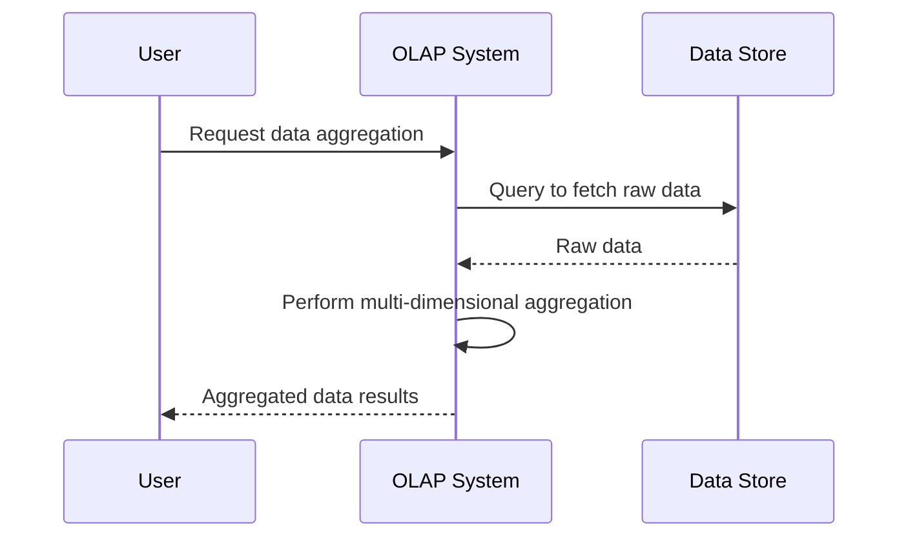

## Overview

Multi-Dimensional Aggregation is a data processing pattern that focuses on aggregating data over several dimensions. It is particularly useful for analytical queries that require an understanding of data from different perspectives simultaneously. By implementing this pattern, organizations can derive deeper insights from their data, highlighting relationships and trends that might remain hidden if viewed through a simpler lens.

## Architectural Approaches

1. **Data Cube Construction**: This approach involves constructing a multi-dimensional data cube where each cell represents aggregated data across several dimensions. Technologies such as Apache Druid are designed to facilitate this.

2. **Pivot Tables**: Widely used in spreadsheet applications and analytical software, pivot tables allow users to dynamically group and summarize data.

3. **OLAP (Online Analytical Processing)**: OLAP is a category of software that provides an interface for executing multi-dimensional queries. Systems like Apache Kylin and Oracle OLAP enable complex calculations, trend analyses, and data modeling.

4. **Stream Processing Frameworks**: Frameworks such as Apache Kafka Streams and Apache Flink provide support for continuous aggregation over multiple dimensions, processing large volumes of real-time data.

## Example Code

Here's a concise example using Apache Kafka Streams to perform multi-dimensional aggregation:

```java
StreamsBuilder builder = new StreamsBuilder();

KStream<String, SalesRecord> salesStream = builder.stream("sales_topic");

KTable<Windowed<String>, Long> salesAggregation = salesStream
    .groupBy((key, value) -> value.getProduct() + "|" + value.getRegion() + "|" + value.getChannel())
    .windowedBy(TimeWindows.of(Duration.ofHours(1)))
    .count();

salesAggregation.toStream().foreach((windowedId, count) -> {
    String[] dimensions = windowedId.key().split("\\|");
    System.out.println("Product: " + dimensions[0] + ", Region: " + dimensions[1] +
                       ", Channel: " + dimensions[2] + ", Count: " + count);
});
```

## Best Practices

- **Data Normalization**: Ensure that all data sources are cleaned and normalized before performing aggregation to avoid discrepancies.
  
- **Selecting Dimensions**: Choose dimensions that are meaningful for analysis rather than unnecessary or redundant attributes.

- **Performance Optimization**: Leverage partitioning and indexing to improve query performance.

- **Incremental Updates**: Consider real-time processing capabilities to continuously update results, thus providing up-to-date analytics.

## Diagrams

### UML Sequence Diagram



## Related Patterns

- **Partitioned Parallel Processing**: Works with splitting the dataset to handle high volumes of data processing efficiently.
  
- **Materialized View Pattern**: For pre-processing and storing complex queries results, speeding up query times.

## Additional Resources

- [Druid: A Real-time Analytics Database](https://druid.apache.org/)
- [Apache Kylin: OLAP on Hadoop](https://kylin.apache.org/)
- [Apache Kafka Streams Documentation](https://kafka.apache.org/documentation/streams/)

## Summary

Multi-Dimensional Aggregation is a powerful design pattern for deriving deep insights from complex data sets. By analyzing data over multiple dimensions, organizations can uncover valuable trends and relationships. Implementing this pattern can significantly enhance the decision-making process by providing high-quality, nuanced information. Proper planning in selecting dimensions, normalizing data, and optimizing performance are key to successfully deploying this pattern in real-world scenarios.
