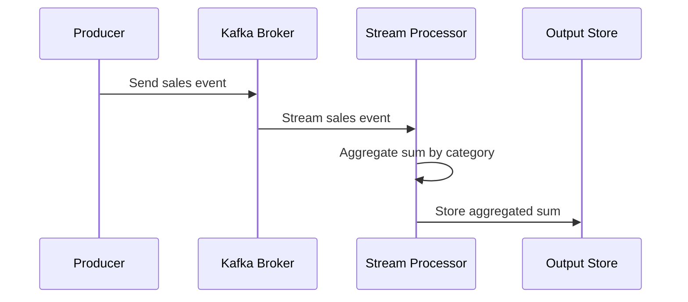

## Introduction to Sum Aggregation Pattern

The Sum Aggregation pattern is integral to real-time data processing applications where aggregation of numeric values is required over a time period or within grouped data segments. It is a fundamental pattern used in stream processing systems to efficiently compute totals, such as the daily sales amount for each product category.

## Characteristics and Benefits

- **Simplicity and Efficiency**: This pattern offers a straightforward solution for calculating sums, greatly increasing the efficiency of data processing pipelines.
- **Real-time Insights**: Enables businesses to gain immediate insights into metrics such as sales, user interactions, or data consumption, paving the way for real-time decision making.
- **Scalability**: Designed to operate within distributed systems, handling vast amounts of incoming data streams seamlessly.
  
## Example Use Case

For instance, an e-commerce platform aims to compute the total sales for each product category daily. Utilizing the Sum Aggregation pattern, the system can continuously process incoming purchase events, group them by category, and maintain a running total that updates in real-time.

## Architectural Approach

### Technologies and Tools

To implement this pattern, you might employ frameworks and platforms such as:

- **Apache Kafka with Kafka Streams** to ingest and process streaming events in real-time.
- **Apache Flink** for building streaming applications with complex event processing capabilities.
- **Amazon Kinesis** for scalable real-time data processing in cloud environments like AWS.

### Code Example

Here is a basic Kafka Streams example demonstrating sum aggregation:

```java
StreamsBuilder builder = new StreamsBuilder();
KStream<String, Integer> salesStream = builder.stream("sales");

KTable<String, Integer> sumByCategory = salesStream
    .groupBy((key, value) -> value.getCategory()) // Key by category
    .aggregate(
        () -> 0, // Initializer
        (aggKey, newValue, aggValue) -> aggValue + newValue.getAmount(), // Aggregator
        Materialized.<String, Integer, KeyValueStore<Bytes, byte[]>>as("sum-store")
    );

sumByCategory.toStream().to("total-sales-per-category");
```

### Diagram

Below is a sequence diagram demonstrating the Sum Aggregation pattern:



## Related Patterns and Paradigms

- **Counting Aggregation**: Similar to Sum Aggregation but focuses on counting occurrences instead of summing values.
- **Windowing Functions**: Often used alongside sum aggregation to segment and manage data over different time windows like tumbling or sliding windows.
- **MapReduce**: Another paradigm for data aggregation, operating in batch mode suitable for large-scale computations.

## Additional Resources

- [Kafka Streams Documentation](https://kafka.apache.org/documentation/streams/)
- [Apache Flink Official Guide](https://flink.apache.org/learn-flink)

## Summary

The Sum Aggregation pattern plays a pivotal role in scenarios demanding real-time computational insights. By leveraging streaming frameworks, it facilitates the effortless sum computation of values across categories and time periods, driving informed decision-making processes. Its simplicity, coupled with advanced scalability, equips developers to design robust solutions in big data environments.
