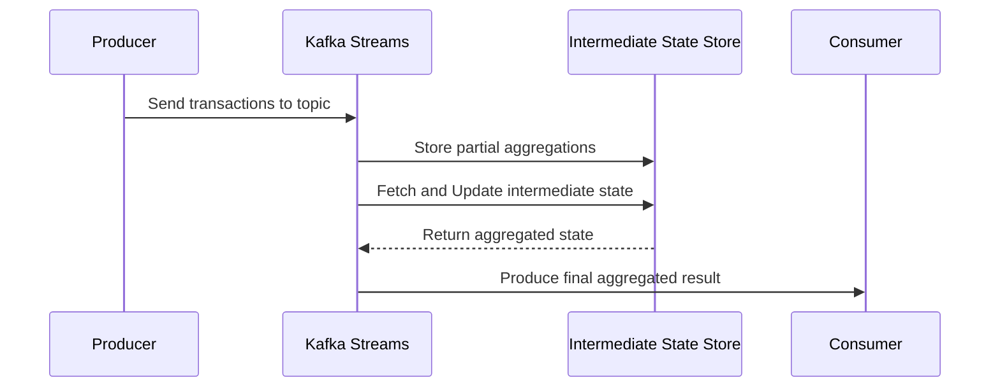

### Nested Aggregation

#### Pattern Description

Nested Aggregation is a design pattern used in stream processing and big data applications where complex aggregation logic must be applied to data hierarchies. In simple terms, it's the process of applying an aggregation function on the result of another aggregation. This pattern is particularly useful when dealing with hierarchical datasets or when multiple aggregation levels are required to extract insights from datasets.

#### Motivation

In scenarios where data is naturally hierarchical or structured in a way that each level requires summarization, Nested Aggregation provides a pathway to iterative data summarization. Common use cases include calculating averages of summed values, such as:

- **Retail:** Computing the average total sales per store, where each store aggregates total sales per product or transaction.
- **Finance:** Averaging total assets or liabilities across different departments or branches of an organization.
- **IoT:** Aggregating sensor data (like average temperature readings) over time intervals and further aggregating by geographic region.

#### Architectural Approach

To implement Nested Aggregation, leverage a distributed data processing framework (e.g., Apache Kafka Streams, Apache Flink) capable of handling complex aggregations in a scalable fashion.

1. **Data Partitioning:** Partition the input stream based on the hierarchical aggregation key (e.g., store ID, department ID).
   
2. **Initial Aggregation:** Apply the first level of aggregation to summarize data on a lower level, such as summing sales per product or transactions per hour.

3. **Intermediate State Management:** Manage the intermediate aggregation state using state stores or windowing techniques to accumulate the results.

4. **Second-level Aggregation:** Perform the next level of aggregation on the results of the initial aggregation, for example, computing averages or totals.

5. **Output Results:** Emit the final results or store them for further processing or analytics.

#### Example Code

Below is a simplified example using Java with Apache Kafka Streams for nested aggregation:

```java
import org.apache.kafka.streams.KafkaStreams;
import org.apache.kafka.streams.StreamsBuilder;
import org.apache.kafka.streams.kstream.KGroupedStream;
import org.apache.kafka.streams.kstream.KTable;
import org.apache.kafka.streams.kstream.Materialized;
import org.apache.kafka.streams.state.StoreBuilder;
import org.apache.kafka.streams.state.Stores;

public class NestedAggregationExample {

    public static void main(String[] args) {
        StreamsBuilder builder = new StreamsBuilder();

        // Assume transactionsStream is a stream of sales transactions
        KGroupedStream<String, Double> salesPerStore = builder
            .stream("sales-transactions-topic")
            .groupBy((key, value) -> extractStoreId(value));

        // First level: Sum total sales per store
        KTable<String, Double> totalSalesPerStore = salesPerStore
            .reduce(Double::sum, Materialized.with(/* key serde */, /* value serde */));

        // Second level: Average total sales across all stores
        Double totalStores = (double) salesPerStore.count().approximateNumEntries();
        KTable<String, Double> averageSalesAcrossStores = totalSalesPerStore
            .mapValues(totalSales -> totalSales / totalStores);

        averageSalesAcrossStores
            .toStream()
            .to("average-sales-output-topic");

        KafkaStreams streams = new KafkaStreams(builder.build(), /* streams configuration */);
        streams.start();
    }

    private static String extractStoreId(Double transactionValue) {
        // Custom logic to extract store ID
        return "storeId";
    }
}
```

#### Diagrams

Below is a Mermaid UML Sequence Diagram illustrating the Nested Aggregation process:



#### Related Patterns

- **Windowed Aggregation:** Focuses on aggregating data within specific time windows for real-time analytics.
- **Hierarchical Aggregation:** Useful for performing aggregations on nested hierarchical data structures.
- **Partitioned Processing:** Involves dividing data across different partitions to apply aggregations and operations in parallel.

#### Additional Resources

- [Kafka Streams Documentation](https://kafka.apache.org/documentation/streams/)
- [Apache Flink's Aggregations and Windows](https://nightlies.apache.org/flink/flink-docs-release-1.15/docs/dev/datastream/operators/windows/)
- [Stream Processing Fundamentals on AWS](https://aws.amazon.com/big-data/streaming-data/)

#### Summary

Nested Aggregation is a powerful pattern for performing complex, multi-level data summarization. It involves aggregating data across hierarchical keys, enabling higher-level insights and analytics through calculated aggregates, such as averages of totals. This pattern is pivotal when working with structured datasets that necessitate multi-layered analysis, prevalent in domains like retail, finance, and IoT. Through distributed stream processing frameworks, businesses can apply these patterns at scale with optimized resource utilization.
