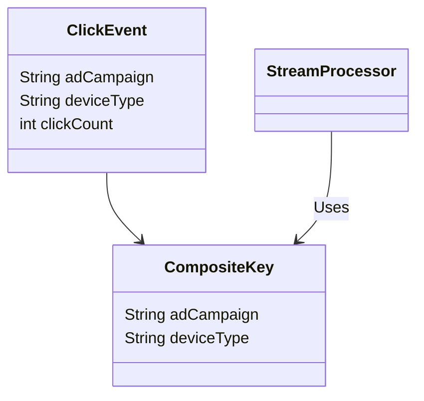
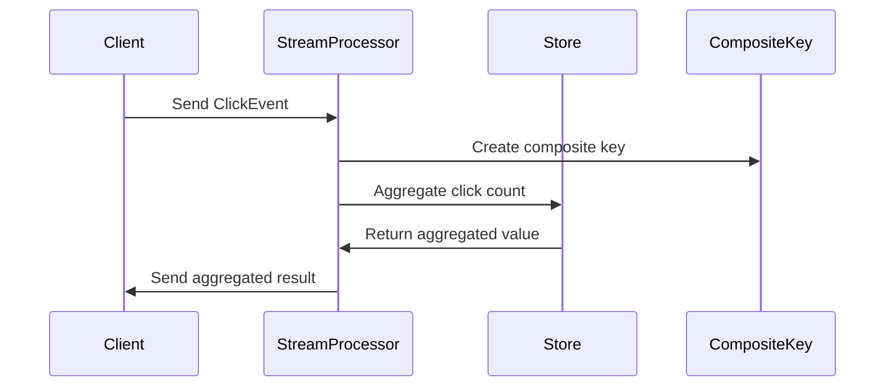

**Composite Key Aggregation**

Composite Key Aggregation is a design pattern used in stream processing and data aggregation to efficiently calculate aggregate metrics over streams of data, where the aggregation occurs based on composite keys formed by combining multiple fields.

### Detailed Explanation

#### What is Composite Key Aggregation?

In the context of data processing, a composite key is a compound key that consists of multiple fields or columns. Composite Key Aggregation involves computing aggregates, such as sums, counts, or averages, using these composite keys as grouping criteria.

#### Why use Composite Key Aggregation?

* **Granular Analysis**: It allows for a more detailed segmentation of data, providing insights at more granular levels of analysis (e.g., summarizing ad campaigns across different devices).
* **Efficiency**: When dealing with real-time data streams, structuring keys in such a manner that they capture relevant dimensions can improve computational efficiency and reduce the need for complex post-processing filters.
* **Scalability**: Effective use of composite keys can enhance scalability by allowing distributed processing over different partitions or nodes.

#### Key Considerations

- **Optimal Key Design**: Deciding the right combination of fields that make up the composite key is critical. It will affect the computation's efficiency and relevance.
- **Performance Overhead**: Composite keys can increase the overhead in storage and network transmission due to larger keys, so balance is necessary.
- **Load Balancing**: Attention must be paid to ensuring distribution remains balanced across partitions, avoiding bottlenecks.

### Architectural Approaches

#### 1. Stream Processing Frameworks

Frameworks like Apache Kafka Streams, Apache Flink, and Apache Spark Streaming have built-in functions for creating composite keys and performing efficient aggregation over data streams.

#### 2. Custom Implementations

You can also manually implement composite key aggregation using a programming language of choice, like Java or Scala, by mapping and reducing operations over data streams.

### Example Code

Here's a simple example in Apache Kafka Streams:

```java
KStream<String, ClickEvent> clickStream = builder.stream("click_events");

KGroupedStream<CompositeKey, ClickEvent> groupedStream = clickStream
    .map((key, value) -> KeyValue.pair(
        new CompositeKey(value.getAdCampaign(), value.getDeviceType()), value))
    .groupByKey();

KTable<CompositeKey, Long> aggregatedStream = groupedStream
    .aggregate(
        () -> 0L,
        (aggKey, newValue, aggValue) -> aggValue + newValue.getClickCount(),
        Materialized.<CompositeKey, Long, KeyValueStore<Bytes, byte[]>>as("aggregated-clicks-store")
    );

aggregatedStream.toStream().to("aggregated_clicks_output");
```

Here, `CompositeKey` is assumed to be a user-defined class combining ad campaign and device type.

### Diagrams

#### UML Class Diagram



#### Sequence Diagram



### Related Patterns

- **Partitioning**: Distributing data based on partition keys to ensure efficient data access and scalability.
- **Sliding and Tumbling Windows**: Aggregate data over time windows, often used in conjunction with composite key aggregation for temporal analysis.

### Additional Resources

- [Apache Kafka Streams Documentation](https://kafka.apache.org/documentation/streams/)
- [Apache Flink Windowed Joins](https://ci.apache.org/projects/flink/flink-docs-stable/dev/stream/operators/)
- [Designing Data-Intensive Applications by Martin Kleppmann](https://dataintensive.net)

### Summary

The Composite Key Aggregation pattern provides a robust method for aggregating data across multiple dimensions in a scalable and efficient manner. This pattern is indispensable when streamed data needs to be analyzed in real-time across various combinations of fields, like campaigns and devices. When implementing this pattern, consideration must be given to key design, scaling concerns, and architectural choices for optimal performance and insights.
