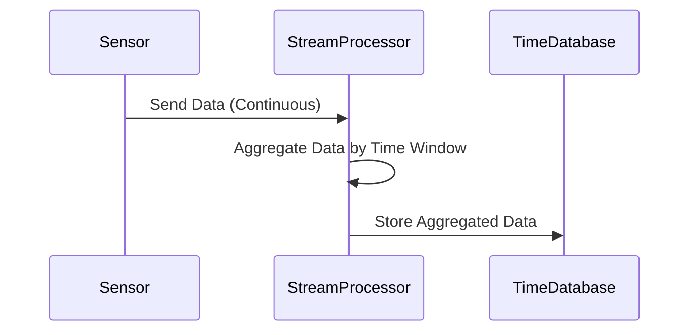

## Introduction

Time-Series Aggregation is a crucial design pattern used extensively in data systems that require analysis over time. This pattern involves specifically aggregating data points collected at successive points in time, allowing for a meaningful interpretation of trends, patterns, and seasonal variances. It is particularly applicable in systems dealing with financial markets, sensor networks, IoT devices, and monitoring frameworks. 

The key objective of Time-Series Aggregation is to downsample time-series data (e.g., from seconds to minutes or hours) to facilitate long-term analysis and reduce the storage and computational burden without losing significant information.

## Architectural Approaches

### 1. Windowing

Windowing divides your data stream into finite chunks over a set duration or count of elements. Common window types include:

- **Tumbling Windows**: Non-overlapping and fixed-size windows. Useful for discrete time interval analysis.
- **Sliding Windows**: Overlapping windows that shift with each event. Suitable for detecting more nuanced trends.
- **Session Windows**: Dynamic windows based on events without fixed sizes, ideal for user session data.

### 2. Aggregation Functions

Choosing the right aggregation functions is essential. Common functions include:

- **Sum/Average**: Calculating the total or average value of a numeric field.
- **Min/Max**: Detecting extreme values over periods.
- **Count**: Simply counting the number of events or occurrences.
- **Custom Functions**: Any user-defined aggregation logic tailored to specific requirements.

## Best Practices

- **Data window sizing**: Selecting appropriate window sizes is crucial. Smaller windows provide more granular data, whereas larger windows offer broader insights but risk data loss.
- **Handling late arrivals**: Plan for data delays in streaming architectures by implementing mechanisms to handle out-of-order data.
- **Efficient storage**: Use time-series databases like InfluxDB or OpenTSDB, which are optimized for storing and querying time-series data.

## Example Code

Here is an example of a Time-Series Aggregation using Apache Kafka Streams:

```java
KStream<String, SensorReading> sensorStream = builder.stream("sensor-readings");

TimeWindowedKStream<String, SensorReading> timeWindowedStream = sensorStream
    .groupByKey()
    .windowedBy(TimeWindows.of(Duration.ofHours(1)));

KTable<Windowed<String>, Double> averageSensorReadings = timeWindowedStream
    .aggregate(
        SensorAggregator::new,
        (key, sensorReading, aggregate) -> aggregate.add(sensorReading),
        Materialized.with(Serdes.String(), CUSTOM_SERDE));

averageSensorReadings.toStream().to("hourly-sensor-averages");
```

This example aggregates sensor readings into hourly averages using Kafka Streams, illustrating downsampling from raw sensor data.

## Diagrams

A sequence diagram showcasing the Time-Series Aggregation process:



## Related Patterns

- **Data Transformation**: Complementary for transforming raw data before aggregation.
- **CQRS (Command Query Responsibility Segregation)**: Often used with time-series systems to separate write and read concerns.
- **Batch Processing**: For handling large data sets in a non-real-time manner, suitable for historical time-series analysis.

## Additional Resources

- [Time-Series Database Concepts](https://www.influxdata.com/time-series-database/)
- [Apache Kafka Stream Processing](https://kafka.apache.org/documentation/streams/)

## Summary

Time-Series Aggregation is a pivotal pattern for extracting valuable insights from time-sequenced data, enabling organizations to make data-driven decisions. By implementing efficient aggregation strategies, windowing techniques, and using optimized architectures, systems can handle real-time processing and retrospective analysis effectively.
