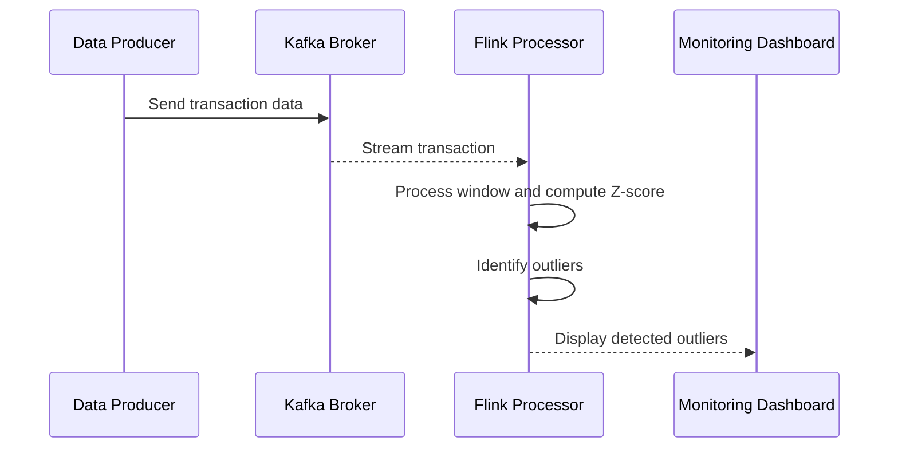

## Overview

In stream processing and data aggregation tasks, outlier detection plays a vital role in ensuring the reliability and trustworthiness of processed data. Outliers are data points that significantly diverge from other observations in your dataset, typically caused by anomalies, errors, or rare events. Detecting these outliers during aggregation helps businesses in making informed decisions, especially in fields requiring precise data integrity and real-time analytics such as fraud detection, sensor data monitoring, and financial record processing.

## Architectural Context

In modern data systems, streaming architectures often encompass the need to process and aggregate large volumes of data in real-time. The challenge arises in identifying which data points well outside the expected range should be flagged as anomalies. Outlier detection during aggregation often integrates seamlessly into environments such as:

- **Real-time Stream Processing Engines**: Apache Kafka, Apache Flink, Apache Spark Streaming, etc.
- **Batch Processing Paradigms**: Using frameworks like Hadoop or large-scale compute engines.
- **Data Warehousing Solutions**: Such as Snowflake or BigQuery, enabling complex queries to facilitate outlier detection on aggregated datasets.

## Design Pattern Details

This pattern involves leveraging statistical or machine learning techniques to identify anomalies as data streams are being aggregated. Common methods include:

1. **Statistical Techniques**: Utilize algorithms such as Z-score, Interquartile Range (IQR), or Grubbs' test which assume specific distributions in your data allowing simple outlier detection based on calculated cut-offs.

2. **Machine Learning Approaches**: Employ unsupervised models like clustering-based anomaly detectors (e.g., DBSCAN), autoencoders, or Isolation Forest, which adaptively learn normal patterns and identify deviations.

3. **Hybrid Methods**: Combine rule-based systems with learning algorithms for both precise control and adaptive detection.

### Example Code

Below is a conceptual example using Apache Flink for anomaly detection during real-time transaction data aggregation:

```scala
import org.apache.flink.streaming.api.scala._
import org.apache.flink.streaming.api.windowing.time.Time

// Define a case class for transactions
case class Transaction(id: String, amount: Double, timestamp: Long)

object OutlierDetection {
  def main(args: Array[String]): Unit = {
    val env = StreamExecutionEnvironment.getExecutionEnvironment

    // Source: Assume a Kafka source that reads transaction data
    val transactions: DataStream[Transaction] = env.addSource(/*KafkaSourceImplementation*/)
    
    // Define the threshold for anomalies
    val anomalyThreshold = 10000.0

    // Process each window of transactions and identify outliers
    val outliers = transactions
      .keyBy(_.id)
      .timeWindow(Time.minutes(5))
      .apply((key, window, transactions, out: Collector[Transaction]) => {
        val amounts = transactions.map(_.amount)
        val mean = amounts.sum / amounts.size
        val stddev = Math.sqrt(amounts.map(a => Math.pow(a - mean, 2)).sum / amounts.size)
        // Z-score calculation
        transactions.foreach { t =>
          val zScore = (t.amount - mean) / stddev
          if (Math.abs(zScore) > 3) {  // Common Z-score threshold is above 3
            out.collect(t.copy(amount = t.amount, timestamp = t.timestamp))
          }
        }
      })

    outliers.print()

    env.execute("Outlier Detection in Transaction Aggregation")
  }
}
```

### Diagrams

#### Sequence Diagram



## Related Patterns

**Pattern Name: Event Detection and Monitoring**
Focuses on general strategies for detecting and responding to events or trends within data streams.

**Pattern Name: Real-time Data Aggregation**
Covers techniques for aggregating data in a streaming context, allowing for near-instantaneous analysis.

## Additional Resources

1. **Books and Articles**
   - "Data Science for Streaming" by Andrew Hume and Byron Ellis, provides insights into streaming analytics.

2. **Apache Flink Documentation**
   - Official documentation on how to leverage windows and streaming computation for effective streaming analytics and aggregation.

3. **Research Papers**
   - Look for recent publications on anomaly detection in streaming data.

## Summary

Outlier Detection in Aggregation is essential for maintaining data integrity and operational excellence, especially in real-time analytics settings. By implementing effective anomaly detection strategies, organizations can ensure they accurately identify and react to unexpected events, enabling better decision-making and heightened awareness of operational anomalies. The blend of traditional statistical methods with advanced machine learning approaches offers robust options suited to various application domains.
