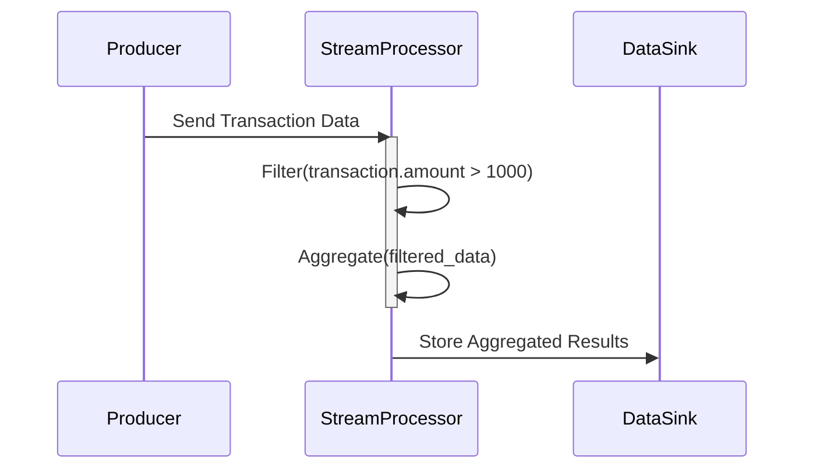

## Conditional Aggregation

### Description

Conditional Aggregation is a design pattern in stream processing that involves performing aggregation operations (such as sum, count, average, etc.) only on data elements that satisfy certain specified conditions or filters. This pattern is particularly useful in scenarios where it is necessary to analyze subsets of data based on specific criteria, thereby enabling more efficient and meaningful data analysis.

### Architectural Approach

- **Data Filtering**: Before applying aggregation, appropriate filtering mechanisms are set up to identify data elements that meet the criteria of interest.
- **Aggregation Functions**: Standard aggregation functions are utilized, such as `sum`, `count`, `max`, `min`, etc., but are applied only to the filtered data subset.
- **Streaming Infrastructure**: Leverage stream processing platforms like Apache Kafka with Kafka Streams, Apache Flink, or Apache Beam, which inherently support real-time data filtering and aggregation.
- **Scalable and Fault-Tolerant**: Implement the system in a cloud environment for scalable and fault-tolerant stream processing, using cloud services like AWS Kinesis, Google Cloud Dataflow, or Azure Stream Analytics.

### Best Practices

- **Efficient Filtering**: Implement efficient filtering logic to reduce the data volume entering the aggregation phase. 
- **Windowing**: Use time-based or count-based windows to manage the scope of aggregation for streaming data.
- **Resource Management**: Optimize cloud resources by adjusting instance types and parallel processing capabilities based on load and traffic patterns.
- **Monitoring and Alerts**: Implement comprehensive monitoring and alert systems for real-time insight into the aggregation processes and to detect anomalies promptly.

### Example Code

Below is a simple example using Apache Kafka Streams in Java to perform conditional aggregation on transaction amounts greater than $1,000.

```java
StreamsBuilder builder = new StreamsBuilder();
KStream<String, Transaction> transactions = builder.stream("transactions");

KTable<Windowed<String>, Double> highValueSales = transactions
    .filter((key, transaction) -> transaction.getAmount() > 1000)
    .groupBy((key, transaction) -> transaction.getType())
    .windowedBy(TimeWindows.of(Duration.ofMinutes(5)))
    .aggregate(
        () -> 0.0,
        (aggKey, newTransaction, aggValue) -> aggValue + newTransaction.getAmount(),
        Materialized.with(Serdes.String(), Serdes.Double())
    );

highValueSales.toStream().to("highValueSalesOutput");
```

### Diagrams

Here is a simple Mermaid UML Sequence Diagram to describe the process:



### Related Patterns

- **Stateful Processing**: This pattern involves remembering previous states across stream elements, essential for operations involving conditions across time windows.
- **Complex Event Processing (CEP)**: CEP involves detecting patterns and relationships among events and could complement conditional aggregation to trigger actions based on detected high-value patterns.

### Additional Resources

- "Kafka Streams: Real-time Stream Processing" by Confluent
- "Streaming Systems" by Tyler Akidau et al.
- Apache Flink and Kafka Streams official documentation

### Summary

Conditional Aggregation is an essential pattern in stream processing that optimizes and enhances data analytics by focusing on data subsets meeting defined criteria. It effectively saves resources, enhances processing efficiency, and provides insightful analytics for real-time applications, particularly on scalable cloud infrastructure. By implementing best practices and leveraging modern streaming infrastructures, one can greatly benefit from relevant and high-value aggregated insights.
