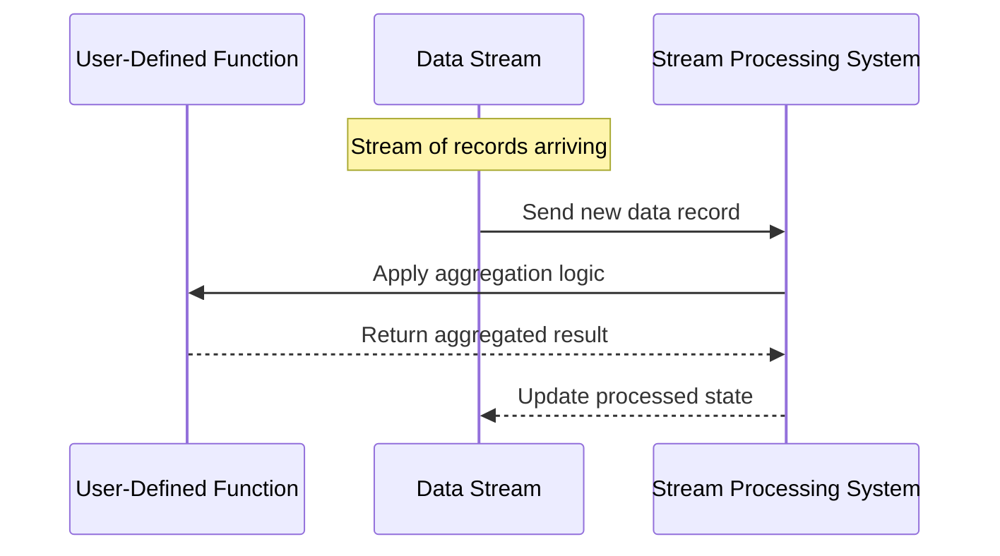

User-Defined Aggregation Functions (UDAFs) provide flexibility by allowing developers to create custom aggregation logic beyond predefined operations. This design pattern is crucial when standard aggregation functions (like SUM, COUNT, or AVERAGE) do not fulfill specific business logic requirements.

## Description

In data processing systems, a typical requirement is aggregating data to compute values such as averages, sums, or counts. However, there are scenarios where application-specific requirements necessitate customization of these aggregation operations. UDAFs cater to these cases by enabling developers to define how data should be aggregated.

UDAFs are crucial for the following use cases:

- **Custom Metric Computation**: Applications might need to compute business-specific metrics that standard operations cannot cover.
- **Complex Aggregation Logic**: Certain calculations involve multi-step or conditional logic that predefined functions cannot accomplish.
- **Real-time Data Processing**: Systems dealing with large-scale data streams benefit from tailored aggregation functions that can process data as it arrives, ensuring minimal latency.

## Example

Consider a social media analytics application tracking sentiment scores from various platforms. Given positive, negative, and neutral scores, a tailored aggregation function might be necessary to compute weighted sentiments depending on platform-specific popularity scores.

Here's how you can implement a simple UDAF using Apache Flink's data stream API in Scala:

```scala
import org.apache.flink.api.common.functions.AggregateFunction

case class Sentiment(platform: String, score: Double, popularity: Int)

class WeightedSentimentAggregator extends AggregateFunction[Sentiment, (Double, Int, Int), Double] {
  // Initialization of the accumulator
  override def createAccumulator(): (Double, Int, Int) = (0.0, 0, 0)

  // Adding the element into the accumulator
  override def add(sentiment: Sentiment, acc: (Double, Int, Int)): (Double, Int, Int) = {
    val weightedScore = sentiment.score * sentiment.popularity
    (acc._1 + weightedScore, acc._2 + sentiment.popularity, acc._3 + 1)
  }

  // Returning the final result (Weighted Average Score)
  override def getResult(acc: (Double, Int, Int)): Double =
    if (acc._2 == 0) 0.0 else acc._1 / acc._2

  // Merging two accumulators
  override def merge(acc1: (Double, Int, Int), acc2: (Double, Int, Int)): (Double, Int, Int) =
    (acc1._1 + acc2._1, acc1._2 + acc2._2, acc1._3 + acc2._3)
}
```

In this example, `WeightedSentimentAggregator` computes a weighted sentiment score by taking into account the popularity of each platform. This approach exemplifies how UDAFs allow precise control over aggregation logic.

## Diagrams

Here's an example of a sequence diagram explaining the UDAF process:



## Related Patterns

- **MapReduce**: A widely used pattern for processing and aggregating large datasets in a distributed environment. It involves mapping data to a key-value set and then reducing all values associated with the same key.
- **Streaming MapReduce**: Extends traditional MapReduce to handle continuous data by continuously applying map and reduce operations on incoming data.

## Additional Resources

- **Apache Flink Documentation**: Explore more about creating custom UDAFs in Flink.
- **AWS Lambda with Aggregation**: Learn how AWS Lambda can be integrated with custom aggregation logic for serverless compute tasks.
- **Flink UDF API**: A comprehensive guide to user-defined functions in Flink.

## Summary

User-Defined Aggregation Functions provide a means to introduce custom, application-specific aggregation logic in stream processing systems. They fill the gap where built-in aggregation functions fall short, enabling more complex data processing scenarios. By leveraging UDAFs, businesses can derive valuable insights from data streams and execute intricate computations tailored to their unique requirements.
