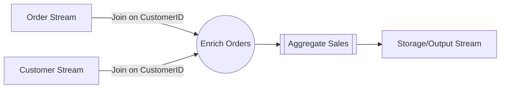

## Stream Joins Before Aggregation

### Description

Stream Joins Before Aggregation is a design pattern commonly used in real-time data processing. It involves joining multiple data streams to enrich the data before performing aggregation operations. This strategy ensures that the aggregated data benefits from additional context provided by related streams, thus enhancing the quality and insightfulness of the resulting data.

By implementing this pattern, organizations can glean more meaningful insights from their aggregated data, such as understanding customer behavior patterns or operational metrics, by integrating and analyzing complementary datasets in real-time.

### Architectural Approaches

1. **Kappa Architecture**:
   - Employ a Kappa architecture using Apache Kafka for stream processing. By leveraging Kafka Streams, you can join different streams to enrich messages and then apply aggregations.

2. **Lambda Architecture**:
   - Use Apache Flink or Beam to handle both batch and stream processing aspects. Streams can be enriched with historical batch data for more informed aggregations.

3. **Microservices with Event Sourcing**:
   - Implement microservices that listen to domain events. Use these events to join and enrich streams before aggregating the data within the service boundary.

### Paradigms

- **Event-Driven Architecture**:
  Utilize event streams effectively by designing your system to react and adapt to incoming data events, enriching and aggregating them as needed.

- **CQRS (Command Query Responsibility Segregation)**:
  Separate the data processing logic for commands and queries to independently join and aggregate data streams.

### Best Practices

- **Optimize Join Conditions**: 
  Ensure that the conditions for joining streams efficiently utilize keys or indices, minimizing the impact on performance.

- **Monitor Stream Lag**: 
  Regularly monitor the time lag to ensure that your joined and aggregated results are as close to real-time as possible.

- **Schema Evolution**: 
  Be mindful of changes in data schemas over time and manage them dynamically to prevent interruptions in the data flow.

### Example Code

Here's an example using Kafka Streams in Java to join two streams and perform aggregation:

```java
StreamsBuilder builder = new StreamsBuilder();

// Stream of orders
KStream<String, Order> orderStream = builder.stream("orders");

// Stream of customers
KTable<String, Customer> customerTable = builder.table("customers");

// Enrich order stream with customer data
KStream<String, EnrichedOrder> enrichedOrderStream = orderStream.join(
  customerTable,
  (order, customer) -> new EnrichedOrder(order, customer),
  Joined.with(Serdes.String(), orderSerde, customerSerde)
);

// Aggregate enriched order data
KTable<String, Double> salesPerCustomer = enrichedOrderStream
  .groupBy((key, enrichedOrder) -> enrichedOrder.getCustomerId(), Grouped.with(Serdes.String(), enrichedOrderSerde))
  .aggregate(
    () -> 0.0,
    (key, enrichedOrder, total) -> total + enrichedOrder.getOrderAmount(),
    Materialized.with(Serdes.String(), Serdes.Double())
  );

salesPerCustomer.toStream().to("sales-per-customer", Produced.with(Serdes.String(), Serdes.Double()));
```

### Diagrams

Here is a simple diagram depicting the Stream Joins before Aggregation process:



### Related Patterns

- **Stream Aggregation Pattern**: Directly related, as it highlights methods to summarize and compress data streams.
- **Co-Group Pattern**: Useful for grouping related records from different streams, akin to SQL GROUP BY but in a streaming context.

### Additional Resources

- [Kafka Streams Documentation](https://kafka.apache.org/documentation/streams/)
- [Pattern: Joining Streams in Data Processing](https://martinfowler.com/articles/stream-join.html)
- [Apache Flink Join Transformations](https://nightlies.apache.org/flink/flink-docs-release-1.12/dev/stream/operators/join/)

### Summary

The Stream Joins Before Aggregation pattern is essential for achieving enriched, meaningful aggregated data in real-time analytics systems. By properly joining streams before executing aggregation operations, organizations can attain a more nuanced understanding of their data. This approach leverages the power of event-driven architectures and advanced stream processing frameworks to deliver timely, context-rich insights.
