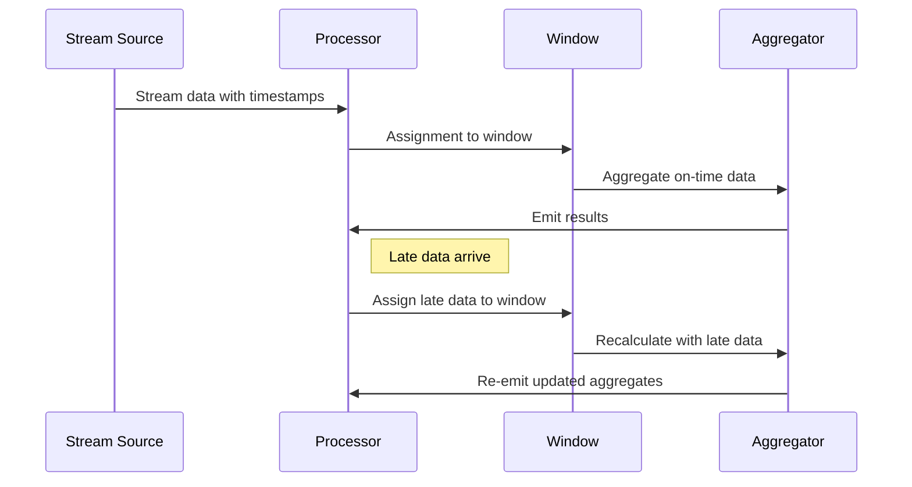

## Introduction

In stream processing systems, data often arrives out of order, and late events can significantly affect the accuracy of results, particularly in stateful computations like aggregations. The "Aggregation with Late Data" pattern addresses this challenge by adjusting computed aggregates when late events arrive. This ensures that the results remain correct and reflective of all available data.

## Problem

Stream processing systems often rely on event-time semantics to handle data streams effectively. However, events can arrive late due to various reasons such as network delays, processing lags, and system failures. Late data can skew aggregates if they are not handled properly, leading to inaccurate analytics and insights.

## Solution

The "Aggregation with Late Data" pattern involves:

1. **Windowing Strategy**: Implement a time-based window (tumbling, sliding, session) to segregate streams into manageable batches that represent the scope of aggregation.
2. **Watermarks**: Use watermarks to track the progress of event-time and determine when a window has received all the expected data. Watermarks help differentiate on-time data from late data.
3. **Late Data Handling**:
   - **Incorporation**: Integrate late events arriving after the window closing into the corresponding windows as updates.
   - **Re-emission of Updated Results**: Ensure the output reflect accurate aggregates by consistently updating as late data arrives.
   
## Implementation

Below is an example of how aggregation with late data might be implemented using Apache Flink, a popular stream processing framework:

```java
import org.apache.flink.streaming.api.TimeCharacteristic;
import org.apache.flink.streaming.api.datastream.DataStream;
import org.apache.flink.streaming.api.environment.StreamExecutionEnvironment;
import org.apache.flink.streaming.api.windowing.time.Time;
import org.apache.flink.streaming.api.windowing.assigners.TumblingEventTimeWindows;
import org.apache.flink.streaming.api.windowing.triggers.EventTimeTrigger;

public class AggregationWithLateData {

    public static void main(String[] args) throws Exception {
        StreamExecutionEnvironment env = StreamExecutionEnvironment.getExecutionEnvironment();
        env.setStreamTimeCharacteristic(TimeCharacteristic.EventTime);

        // Example data stream with events having timestamps
        DataStream<Event> eventStream = // source of stream

        eventStream
            .keyBy(event -> event.getKey())
            .window(TumblingEventTimeWindows.of(Time.hours(1)))
            .trigger(EventTimeTrigger.create())
            .allowedLateness(Time.minutes(5))
            .sideOutputLateData(lateDataOutputTag)
            .aggregate(new SalesAggregator())
            .print();

        env.execute("Aggregation with Late Data Example");
    }
}
```

## Diagram



## Related Patterns

- **Windowing Strategies**: Provides methods for grouping events such as tumbling and sliding windows.
- **Watermarking**: Utilizes watermarks to handle late-arriving data systematically.
- **Stateful Stream Processing**: Involves maintaining state information across stream data to facilitate complex event processing.

## Additional Resources

- [Stream Processing with Flink](https://ci.apache.org/projects/flink/flink-docs-stable/)
- [Streaming Event Processing in Apache Kafka](https://kafka.apache.org/documentation/streams/)
- [Data-Driven Event-Time Processing with Google Cloud Dataflow](https://cloud.google.com/dataflow/docs/concepts/event-time-processing)

## Summary

Aggregation with late data is a crucial design pattern in stream processing that ensures the accuracy of real-time analytics even when events arrive after expected deadlines. By leveraging windowing, watermarks, and proper handling of late arrivals, systems can maintain reliable and precise aggregates suited for real-time decision-making.
