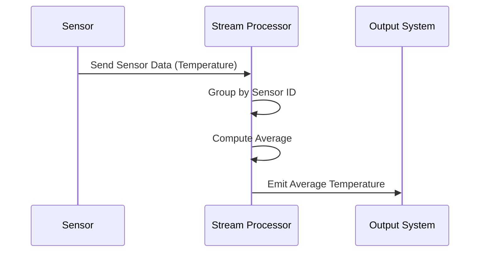

## Introduction

The Average Aggregation pattern is employed to calculate the mean value of numeric fields over a continuous stream of data or within predefined time windows. This pattern is prevalent in stream processing systems to provide real-time insights and analytics. Use cases include monitoring and reporting average metrics, such as temperature, speed, or financial indicators, from incoming data streams.

## Problem

In real-time data streams, there is often a need to compute summary statistics such as the average for incoming numeric data. This can be challenging due to the continuously evolving nature of streams and the necessity to maintain calculations efficiently with minimal latency.

## Solution

The Average Aggregation pattern involves the following steps to compute the mean value:

1. **Collect Numeric Data**: Continuously receive and parse the stream of incoming numeric data.
2. **Windowing (Optional)**: Define a window—time-based or count-based—to group data points for specific intervals.
3. **Calculate Mean**: Sum up all numeric values within the dataset or window and divide by the count of data points.
4. **Emit Result**: Output the average at each window's end or at defined intervals within continuous computation.

## Example

Consider a system that monitors temperature sensors deployed across a region. Every 15 minutes, compute the average temperature reported by all sensors:

```java
import org.apache.flink.api.java.tuple.Tuple2;
import org.apache.flink.streaming.api.environment.StreamExecutionEnvironment;
import org.apache.flink.streaming.api.windowing.time.Time;
import org.apache.flink.streaming.api.datastream.DataStream;

public class AverageTemperature {
    public static void main(String[] args) throws Exception {
        final StreamExecutionEnvironment env = StreamExecutionEnvironment.getExecutionEnvironment();

        DataStream<Tuple2<String, Double>> sensorData = // Source of sensor data

        sensorData
            .keyBy(value -> value.f0) // Group by sensor ID
            .timeWindow(Time.minutes(15))
            .reduce((value1, value2) -> 
                new Tuple2<>(value1.f0, (value1.f1 + value2.f1) / 2) // Compute average
            )
            .print();

        env.execute("Average Temperature Computation");
    }
}
```

## Diagrams

### Average Aggregation Flow



## Related Patterns

- **Sum Aggregation**: Involves summing values within a dataset or time window.
- **Count Aggregation**: Counts the number of entries or data points in a dataset or time window.
- **Windowing Patterns**: Define the logic for segmenting data streams into time or event-based chunks.

## Best Practices

- **Windowing Strategy**: Select appropriate windowing strategies (e.g., tumbling, sliding) based on exact requirements.
- **Efficiency**: Optimize data collection and processing to minimize latency and resource consumption.

## Additional Resources

- [Apache Flink Window Operations](https://ci.apache.org/projects/flink/flink-docs-stable/dev/stream/operators/windows.html)
- [Storm Aggregation Techniques](https://storm.apache.org/releases/2.1.0/Aggregation-in-Storm.html)

## Summary

The Average Aggregation pattern is crucial for real-time stream processing systems where calculating the mean of numeric data is necessary for monitoring and analysis. By structuring data into windows and efficiently computing averages, systems can provide timely insights and enable data-driven decision-making.
