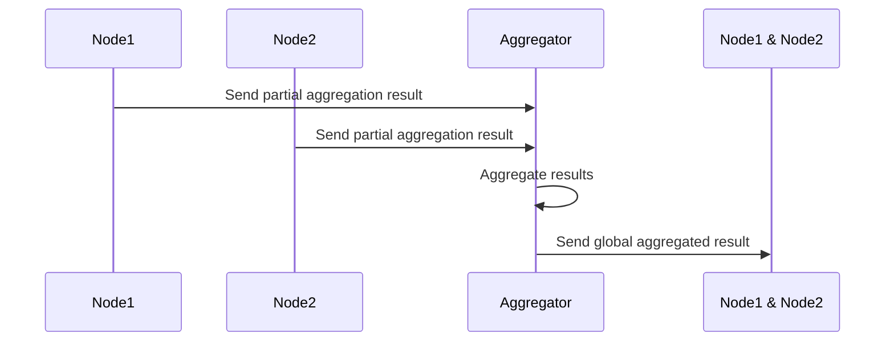

### Distributed Aggregation

#### Description
Distributed Aggregation is a design pattern in stream processing and distributed systems that aims to aggregate data across multiple nodes or partitions to handle large-scale data inputs and computations. By partitioning the data and computation tasks, this pattern enables horizontal scalability, enhancing performance and fault tolerance in data processing systems.

#### Architectural Approach
The main architectural approach for Distributed Aggregation involves decomposing the aggregation task into a two-phase process:

1. **Local Aggregation (Pre-aggregation):** Each node or partition performs a partial aggregation of the data it holds. This reduces the amount of data that needs to be transferred and processed in subsequent steps. The use of a **combiner function** is pivotal at this stage to produce intermediate aggregates that summarize local data effectively.

2. **Global Aggregation (Post-aggregation):** The intermediate aggregates from each node are then sent to a central node or a set of coordinated nodes for a comprehensive aggregation. This step combines the pre-aggregated results into a final aggregated output.

This two-phase approach minimizes data movement across the network and improves the efficiency of the aggregation process.

#### Example Code
Here’s a simplified example using Apache Spark, illustrating how Distributed Aggregation can be implemented using a combiner:

```scala
import org.apache.spark.sql.SparkSession

object DistributedAggregationExample {
  def main(args: Array[String]): Unit = {
    val spark = SparkSession.builder()
      .appName("Distributed Aggregation Example")
      .getOrCreate()

    // Sample data
    val data = Seq((1, 10), (2, 20), (1, 30), (3, 40), (2, 50))
    val rdd = spark.sparkContext.parallelize(data)

    // Pre-aggregation: Partially aggregating on each node
    val partialAgg = rdd.mapValues(value => (value, 1))
      .reduceByKey((a, b) => (a._1 + b._1, a._2 + b._2))  // combine counts and sums

    // Global aggregation: Combining the pre-aggregated results
    val globalAgg = partialAgg.mapValues { case (sum, count) => sum / count.toDouble }

    globalAgg.collect().foreach(println)
    // Output: Aggregated averages for each key

    spark.stop()
  }
}
```

#### Diagram


#### Related Patterns
- **MapReduce Pattern:** Related in that it also involves a mapped phase followed by a reduced/aggregation phase. Used predominantly in batch processing contexts.
- **Federated Aggregation:** Similar concept used in Federated Learning, where local models are aggregated into a global model without significant data exchange, focusing on preserving privacy.

#### Additional Resources
- *Designing Data-Intensive Applications* by Martin Kleppmann - In-depth discussion on data processing architectures.
- Apache Spark documentation on transformations, which covers more on `reduceByKey` and related aggregation operations.
- Real-time Stream Processing with Apache Kafka - Covers integrating Apache Kafka with stream processing engines like Apache Flink or Spark Streaming.

#### Summary
Distributed Aggregation is a critical pattern for applications involving large data processing and the requirement for high throughput and low latency. By leveraging local and global aggregation, this pattern effectively reduces the network and computational overhead, enabling scalable and efficient data processing workflows. This pattern is applicable across various domains, including real-time analytics, IoT data processing, and financial services.

Effective implementation involves understanding partition strategies, designing efficient combiner functions, and choosing appropriate technologies based on the use case requirements.
