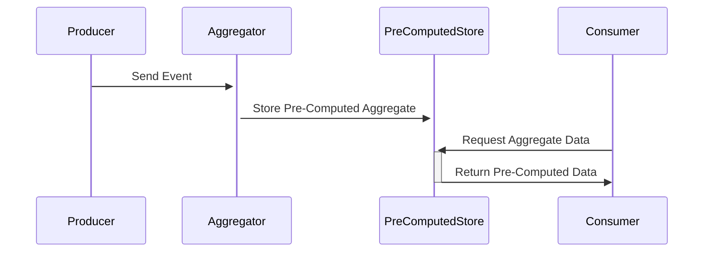

## Introduction

Aggregate Pre-Compute is a design pattern that focuses on pre-calculating data aggregates in advance to optimize access speed and reduce computational overhead during real-time data access. This pattern is particularly prevalent in environments where rapid responses are critical, such as in dashboards or analytics systems.

## Detailed Explanation

The Aggregate Pre-Compute pattern involves calculating aggregated data in advance rather than on-demand at query time. This pre-calculated data is stored in a way that allows it to be retrieved much faster compared to querying raw data and performing computations on-the-fly.

### Use Cases

- **Performance Optimization**: Increases the performance of applications and systems, especially those requiring real-time data processing and display, such as financial dashboards.
- **Resource Management**: Reduces computational load during peak access times by shifting processing to off-peak periods.
- **Consistency**: Ensures that all consumers of the pre-computed data view the same aggregate results, providing consistency across the application.

## Architectural Approaches

When designing a system that uses the Aggregate Pre-Compute pattern, consider the following architectural strategies:

- **Batch Processing**: Use scheduled batch jobs to compute aggregates at regular intervals, storing the results for quick access.
- **Real-Time Streaming**: Employ streaming platforms like Apache Kafka or AWS Kinesis to compute aggregates as data flows through the system.
- **Event Sourcing**: Leverage event-driven architectures to update aggregated views in response to new event arrivals.

## Example Code

Here is a simplified example of how to pre-compute aggregates using a stream processing framework like Apache Kafka Streams:

```java
KStream<String, Transaction> transactionsStream = builder.stream("transactions");

KTable<String, Long> preAggregatedSums = transactionsStream
        .groupBy((key, transaction) -> transaction.getCategory())
        .aggregate(
                () -> 0L,
                (aggKey, newValue, aggValue) -> aggValue + newValue.getAmount(),
                Materialized.<String, Long, KeyValueStore<Bytes, byte[]>>as("preAggregatedStore")
        );

preAggregatedSums.toStream().to("preAggregatedTransactions");
```

In this example, transactions are grouped by category, and the amount is summed to create a pre-aggregated store.

## Diagrams

Here's a simple Mermaid sequence diagram to illustrate how data flows through an Aggregate Pre-Compute process:



## Related Patterns

- **Caching**: The Aggregate Pre-Compute pattern often works closely with caching mechanisms to improve data retrieval times.
- **CQRS (Command Query Responsibility Segregation)**: Allows separation of read and write operations, often paired with pre-computation for read projections.
- **Event Sourcing**: Maintains all changes to application state as a sequence of events that can be used to optimize updates to pre-computed aggregates.

## Additional Resources

- *Kafka Streams API Documentation*: Provides comprehensive guidance on building stream processing applications.
- *Cloud Data Warehouse Solutions*: Consider using cloud-native data warehouses like Snowflake for storing pre-computed aggregations.

## Summary

The Aggregate Pre-Compute pattern is a powerful approach in stream processing architectures focused on delivering high-speed data access by pre-computing and caching aggregates. Its implementation involves careful design choices around how and when aggregates are computed, stored, and accessed, making it essential for systems demanding low-latency and high-throughput data delivery.

By leveraging this pattern, systems can achieve more efficient resource utilization, consistent performance, and improved response times, ultimately delivering enhanced user experiences.
