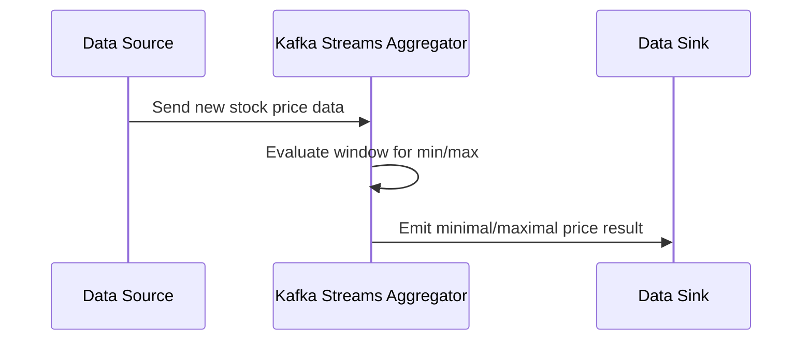

### Introduction

**Minimum/Maximum Aggregation** is a fundamental pattern in data processing, particularly within the context of stream processing. This pattern involves computing the smallest (minimum) or largest (maximum) value in a continuous stream of data or over a defined window. This capability is crucial for applications that require real-time analytics, such as monitoring stock prices, detecting sensor hits, or assessing performance metrics in a fleet of devices.

### Pattern Description

The Minimum/Maximum Aggregation pattern efficiently extracts extreme values from data streams. It operates by continually updating minimum and maximum values as new data arrives. The process is optimized for performance, typically using constant time operations for comparisons. This pattern finds use in various domains including finance, IoT, and monitoring systems.

#### Key Components:
- **Data Stream**: A continuous flow of data elements.
- **Windowing**: A mechanism to define the subset of the stream for analysis, often through time windows.
- **Aggregation Function**: Logic for deriving the minimum or maximum value from the current window's data.

### Example Use Case

To illustrate, consider a stock market application that tracks the highest price of a company's stocks during a trading day. As tick data flows in real-time, the maximum aggregation logic continuously updates the highest tracked value until the market closes.

### Architectural Approach

#### System Architecture

The architecture typically involves the components listed below. A Kafka Stream application can continuously process data and apply Minimum/Maximum Aggregation logic.

- **Source Processor**: Collects incoming data from the source.
- **Aggregator Processor**: Continuously assesses the incoming stream to update minimum/maximum values using event time or processing time windows.
- **Sink Processor**: Relays calculated extremes to downstream systems for further action or notification.

#### Code Example: Using Kafka Streams and Java

```java
import org.apache.kafka.streams.KafkaStreams;
import org.apache.kafka.streams.StreamsBuilder;
import org.apache.kafka.streams.kstream.KStream;
import org.apache.kafka.streams.kstream.TimeWindows;

import java.time.Duration;

public class ExtremePriceCalculation {

    public static void main(String[] args) {
        StreamsBuilder builder = new StreamsBuilder();
        KStream<String, Double> prices = builder.stream("stocks-input");

        prices
            .groupByKey()
            .windowedBy(TimeWindows.of(Duration.ofMinutes(1)))
            .aggregate(
                () -> Double.MIN_VALUE,
                (key, newValue, aggValue) -> Math.max(newValue, aggValue)
            )
            .toStream()
            .foreach((windowedKey, maxPrice) -> 
                System.out.printf("Stock: %s; Max Price within window: %f%n", windowedKey.key(), maxPrice)
            );

        KafkaStreams streams = new KafkaStreams(builder.build(), /* properties */);
        streams.start();

        Runtime.getRuntime().addShutdownHook(new Thread(streams::close));
    }
}
```

### Diagram

#### UML Sequence Diagram



### Best Practices

- **Window Configuration**: Choose appropriate window sizes (e.g., tumbling, sliding, or session) based on the application requirements.
- **State Management**: Use state stores wisely to avoid excessive memory usage while ensuring efficient state recovery.
- **Performance Tuning**: Monitor and optimize processing latency, ensuring the system can handle peak data rates.

### Related Patterns

- **Tumbling Window**: Fixed-size, non-overlapping time windows that aggregate data.
- **Sliding Window**: Overlapping windows that maintain aggregates with fine granularity.
- **Session Window**: Flexible windows with gaps/durations defined by the absence of incoming data.

### Additional Resources

- Kafka Streams Documentation
- Real-Time Analytics with Apache Kafka
- Windowing Concepts in Stream Processing

### Summary

The Minimum/Maximum Aggregation pattern is critical in processing scenarios where understanding extremes is necessary. By leveraging stream processing technologies like Kafka Streams, applications can monitor real-time data and perform efficient aggregations to capture the ups and downs across various domains. Proper design and implementation using this pattern provide a backbone for efficient, timely, and scalable data-driven insights.
