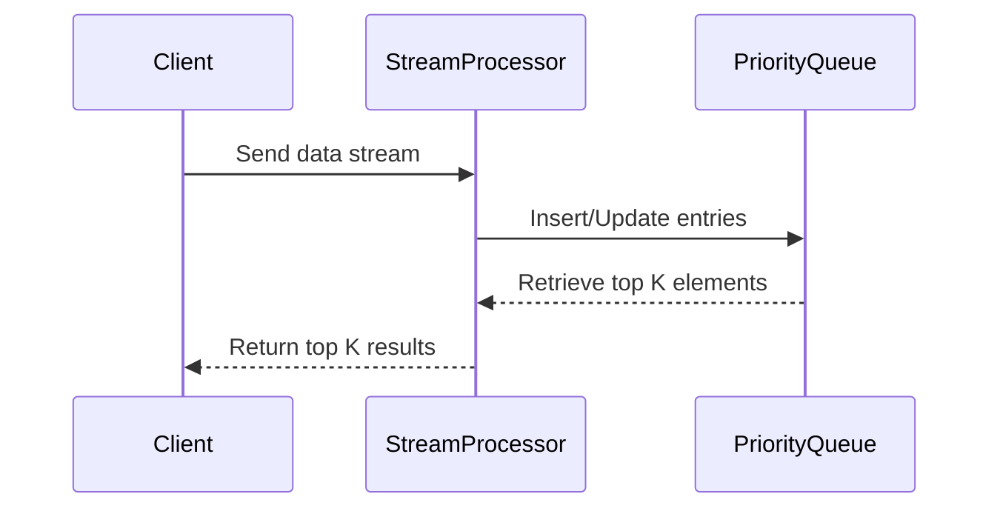
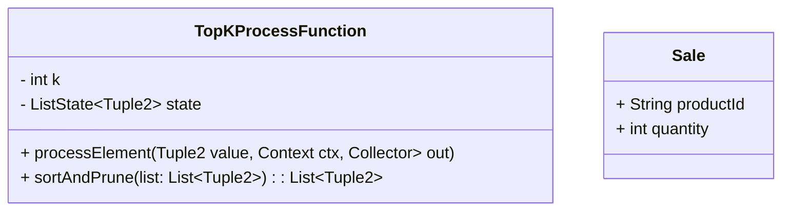

## Introduction
Top-K Aggregation is a design pattern used to identify the top K elements from an incoming stream of data based on a specified metric, such as frequency or numerical value. This pattern is crucial in scenarios where only the highest-ranking items need attention, such as trending hashtags, top-selling products, or highest-rated posts.

## Architectural Approach
Top-K Aggregation can be approached using various strategies, depending on the data source and infrastructure:

1. **Batch Processing**: Accumulate data over a time period and compute the top K elements using distributed batch processing frameworks like Apache Spark.
2. **Stream Processing**: Continuously calculate the top K elements in real-time using frameworks like Apache Flink or Apache Kafka Streams.
3. **Approximate Algorithms**: Use probabilistic data structures (e.g., Count-Min Sketch) for memory-efficient approximate calculations.

## Best Practices
- **Select Appropriate Data Structures**: Use priority queues or heaps to efficiently manage and extract top K elements.
- **Optimize Memory Usage**: Keep memory footprint minimal by pruning non-essential data frequently.
- **Balance Accuracy and Performance**: Use approximate algorithms for large data volumes to trade off a slight drop in accuracy for performance.
- **Fault Tolerance**: Ensure that the system can recover and maintain state in the event of failures for continual computation.

## Example Code

Here's a sample implementation using Apache Flink for stream processing to compute the top K elements:

```java
DataStream<Sale> salesStream = // assume this is already set up

DataStream<Tuple2<String, Long>> topK = salesStream
    .keyBy(Sale::getProductId)
    .timeWindow(Time.days(30))
    .sum("quantity")
    .keyBy(tuple -> true) // perform a global grouping
    .process(new TopKProcessFunction(10)); // assuming 10 is the K we want

public class TopKProcessFunction extends KeyedProcessFunction<Boolean, Tuple2<String, Long>, Tuple2<String, Long>> {
    private final int k;
    private transient ListState<Tuple2<String, Long>> state;

    public TopKProcessFunction(int k) {
        this.k = k;
    }

    @Override
    public void open(Configuration parameters) throws Exception {
        ListStateDescriptor<Tuple2<String, Long>> descriptor =
            new ListStateDescriptor<>("state", TypeInformation.of(new TypeHint<Tuple2<String, Long>>()));
        state = getRuntimeContext().getListState(descriptor);
    }

    @Override
    public void processElement(Tuple2<String, Long> value, Context ctx, Collector<Tuple2<String, Long>> out) throws Exception {
        List<Tuple2<String, Long>> allElements = new ArrayList<>();
        for (Tuple2<String, Long> element : state.get()) {
            allElements.add(element);
        }
        allElements.add(value);
        allElements.sort((a, b) -> b.f1.compareTo(a.f1)); // sort in decreasing order of sales
        state.update(allElements.subList(0, Math.min(k, allElements.size())));
        for (int i = 0; i < Math.min(k, allElements.size()); i++) {
            out.collect(allElements.get(i));
        }
    }
}
```

## Diagrams

### Top-K Aggregation Sequence



### UML Class Diagram



## Related Patterns
- **Windowed Aggregation**: Compute aggregates over sliding or tumbling windows, which can be a precursor for top-K calculations.
- **Filtering Streams**: Remove unimportant data, focusing computational resources on meaningful segments that may contribute to top-K.

## Additional Resources
- [Apache Flink Documentation for Window Functions](https://flink.apache.org)
- [Strategies for Real-Time Data Aggregation](https://aws.amazon.com/blogs/big-data)
- [Efficient Data Streaming Techniques](https://www.oreilly.com/library/view/stream-processing-with)

## Summary
The Top-K Aggregation pattern effectively identifies high-ranking elements in a data stream through a real-time analysis. Whether using batch or stream processing, employing the right data structures and algorithms can significantly enhance performance and scalability. Implementing this pattern enables organizations to quickly gain insights into dynamic datasets, supporting data-driven decision-making.
