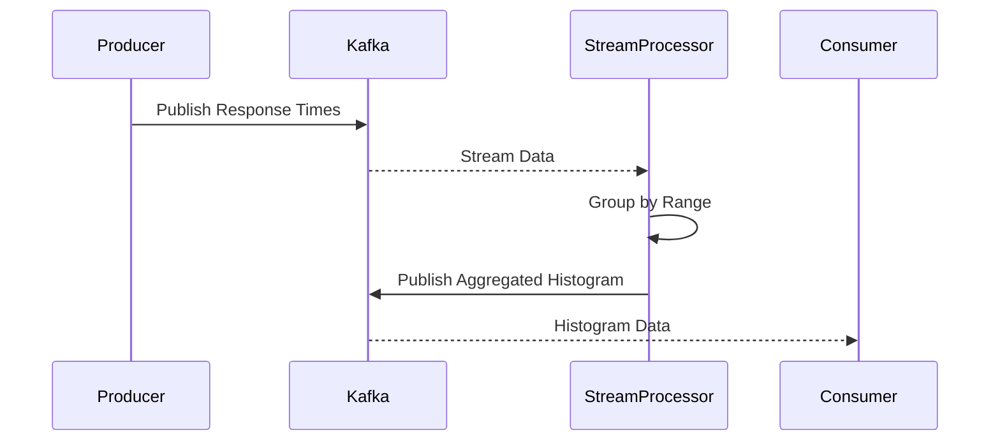

## Overview

Histogram aggregation is a pattern used to distribute data into predefined bins or intervals, resulting in a histogram that represents the frequency distribution of a variable. This pattern is especially useful in stream processing scenarios where ongoing aggregation of data points provides insights into system behaviors such as latency, error rates, and performance metrics.

## Description

In a typical histogram aggregation, data is collected in real-time and mapped to specific bins based on their values. Each bin represents a range, and the data points falling within these ranges contribute to the count of that bin. The final result is a histogram that visually portrays the distribution of data across the specified ranges.

### Use Cases

- Analyzing response times of a web application to identify performance bottlenecks.
- Monitoring CPU usage of servers to optimize resource allocation.
- Aggregating and visualizing transaction sizes in a financial application to detect anomalies.

### Example

Suppose you're developing a cloud-based instrumentation service aiming to track and analyze API response times. The objective is to have a real-time histogram that displays the frequency of response times in different intervals (e.g., 0–250 ms, 250–500 ms, etc.). This insight helps in quickly identifying potential performance issues.

**Sample Code (Java with Apache Kafka Streams):**

```java
StreamsBuilder builder = new StreamsBuilder();
KStream<String, Long> responseTimes = builder.stream("api-response-times");

KGroupedStream<String, Long> groupedByResponseTime = responseTimes
    .groupBy((key, value) -> {
        if (value <= 250) return "0-250ms";
        else if (value <= 500) return "250-500ms";
        else if (value <= 1000) return "500-1000ms";
        else return "1000ms+";
    });

KTable<String, Long> histogram = groupedByResponseTime.count();

histogram.toStream().to("response-time-histogram", Produced.with(Serdes.String(), Serdes.Long()));
```

In this example, streaming data from an `api-response-times` topic is grouped into buckets/bins representing different response time categories. The aggregated data is then sent to another Kafka topic for further analysis or visualization.

## Diagram

Here is a simple UML Sequence Diagram using Mermaid syntax to represent the data flow in a Histogram Aggregation system:



## Related Patterns

- **Time Windowing**: Often used alongside histogram aggregation to limit the aggregation to specific time windows.
- **Sliding Window**: Helps in creating a moving histogram overview by adjusting the time window as new data arrives.
- **MapReduce**: For batch processing and generating histograms over large datasets processed in chunks.

## Additional Resources

- [Understanding Apache Kafka Streams for Real-time Processing](https://kafka.apache.org/documentation/streams/)
- [Real-time Data Binning and Histogram Aggregation Techniques](https://linktosource.com)
- [Data Analysis with Histograms using Python and Pandas](https://pandas.pydata.org/docs/user_guide/visualization.html#visualization-histograms)

## Summary

Histogram aggregation is an essential analytic tool in stream processing architectures, providing real-time insights into data frequency distribution. By classifying data into specific bins and analysing these across the real-time streams, developers can gain meaningful insights into the performance and behavior of distributed systems. This structured approach not only enhances decision-making but also aids in identifying and mitigating potential system anomalies.
