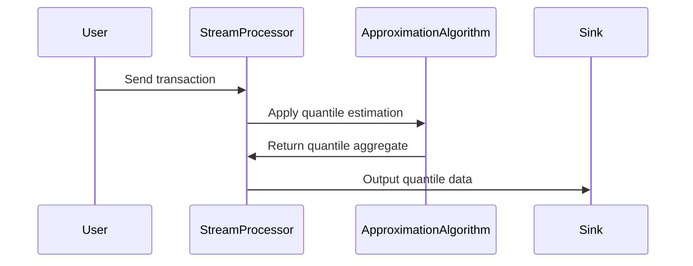

## Description

Quantile Aggregation is a stream processing design pattern used to compute quantiles such as median, quartiles, and percentiles in real-time data streams. By summarizing data distributions efficiently, it helps in detecting anomalies, understanding data spread, and making data-driven decisions. Computing quantiles in streaming environments can handle large volumes of data and provides timely metrics without the need for entire datasets to be stored for batch processing.

## Example

Consider a financial institution looking to monitor transaction amounts in real-time to detect anomalies. By applying Quantile Aggregation, they can compute the 90th percentile of transaction amounts and quickly identify transactions that are unusually large, which might indicate fraudulent activities or require further investigation.

## Architectural Approaches

1. **T-Digest Algorithm**: This technique is used for accurate and efficient quantile estimation on data streams. It processes incoming data to update a compressed representation, which can be queried for any quantile.

2. **Approximate Data Structures**: Use data sketches like Count-Min Sketch or Quantile Sketch which trade off between accuracy and resource usage, making them suitable for high throughput environments.

3. **Sliding Window Aggregation**: Apply quantile calculations over a moving window (e.g., last 5 minutes of data) to continually update quantile estimations without storing the entire data history.

## Best Practices

- **Choose the Right Approximation Technique**: The choice between different quantile estimation methods is crucial based on the accuracy requirements and available resources.
- **Understand Data Characteristics**: Understanding the distribution and variance of incoming data helps in tuning aggregation parameters for optimal performance.
- **Monitor Resource Usage**: Periodically assess CPU and memory usage in real-time systems to ensure that quantile computations do not become bottlenecks.

## Example Code

```scala
import org.apache.flink.streaming.api.scala._
import org.apache.flink.streaming.api.windowing.time.Time
import org.apache.flink.streaming.connectors.kinesis.FlinkKinesisConsumer
import org.apache.flink.api.common.serialization.SimpleStringSchema

object QuantileAggregationExample {
  def main(args: Array[String]): Unit = {
    val env = StreamExecutionEnvironment.getExecutionEnvironment

    val stream = env.addSource(
      new FlinkKinesisConsumer[String](
        "transaction-stream",
        new SimpleStringSchema(),
        new Properties()
      )
    )

    val transactionAmounts = stream
      .map(_.toDouble)
      .timeWindowAll(Time.minutes(5))
      .apply(/* Quantile Estimation Logic Here */)

    transactionAmounts.print()

    env.execute("Quantile Aggregation Example")
  }
}
```

## Diagrams

### Sequence Diagram



## Related Patterns

- **Sliding Window Pattern**: Use a sliding window to maintain a rolling computation of quantiles over a fixed period.
- **Approximate Computing Pattern**: Leverage approximate algorithms to process large-scale data with reduced resource consumption.
- **Data Sketching**: Utilize memory-efficient data structures for real-time stream processing.

## Additional Resources

- [Quantiles in Data Streams](https://en.wikipedia.org/wiki/Quantile#Estimating_quantiles_statistically)
- [Streaming Algorithms using Apache Flink](https://flink.apache.org/learn-flink/)
- [T-Digest Algorithm](https://github.com/tdunning/t-digest)

## Summary

Quantile Aggregation in stream processing is a vital technique for providing insights into data distribution and variance at scale. By effectively applying approximation techniques and maintaining performance constraints, data analytics applications can achieve real-time anomaly detection, improved decision-making and more efficient utilization of computational resources.
