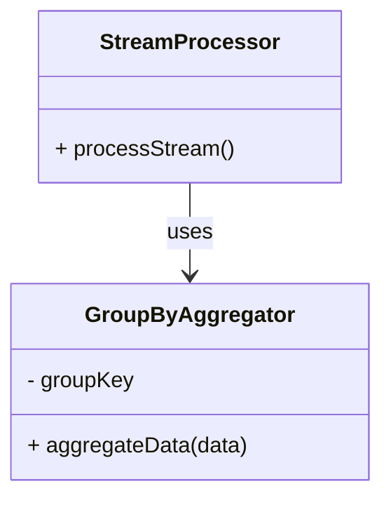

## Introduction to GroupBy Aggregation

In modern cloud architectures and real-time data processing systems, there is often a need to aggregate streams of data based on specific grouping criteria. The GroupBy Aggregation pattern is a fundamental design pattern used to summarize and analyze such data streams. It involves grouping data entries from a stream based on unique keys or fields and subsequently performing aggregation operations, such as count, sum, average, etc., on those groups.

### Common Use Cases
- Summarizing sales data by region and product category.
- Calculating the average latency of transactions grouped by service endpoint in a distributed system.
- Generating metrics such as total page views or unique users per hour in web analytics.

## Architectural Approaches

### 1. Single-Step GroupBy
Involves applying the group-by operation directly to incoming streams followed by an aggregation function. This approach is efficient for simple aggregations where data can be processed in memory.

### 2. Multi-Step GroupBy
This is an extension of the single-step approach, which involves dividing the aggregation task into smaller subtasks distributed across several nodes or stages. It is used for more complex scenarios that require high availability and resilience.

## Best Practices

- **Choosing the Key Wisely**: Ensure that the field or key being chosen for grouping results in a balanced distribution, avoiding skewed aggregations which can overload specific nodes.
- **Windowing in Streaming Contexts**: To handle infinite streams efficiently, apply time-based or count-based windowing techniques to segment data before applying group-by operations.

### Example Code in Scala (Using Apache Spark)

```scala
import org.apache.spark.sql.SparkSession
import org.apache.spark.sql.functions._

val spark = SparkSession.builder()
  .appName("GroupBy Aggregation Example")
  .getOrCreate()

val salesData = spark.read.json("sales_data.json")

val aggregatedData = salesData.groupBy("region", "productCategory")
  .agg(sum("salesAmount").as("totalSales"))

aggregatedData.show()
```

## UML Class Diagram Using Mermaid



### Related Patterns

- **Windowed Aggregation**: Used along with GroupBy Aggregation to handle continuous streams of data.
- **Stateful Processing**: Maintains state information, useful for tracking aggregates over sliding windows or complex event patterns.

## Additional Resources

- [Stream Processing with Apache Kafka](https://kafka.apache.org/documentation/streams/)
- [Apache Spark Structured Streaming](https://spark.apache.org/docs/latest/structured-streaming-programming-guide.html)
- [Reactive Streams Initiative](https://www.reactive-streams.org/)

## Summary

The GroupBy Aggregation pattern is integral to processing and analyzing large datasets across various domains, from sales analytics to system monitoring. By grouping and aggregating data efficiently in streaming environments, systems can derive meaningful insights while ensuring scalability and performance. Aligning with best practices and utilizing cloud-native tools and frameworks can enhance the process, especially in distributed systems handling vast inflows of diverse data.
