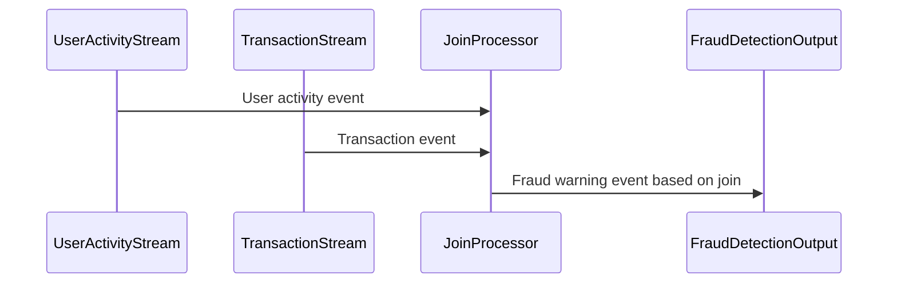

## Description

The Stream-to-Stream Join pattern is essential for applications that require real-time correlation of events occurring in multiple data streams. This pattern involves combining two or more continuous data streams on a shared key or condition, enabling systems to detect, aggregate, and act on related events from distinct sources as they happen. This capability is particularly useful in scenarios such as fraud detection, where different streams may represent various parts of a transactional process.

## Architectural Approach

To implement this pattern, you typically use stream processing frameworks like Apache Kafka Streams, Apache Flink, or Apache Beam. These frameworks provide mechanisms to handle the continuous nature of incoming data while efficiently joining streams based on predefined keys or conditions.

- **Windowing**: Since streams are potentially infinite, it's crucial to define time windows during which joining should occur. This limits the amount of data in memory and provides temporal context to the correlation.
- **State Management**: Efficient state management is critical as join operations can involve storing partial join results until a matching record is found in the other stream.
- **Late Arrivals and Out-of-Order Events**: The architecture should account for events arriving late or out of sequence, with mechanisms like watermarking to handle such discrepancies.

## Best Practices

1. **Window Selection**: Choose appropriate time windows (tumbling, sliding, or session windows) based on your application's requirements and expected data arrival patterns.
2. **Key Selection**: Use a key selection strategy that ensures efficient joins while minimizing state size and computation costs.
3. **State Optimization**: Implement state size management to optimize resources, using techniques like state expiration and compression.
4. **Event Time vs. Processing Time**: Prefer event time processing to accommodate variations in data arrival times and network latencies.

## Example Code

Here's a simplified example of a Stream-to-Stream Join using Apache Kafka Streams:

```java
StreamsBuilder builder = new StreamsBuilder();

// Stream of user activity events
KStream<String, UserActivity> userActivityStream = builder.stream("user-activity");

// Stream of transaction events
KStream<String, Transaction> transactionStream = builder.stream("transactions");

// Join streams on userId within a one-minute window
KStream<String, FraudWarning> fraudDetectionStream = userActivityStream
    .join(transactionStream,
        (userActivity, transaction) -> new FraudWarning(userActivity, transaction),
        JoinWindows.of(Duration.ofMinutes(1)),
        Joined.with(Serdes.String(), Serdes.serdeFrom(UserActivity.class), Serdes.serdeFrom(Transaction.class))
    );

// Output the joined stream
fraudDetectionStream.to("fraud-warnings");

KafkaStreams streams = new KafkaStreams(builder.build(), new Properties());
streams.start();
```

## Diagrams

### Sequence Diagram



## Related Patterns

- **Event Sourcing**: Captures all changes to an application's state as a sequence of events, which can be correlated across streams.
- **Complex Event Processing (CEP)**: Allows for detection of complex patterns within streams.

## Additional Resources

- [Kafka Streams Documentation](https://kafka.apache.org/documentation/streams/)
- [Apache Flink Join Documentation](https://nightlies.apache.org/flink/flink-docs-release-1.13/docs/dev/table/sql/queries/joins/)
- [Designing Data-Intensive Applications by Martin Kleppmann](https://dataintensive.net/)

## Summary

Stream-to-Stream Join is a powerful design pattern for processing and correlating events across multiple data streams in real-time. By carefully designing windowing, state management, and handling of late arrivals, organizations can create robust systems that swiftly respond to patterns in streaming data, such as detecting fraudulent activities or triggering timely alerts.
