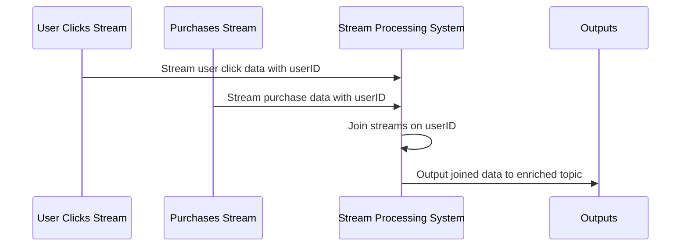

## Description

Key-based join is a critical pattern in stream processing that allows for enriching streaming data by merging information from different data streams based on common identifiers. This pattern is widely used in scenarios where you have multiple streams that hold partial data about an entity, and you need them combined to form a complete record. For instance, joining user clickstream logs with purchase transactions allows businesses to glean insights into user behavior directly related to purchasing decisions.

## Architectural Approaches

### 1. Apache Kafka Streams

Apache Kafka Streams is a powerful library often employed for implementing key-based joins. Kafka Streams offer a high-level DSL that simplifies the process of performing stream-to-stream joins. The streams are typically partitioned based on the key, to ensure that all records with a particular key are processed by the same instance. This partitioning is essential for stateful operations such as joins.

### 2. Flink's DataStream API

Apache Flink provides robust facilities for key-based joins through its DataStream API. Using keyed streams, Flink efficiently performs operations by maintaining state only for relevant keys, ensuring that only required data is retained for processing joins.

### 3. Spark Structured Streaming

In Apache Spark Structured Streaming, key-based joins are facilitated through its streaming DataFrame API. This approach mimics SQL-like joins while handling streaming data, ensuring that data matching the specific key is aggregated from both the sources efficiently.

## Example Code

Here is an example of how you might implement a key-based join using Kafka Streams in Java:

```java
StreamsBuilder builder = new StreamsBuilder();

// Define input topics
KStream<String, String> clicksStream = builder.stream("user-clicks-topic");
KStream<String, String> purchasesStream = builder.stream("user-purchases-topic");

// Perform key-based join
KStream<String, String> userEnrichmentStream = clicksStream.join(
    purchasesStream,
    (clickValue, purchaseValue) -> clickValue + "," + purchaseValue,
    JoinWindows.of(Duration.ofMinutes(5)),
    StreamJoined.with(Serdes.String(), Serdes.String(), Serdes.String())
);

// Output the joined stream
userEnrichmentStream.to("user-enriched-topic");
```

## Diagrams

Below is a sequence diagram illustrating the key-based join process between two streams:



## Related Patterns

- **Change Data Capture (CDC)**: Captures database changes to feed into a streaming pipeline—often used for updating keyed-join states in real-time.
- **Event Sourcing**: Manages application state by storing streams of events, which can be utilized in pair with key-based joins to reconstruct complex state logic from the combination of multiple streams.

## Additional Resources

- "Kafka Streams Documentation" provides primary resources for using Kafka Streams effectively in the key-based join pattern.
- "Hands-On State Management with Apache Flink" is a great book covering best practices for handling state in stream processing.
- "Mastering Structured Streaming with Apache Spark" offers deep insights into managing stream queries and state in Spark.

## Summary

In stream processing, key-based join patterns enable the merging of data across disparate streams using common identifiers. These joins facilitate the generation of comprehensive insights from real-time data feeds, proving invaluable to numerous domains, ranging from e-commerce clickstream analytics to real-time IoT data processing. By leveraging tools such as Apache Kafka Streams, Apache Flink, or Spark Structured Streaming, developers can implement efficient and scalable key-based joins to meet modern data integration requirements.
