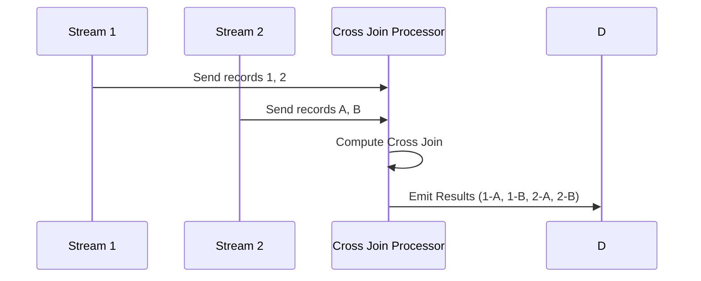

## Overview

In stream processing, the Cross Join pattern is used to produce a Cartesian product of two data streams. By joining every record from one stream with each record from another, the Cross Join can quickly become resource-intensive, given the exponential increase in result set size. While seldom applied due to its heavy resource demands, it can be essential for creating scenarios needing all possible combinations.

## Architectural Approach

### Usage Considerations

Cross Join is primarily used in scenarios requiring exhaustive combinations of data from two streams. Consider carefully if this approach is necessary as it can be very demanding on system resources and data size.

### Implementation 

```scala
// Assuming the use of Apache Flink for Stream Processing
val env: StreamExecutionEnvironment = StreamExecutionEnvironment.getExecutionEnvironment()

val stream1: DataStream[String] = env.fromElements("item1", "item2")
val stream2: DataStream[String] = env.fromElements("featureA", "featureB")

val crossJoinedStream: DataStream[(String, String)] = stream1.cross(stream2).map{ case (item, feature) => (item, feature) }

crossJoinedStream.print()

env.execute("Cross Join Example")
```

### Best Practices

- **Resource Monitoring**: Implement robust monitoring to anticipate and manage resource consumption.
- **Limited Scope**: Narrow the datasets with pre-filters if combined scope is too wide or unnecessary.
- **Scalability Management**: Utilize a distributed architecture capable of handling sudden spikes in data size.

## Example Use Cases

- **Feature Combination**: Creating a complete set of feature combinations for exhaustive testing in machine learning contexts.
- **Configuration Testing**: Automating the testing process of software configurations by generating every possible setup.

## Diagrams



## Related Patterns and Practices

- **Inner Join**: Combines records with matching values in specified fields, less resource intensive than Cross Join.
- **Left/Right Outer Join**: Includes all records from one stream and matched records from the other.

## Additional Resources

1. [Flink Cross Join in Stream Processing](https://flink.apache.org)
2. [Stream Processing Overview](https://streamprocessing.com)
3. [Data-Intensive Applications Design](https://dataintensive.net)

## Summary

The Cross Join pattern serves a specialized purpose in stream processing by generating the Cartesian product of two data streams. This exhaustive form of joining is highly resource-intensive, making careful consideration crucial before implementation. Where needed, such as in feature set testing, deploying a well-monitored and scalable architecture ensures the use cases are successfully met without impacting the underlying system stability.
