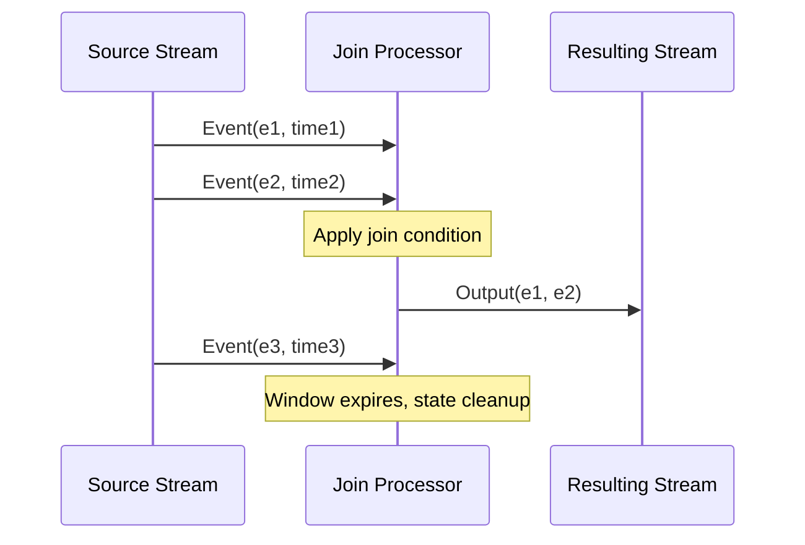

## Description

A Self Join in stream processing entails joining a data stream with itself, often based on varying time windows or differing conditions. This pattern is fundamentally used to detect correlations within the same stream by comparing different windows or subsets of data originating from that stream. It is especially useful for scenarios such as detecting duplicate entries, change data capture, or identifying patterns within a sequence of events.

In the context of distributed data processing systems like Apache Kafka Streams, Apache Flink, or Spark Structured Streaming, executing a Self Join requires leveraging stateful operations and windowed computations to manage and compare streaming data.

## Architectural Approach

1. **Windowing**: Apply window functions to segment the stream into overlapping or non-overlapping portions. Common window types include tumbling, sliding, and session windows. This is crucial as most self-joins rely on temporal conditions or event sequencing.

2. **State Management**: Maintain state efficiently to handle large volumes of data. Stream processing frameworks offer various state management mechanisms to store intermediate join results temporarily.

3. **Event Correlation**: Set up criteria for joining the stream with itself, such as transaction ID, user ID, or any other unique identifier.

4. **Deduplication**: Use Self Join to find duplicates by matching events within the specified condition and timeframe. Ensure sufficient delay handling to accommodate out-of-order data.

## Best Practices

- **Optimize State**: State can grow significantly; regular state cleanup and using compaction strategies can help manage memory and performance.

- **Late Data Handling**: Consider incorporating late event processing strategies to ensure correctness in high-latency environments.

- **Performance Tuning**: Tuning the window size according to the dataset's nature and volume can improve efficiency.

- **Fault Tolerance**: Leverage built-in fault-tolerant features to ensure data loss doesn't occur during join operations upon failures.

## Example Code

Here's an example of a Self Join using Apache Kafka Streams:

```java
StreamsBuilder builder = new StreamsBuilder();
KStream<String, Transaction> transactionsStream = builder.stream("transactions-topic");

// Self Join: Compare transactions within a 5-minute window
KStream<String, TransactionPair> joinedStream = transactionsStream
    .selectKey((key, transaction) -> transaction.getId())
    .join(transactionsStream,
        (leftTransaction, rightTransaction) -> new TransactionPair(leftTransaction, rightTransaction),
        JoinWindows.of(Duration.ofMinutes(5)),
        Joined.with(Serdes.String(), transactionSerde, transactionSerde));

joinedStream.foreach((key, transactionPair) -> {
    // Process the joined transactions - detect duplicates or patterns
});
```

## Diagrams

A Mermaid Sequence Diagram illustrating a Self Join:



## Related Patterns

- **Windowed Join**: Joins based on temporal windows, crucial for aligning events based on time.
- **Change Data Capture (CDC)**: Detects changes in databases and streams them; often uses self joins to track changes.
- **Event Sourcing**: Maintaining state as a sequence of events, which can include Self Joins for querying historical data sequences.

## Additional Resources

- [Kafka Streams: Join Operations](https://kafka.apache.org/documentation/streams/developer-guide/dsl-api.html#join-operations)
- [Apache Flink: Streaming Joins](https://nightlies.apache.org/flink/flink-docs-stable/dev/stream/operators/joining.html)
- [Spark Structured Streaming: Joins](https://spark.apache.org/docs/latest/structured-streaming-programming-guide.html#joins)

## Summary

The Self Join pattern is a powerful technique in stream processing for detecting relationships and duplicates within a single stream. By effectively utilizing state management and windowing, it is possible to derive meaningful insights and data deduplication in real-time analytics. Implementing this pattern requires careful consideration of the join conditions, window sizes, and state persistence strategies to ensure both accuracy and performance in processing complex streaming data flows.
