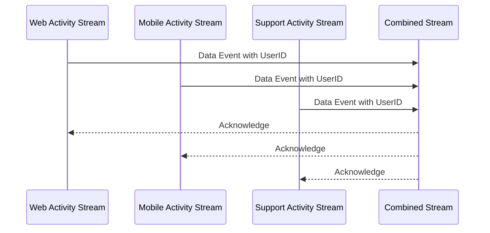

## Overview

The Multi-Way Join pattern is a sophisticated stream processing design paradigm that deals with concurrent combination of multiple data streams based on shared keys or conditions. This approach simplifies the process of correlating information from several different sources in real-time, making it indispensable for applications that require comprehensive, across-the-board data insights. Consider scenarios such as tracing and combining user activities across diverse channels like web interfaces, mobile devices, and customer support systems to create a unified analytics view.

## Architectural Approaches

Implementing a Multi-Way Join in stream processing systems typically involves the following architectural approaches:

1. **Windowed Joins**: These involve joining streams over a specific time window where only data that falls within the same time window are considered for joining.
2. **Stateful Processing**: Maintaining state for each stream that stores buffered records or intermediate join results, accommodating asynchronous arrival of data across the streams.
3. **Event-Time vs. Processing-Time Joins**: Handling synchronization based either on the time the event occurs (event-time) or when it is processed (processing-time).

## Example Code

Here's a basic example of implementing a Multi-Way Join using Apache Kafka Streams with Java:

```java
import org.apache.kafka.streams.KafkaStreams;
import org.apache.kafka.streams.StreamsBuilder;
import org.apache.kafka.streams.kstream.JoinWindows;
import org.apache.kafka.streams.kstream.KStream;
import org.apache.kafka.streams.kstream.Joined;

import java.time.Duration;

public class MultiWayJoinExample {

    public static void main(String[] args) {
        StreamsBuilder builder = new StreamsBuilder();

        // Define source streams
        KStream<String, String> webActivityStream = builder.stream("web-activity");
        KStream<String, String> mobileActivityStream = builder.stream("mobile-activity");
        KStream<String, String> supportActivityStream = builder.stream("support-activity");

        // Perform joins
        KStream<String, String> combinedStream = webActivityStream
                .join(mobileActivityStream,
                        (webActivity, mobileActivity) -> "WebActivity: " + webActivity + ", MobileActivity: " + mobileActivity,
                        JoinWindows.of(Duration.ofMinutes(5)),
                        Joined.with(Serdes.String(), Serdes.String(), Serdes.String()))
                .join(supportActivityStream,
                        (combinedActivity, supportActivity) -> combinedActivity + ", SupportActivity: " + supportActivity,
                        JoinWindows.of(Duration.ofMinutes(5)),
                        Joined.with(Serdes.String(), Serdes.String(), Serdes.String()));

        combinedStream.to("combined-output");

        KafkaStreams streams = new KafkaStreams(builder.build(), getProperties());
        streams.start();
    }

    private static Properties getProperties() {
        Properties props = new Properties();
        props.put(StreamsConfig.APPLICATION_ID_CONFIG, "multi-way-join-app");
        props.put(StreamsConfig.BOOTSTRAP_SERVERS_CONFIG, "localhost:9092");
        props.put(StreamsConfig.DEFAULT_KEY_SERDE_CLASS_CONFIG, Serdes.String().getClass().getName());
        props.put(StreamsConfig.DEFAULT_VALUE_SERDE_CLASS_CONFIG, Serdes.String().getClass().getName());
        return props;
    }
}
```

## Diagram

The following Mermaid sequence diagram illustrates a basic flow of the Multi-Way Join process involving three streams:



## Related Patterns

- **Windowed Join**: Encompasses the concept of performing joins within time-bound intervals.
- **Stateful Streaming**: Fundamental for managing states necessary for performing such comprehensive operations.
- **Event Sourcing**: The idea of capturing state changes as a sequence of events.

## Additional Resources

- *Designing Data-Intensive Applications* by Martin Kleppmann provides in-depth insight into join patterns and stream processing.
- Apache Kafka Documentation for the Kafka Streams API: [Apache Kafka Streams](https://kafka.apache.org/documentation/streams/)

## Summary

The Multi-Way Join pattern is crucial for applications needing a confluence of data from multiple concurrent streams. By leveraging real-time processing capabilities inherent in modern stream processing platforms such as Kafka Streams, this pattern enables complex data integration, ensuring timely analytics and responsive applications. Proper architectural choices, such as using windowed joins and maintaining state, provide the robustness necessary to effectively implement this pattern in production environments.
