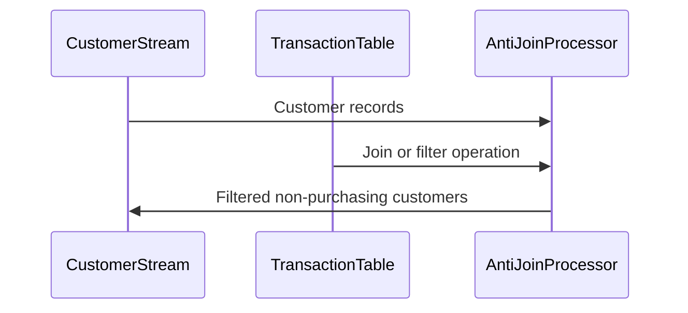

## Anti-Join

### Description

The Anti-Join pattern is a powerful mechanism in stream processing and data integration known for identifying records in one stream that have no corresponding records in another stream. It effectively filters out matched pairs, presenting only unmatched records. This functionality is crucial in scenarios where you need to audit or report entities that lack interaction or existence in another dataset. A classic use case includes identifying customers who have not engaged in specific activities, such as making a purchase, within a designated timeframe.

### Architectural Approach

In a typical streaming architecture, an Anti-Join pattern can be implemented using distributed stream processing platforms like Apache Kafka Streams, Apache Flink, or Spark Streaming. Here’s a high-level architectural approach:

1. **Data Streams Setup**: Establish two streams—one representing the primary dataset (e.g., customer details) and the other representing events or transactions (e.g., purchase records).

2. **State Store Configuration**: Use a State Store to maintain records from the secondary stream (transactions) for a comparison window. This setup requires efficient state management to ensure scalability and fault tolerance.

3. **Stream Processing Operations**:
    - **Stream Enrichment**: As each record from the primary stream arrives, check against the State Store for any corresponding record.
    - **Filter Logic**: Apply a filter operation to exclude records from the primary stream that have matches in the State Store. Only include records that have no corresponding entry.
   
4. **Time Window Consideration**: Implement a time-window logic to ensure relevance (e.g., checking for matches within the last six months).

### Example Code

Below is a simplified example using Kafka Streams in Scala to demonstrate the Anti-Join pattern:

```scala
import org.apache.kafka.streams.scala._
import org.apache.kafka.streams.scala.kstream._
import org.apache.kafka.streams.{KafkaStreams, StreamsConfig}
import org.apache.kafka.streams.scala.Serdes._

import java.util.Properties

object AntiJoinExample extends App {

  val props: Properties = {
    val p = new Properties()
    p.put(StreamsConfig.APPLICATION_ID_CONFIG, "anti-join-example")
    p.put(StreamsConfig.BOOTSTRAP_SERVERS_CONFIG, "localhost:9092")
    p
  }

  val builder: StreamsBuilder = new StreamsBuilder

  // Primary stream: Customers
  val customerStream: KStream[String, String] = builder.stream[String, String]("customer-topic")

  // Secondary stream: Transactions
  val transactionTable: KTable[String, String] = builder.table[String, String]("transaction-topic")

  // Anti-Join logic: Customers with no recent transactions
  val nonPurchasingCustomers: KStream[String, String] =
    customerStream.leftJoin(transactionTable)(
      (customer, transaction) => (customer, Option(transaction)),
      Joined.`with`(Serdes.String, Serdes.String, Serdes.String)
    ).filter((_, recordWithTransaction) => recordWithTransaction._2.isEmpty)

  nonPurchasingCustomers.to("non-purchasing-customers-topic")

  val streams: KafkaStreams = new KafkaStreams(builder.build(), props)
  streams.start()

  sys.ShutdownHookThread {
    streams.close()
  }
}
```

### Diagrams

Here is a Mermaid diagram showing the Anti-Join workflow:



### Related Patterns

- **Join Pattern**: Combines data from two streams based on a matching key.
- **Left Join**: Returns all records from one stream and the matched records from the second stream, if available.
- **Outer Join**: Returns records when there is a match in one of the input streams.

### Additional Resources

- Confluent’s [Kafka Streams Documentation](https://docs.confluent.io/platform/current/streams/index.html).
- Apache Flink’s [Join library](https://nightlies.apache.org/flink/flink-docs-release-1.13/dev/stream/operators/joining.html).
- "Stream Processing with Apache Kafka" by Mitch Seymour – A comprehensive guide for processing streams using Kafka.

### Summary

The Anti-Join pattern provides a strategic method in stream processing for revealing gaps or non-participating entities in datasets, which is crucial for analytical reporting and customer segmentation strategies. By effectively leveraging stream processing technologies and carefully orchestrated patterns, businesses can gain actionable insights into areas that require attention or strategy adjustment.
