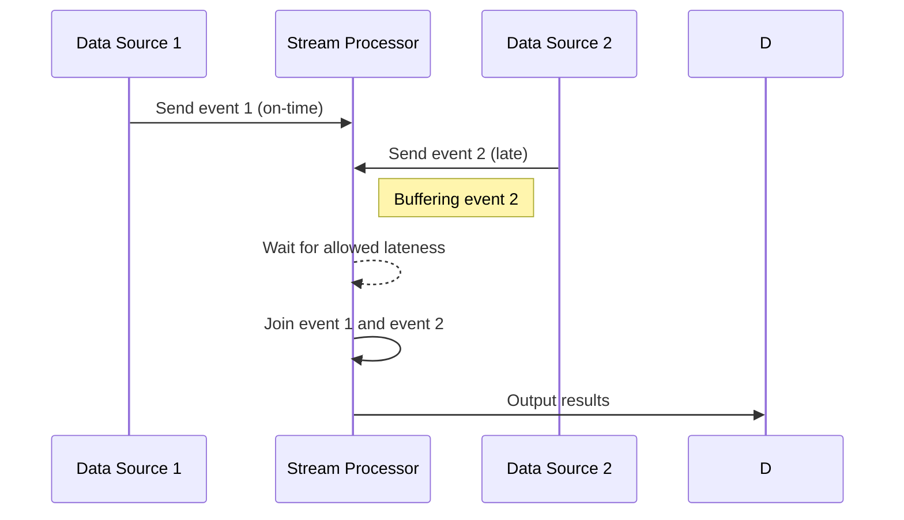

## Late Data Join: Handling Delayed Data in Stream Processing

In modern stream processing systems, handling data that arrives late poses significant challenges. This design pattern, **Late Data Join**, addresses these complexities by employing techniques such as buffering and adjusting window parameters. It ensures that all relevant events, even those that arrive after their expected window, are included in the joining process.

### Context

In streaming applications, data from different sources needs to be joined to derive meaningful insights. However, in real-world scenarios, network latency, variable processing speeds, or inherent characteristics of data sources can cause events to arrive out of order or late. Ignoring late data can result in incomplete or inaccurate computations.

### Problem

How can a stream processing system effectively handle data joins when events arrive later than anticipated?

### Solution

The solution is to either buffer or dynamically adjust window sizes to accommodate data that arrives past its expected time. This solution can be implemented in several ways:

1. **Buffering Late Events**: Temporarily store late-arriving data in a buffer until all expected joins are completed.
2. **Watermarking**: Use watermarks to track the progress of event time; this allows delayed data to be processed within a given watermark's allowance.
3. **Window Adjustments**: Dynamically extend window intervals to process any late-arriving events.

### Example Code

Below is a simplified example using Apache Flink, a popular stream processing framework. This example demonstrates handling late data using watermarks and dynamically adjusting window sizes.

```scala
import org.apache.flink.streaming.api.scala._
import org.apache.flink.streaming.api.windowing.time.Time

case class SensorReading(sensorId: String, timestamp: Long, value: Double)

val env = StreamExecutionEnvironment.getExecutionEnvironment
env.setStreamTimeCharacteristic(TimeCharacteristic.EventTime)

val sensorStream = env
  .fromCollection(Seq(
    SensorReading("sensor1", 1000L, 35.5),
    SensorReading("sensor1", 2000L, 36.1),
    // Assume this record arrives late.
    SensorReading("sensor1", 800L, 33.2)
  ))
  .assignAscendingTimestamps(_.timestamp)

val joinedStream = sensorStream
  .keyBy(_.sensorId)
  .timeWindow(Time.seconds(5))
  .allowedLateness(Time.seconds(2))
  .sum("value")

joinedStream.print()

env.execute("Late Data Join Example")
```

### Architectural Diagram



### Best Practices

- **Use Buffering Judiciously**: Limit the buffer size to prevent memory overflow.
- **Set Appropriate Watermarks**: Use precise watermark strategies to minimize late event waiting time.
- **Log and Monitor Late Arrivals**: Continuously monitor the system for late data patterns to adjust configurations as necessary.

### Related Patterns

- **Windowed Join**: Using time-based windows to batch process stream data joins.
- **Event Time Processing**: Leveraging event time rather than processing time to order and manage stream data.
- **Watermarking**: Emitting watermarks to denote event time progress.

### Additional Resources

- [Stream Processing with Apache Flink](https://flink.apache.org/)
- [Processing Late Data with Watermarks in Kafka Streams](https://kafka.apache.org/documentation/streams/)
- [Joining Unbounded Streams via Apache Beam](https://beam.apache.org/documentation/)

### Summary

Handling late data in stream processing environments is critical to maintaining the accuracy and completeness of data analyses. Utilizing strategies such as buffering, watermarking, and dynamic window adjustments ensures that late arrivals are retroactively processed, thus enhancing the reliability of streaming applications in a robust and scalable manner.
