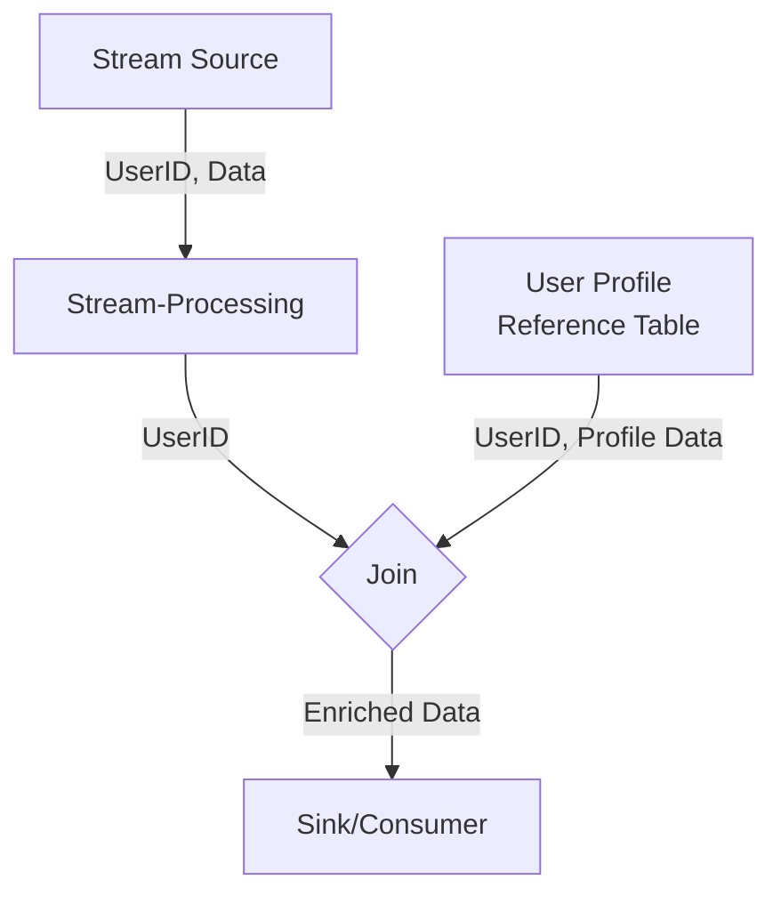

---

linkTitle: "Stream-to-Table Join"
title: "Stream-to-Table Join: Joining Streams with Static or Slowly Changing Tables"
category: "Join Patterns"
series: "Stream Processing Design Patterns"
description: "A pattern that involves joining a data stream with a static or slowly-changing table to enrich streaming events with additional context and information retrieved from this reference data source."
categories:
- Stream Processing
- Data Integration
- Real-time Analytics
tags:
- Stream Processing
- Data Enrichment
- Real-time Analytics
- Reference Data
- Join Patterns
date: 2024-07-07
type: docs

canonical: "https://softwarepatternslexicon.com/101/7/2"
license: "© 2024 Tokenizer Inc. CC BY-NC-SA 4.0"
---

## Introduction

The **Stream-to-Table Join** pattern is a powerful technique in stream processing systems where events from a fast-moving data stream are joined with data from a static or slowly changing table. This table can be a reference or lookup table, usually stored in a database or an in-memory cache. The goal is to enrich streaming data with additional context for improved analytics, reporting, or decision making.

## Detailed Explanation

In many real-time data processing scenarios, a stream of events may lack certain essential pieces of information necessary for effective processing. This missing data often resides in static or slowly-changing tables that serve as reference or lookup stores. The Stream-to-Table Join pattern helps close this gap by combining these disparate data sources into enriched, single-event outcomes.

### Use Cases:
- **Enriching Clickstream Data**: Online user activity streams joined with customer profile information to understand user behavior better based on demographic data.
- **IoT Sensor Data**: Real-time sensor data streams joined with calibration or configuration parameters stored in a table to normalize or contextualize raw sensor readings.
- **Financial Transactions**: Live transaction streams enriched with customer relationship data to provide better fraud detection or personalized responses.

### Architectural Considerations:

1. **Data Consistency and Latency**: Ensuring consistency between the streaming data and table data is crucial as it can impact analytical accuracy. Table data should be relatively static or change slowly.

2. **Performance**: Joins can be CPU and memory-intensive, depending on the size of the stream and table. Utilizing in-memory key-value stores or cached data can improve performance.

3. **Data Synchronization**: Depending on the storage used for the table data, mechanisms may be required to ensure the table data is fresh enough for accurate enrichment.

4. **Fault Tolerance**: Ensure that the system can handle failures gracefully, especially when accessing and joining stream data with table data.

## Example Code

Here's a simple example using Apache Flink (a popular stream processing framework):

```java
DataStream<Event> eventStream = ...; // Your streaming data source.
DataStream<UserProfile> userProfileTable = ...; // Simulated as a stream here, normally a static dataset or periodically updated.

DataStream<EnrichedEvent> enrichedStream = eventStream
    .keyBy(event -> event.getUserId())
    .connect(userProfileTable.keyBy(profile -> profile.getUserId()))
    .flatMap(new RichCoFlatMapFunction<Event, UserProfile, EnrichedEvent>() {
        
        private Map<String, UserProfile> cache = new HashMap<>();
        
        @Override
        public void flatMap1(Event event, Collector<EnrichedEvent> out) throws Exception {
            UserProfile profile = cache.get(event.getUserId());
            if (profile != null) {
                out.collect(new EnrichedEvent(event, profile));
            } else {
                // handle missing user profile case
            }
        }

        @Override
        public void flatMap2(UserProfile profile, Collector<EnrichedEvent> out) throws Exception {
            cache.put(profile.getUserId(), profile);
        }
    });
```

## Diagram



## Related Patterns

- **Table-to-Table Join**: Combines two static or slowly-changing tables rather than incorporating dynamic streams.
- **Stream-to-Stream Join**: A pattern where two live streams are joined, typically requiring stateful processing to manage temporal discrepancies.
- **Depersonalization**: Important when elements such as user profiles are used; minimizing PII after enrichment to safeguard privacy.

## Additional Resources

- Apache Flink Documentation: [DataStream API Guide](https://ci.apache.org/projects/flink/flink-docs-stable/dev/datastream/)
- Confluent Blog: [Joins in KSQL & Apache Kafka for Stream Processing](https://www.confluent.io/stream-processing-cookbook/ksql-join/)

## Summary

The Stream-to-Table Join pattern is invaluable in scenarios where dynamic event streams need additional context or enrichment from static or slowly changing data sources. Implementations must weigh factors such as data freshness, performance, and fault tolerance to ensure successful integration. Efficiently applied, this pattern greatly enhances the value and insights derived from stream processing architectures.
