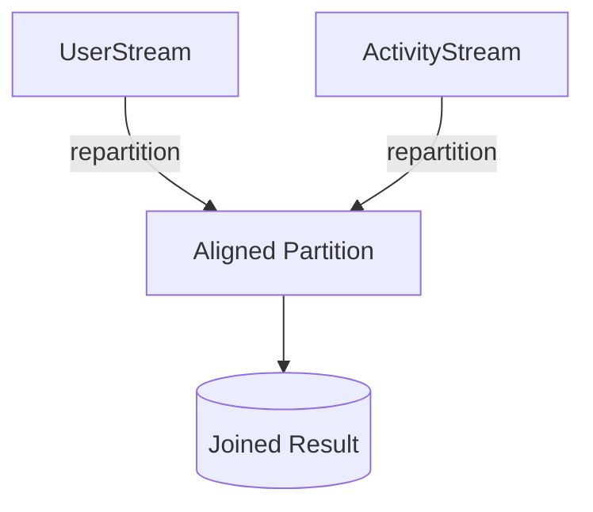

## Overview

The Repartitioned Join pattern is crucial in distributed stream processing environments where data from multiple streams need to be joined based on key values. The challenge typically arises when different partitions of streams may not align, necessitating a strategy that redistributes or "repartitions" these streams to ensure keys align correctly across nodes or partitions.

## Problem Statement

In distributed systems, stream processing frameworks like Apache Kafka or Apache Flink often deal with data distributed across various partitions. When joining two streams, it's imperative that keys from both streams are processed on the same partition to ensure that the join operation is efficient and correct. Misaligned keys can cause increased latency and resource utilization.

## Solution

The Repartitioned Join pattern addresses this by redistributing data based on the join keys to align partitions across different streams. This typically involves changing the partitioning strategy to group similar keys on the same node or partition before performing the join operation. 

Here's a simplified conceptual flow:

1. **Identify Join Key**: Determine the keys used for the join operation.
2. **Repartition Streams**: Adjust partitioning of the streams such that keys align across streams.
3. **Perform the Join**: Execute the join operation, now localized to matching keys across aligned partitions.

## Example

Consider two streams in a Kafka-based architecture: `UserStream` and `ActivityStream`. To join these streams on a user ID, they must be repartitioned to ensure all events related to any given user are processed on the same node.



In this diagram, `UserStream` and `ActivityStream` are first repartitioned so that entries with the same user ID are mapped to the same partition, enabling efficient joining.

```java
// Example using Kafka Streams
KStream<String, User> userStream = builder.stream("user-topic");
KStream<String, Activity> activityStream = builder.stream("activity-topic");

// Repartitioning the streams based on userId
userStream = userStream.map(...).through("user-repartitioned-topic");
activityStream = activityStream.map(...).through("activity-repartitioned-topic");

// Joining the streams
KStream<String, EnrichedUserEvent> joinedStream = userStream.join(
    activityStream,
    (user, activity) -> new EnrichedUserEvent(user, activity),
    JoinWindows.of(Duration.ofMinutes(5))
);
```

## Related Patterns

- **Broadcast Join**: Useful when one of the input streams is small and can be broadcasted to all partitions.
- **Windowed Join**: Aligns streams temporarily based on time windows, dealing with event time differences.
- **CoGroup**: Multiple streams are cogrouped before executing a join, which can involve some form of implicit repartitioning.

## Best Practices

- **Data Volume Consideration**: Be wary of high data shuffle costs. Repartitioning could be expensive in terms of network I/O.
- **Key Cardinality**: Minimize the cardinality of the keys to reduce partitioning stress.
- **Windowing**: If applicable, use windowed joins to mitigate issues with data that don't align perfectly in time.

## Additional Resources

- [Kafka Streams Documentation](https://kafka.apache.org/documentation/streams)
- [Designing Data-Intensive Applications by Martin Kleppmann](https://dataintensive.net/)
- [Stream Processing with Apache Flink](https://ci.apache.org/projects/flink/flink-docs-stable/)

## Summary

The Repartitioned Join is an essential design pattern in stream processing that ensures efficient joining by realigning data streams based on their keys. This ensures that distributed systems can handle join operations smoothly, maintaining performance and correctness across varied workloads.

By implementing this pattern prudently, you can vastly improve the efficiency of your stream processing tasks, thereby enabling more accurate and faster data insights.
