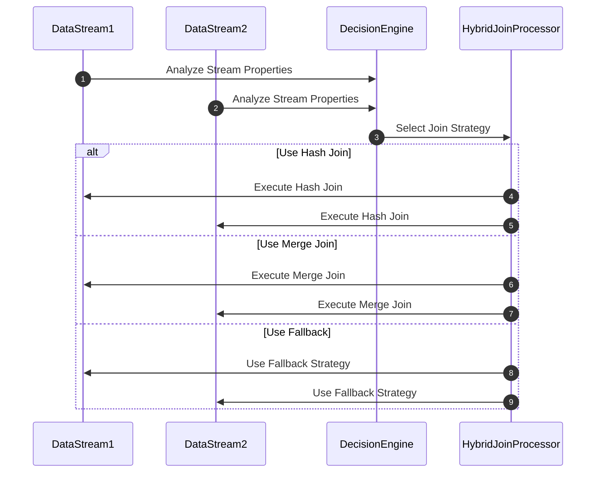

## Introduction

In stream processing systems, joining data from different sources efficiently is critical to achieving high performance. The Hybrid Join design pattern leverages multiple join strategies, such as hash join and merge join, and applies them based on data characteristics to optimize performance and resource utilization.

## Detailed Explanation

Hybrid Join combines join strategies to address their respective limitations and capitalize on their strengths. Below are the two primary strategies typically involved in Hybrid Join:

### Hash Join

- **Strengths**: Hash joins are well-suited for situations where at least one of the tables or streams is small enough to fit into memory, enabling constant-time access.
- **Limitations**: They may suffer from performance degradation if the hash table does not fit into memory or in scenarios involving highly skewed data distributions.

### Merge Join

- **Strengths**: Merge joins excel with ordered and sorted datasets, providing efficient performance with O(n) complexity when both datasets are sorted on the join key.
- **Limitations**: Requires inputs to be sorted upfront, which can be computation-heavy if data is not naturally ordered, leading to potential performance bottlenecks.

By leveraging the Hybrid Join approach, systems can dynamically decide which join strategy to use based on data stream properties, size, current system load, and available resources.

## Architectural Approach

The Hybrid Join pattern can be architected using the following steps:

1. **Data Stream Analysis**: Continuously monitor incoming data characteristics such as size, order, and distribution.
2. **Decision Engine**: Implement a decision engine that chooses the join strategy in real-time based on the analysis from step 1.
3. **Join Execution**: Deploy hash joins for small datasets or in-memory keyed operations, and use merge joins when handling sorted data streams or significant datasets that don't fit entirely in memory.
4. **Monitoring and Feedback**: Use performance metrics to refine decision criteria over time and ensure optimal join strategy selection continuously.

## Example Code

Below is an example using Java with a hypothetical streaming library to implement a Hybrid Join:

```java
public class HybridJoinProcessor {

    public void processStreams(Stream<TableRow> stream1, Stream<TableRow> stream2) {
        boolean isStream1Small = isSmallStream(stream1);
        boolean isStream2Sorted = isSortedStream(stream2);

        // Using hybrid join
        if (isStream1Small) {
            joinUsingHashJoin(stream1, stream2);
        } else if (isStream2Sorted) {
            joinUsingMergeJoin(stream1, stream2);
        } else {
            fallbackToAppropriateJoin(stream1, stream2);
        }
    }

    private boolean isSmallStream(Stream<TableRow> stream) {
        // Implement logic to determine if stream is small enough for a hash join
    }

    private boolean isSortedStream(Stream<TableRow> stream) {
        // Implement logic to check if stream is already sorted
    }

    private void joinUsingHashJoin(Stream<TableRow> stream1, Stream<TableRow> stream2) {
        // Implement hash join logic
    }

    private void joinUsingMergeJoin(Stream<TableRow> stream1, Stream<TableRow> stream2) {
        // Implement merge join logic
    }

    private void fallbackToAppropriateJoin(Stream<TableRow> stream1, Stream<TableRow> stream2) {
        // Implement a fallback strategy for joining
    }
}
```

## Diagrams

### Hybrid Join Sequence Diagram



## Related Patterns

- **Hash Join Pattern**: Focuses exclusively on in-memory joining techniques suited for small datasets.
- **Merge Join Pattern**: Targets scenarios where data streams are pre-sorted, optimizing for merge-based joins.
- **Broadcast Join Pattern**: Useful when joining a large dataset with a relatively small static dataset, broadcasting the small dataset across nodes.

## Additional Resources

- [Stream Processing With Apache Flink](https://flink.apache.org/)
- [Real-Time Streams with Apache Kafka](https://kafka.apache.org/)
- [Designing Data-Intensive Applications by Martin Kleppmann](https://dataintensive.net/)

## Summary

The Hybrid Join design pattern is a flexible approach to optimize join operations in stream processing systems. By selectively choosing between hash and merge join strategies, a Hybrid Join system adapts to varying data characteristics and workloads, balancing the trade-offs between speed, resource usage, and computational overheads. This pattern is crucial for real-time analytics and performance-critical applications that deal with diverse data stream environments.
