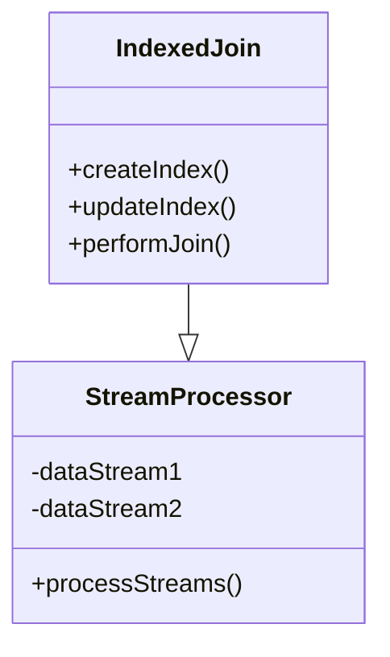

## Indexed Join

### Introduction
In the realm of stream processing, performing efficient joins on large data sets is a critical challenge. The **Indexed Join** pattern employs the use of indexes on join keys to dramatically expedite the join process, optimize resource usage, and enhance real-time data processing capabilities.

### Design Pattern Description
An Indexed Join involves constructing an index structure over the join keys to facilitate rapid data access during the join operation. This pattern is particularly useful in stream processing systems where data arrives in high volumes and needs to be processed with minimal latency.

### Architectural Approaches
1. **In-Memory Indexing**: Constructs an in-memory index for small to medium datasets, allowing quick joins but limited by memory constraints.
2. **Distributed Indexing**: For handling larger datasets, distribute the index across nodes in a cluster, enabling horizontal scale-out.
3. **Hybrid Indexing**: Combines memory and disk-based structures to balance speed and scale.

### Best Practices
- **Index Selection**: Choose appropriate fields for indexing that maximize filtering and minimize unnecessary data processing.
- **Index Maintenance**: Regularly update indexes to reflect real-time data changes, ensuring accuracy and efficiency.
- **Balanced Resource Utilization**: Optimize the trade-off between memory usage and processing speed, particularly in distributed environments.

### Example Code
```scala
// Scala example using Apache Flink
val inputStream1: DataStream[(String, String)] = // Stream of (userID, userData)
val inputStream2: DataStream[(String, String)] = // Stream of (userID, transactionData)

val indexedJoinResult: DataStream[(String, String, String)] = inputStream1
     .keyBy(_._1)
     .connect(inputStream2.keyBy(_._1))
     .map(new KeyedCoProcessFunction[String, (String, String), (String, String), (String, String, String)] {
       override def processElement1(value: (String, String), ctx: Context, out: Collector[(String, String, String)]): Unit = {
         // Index the first input by userID
       }
       
       override def processElement2(value: (String, String), ctx: Context, out: Collector[(String, String, String)]): Unit = {
         // Look up matches in the indexed first input
       }
     })
```

### Diagrams


### Related Patterns
- **Windowed Join**: Focuses on joining streams within specific time windows, potentially using indexes for optimization.
- **Hash Join**: Utilizes hash-based indexing, offering an alternative indexing approach for rapid joins.
- **Stateful Stream Processing**: Maintains state across streams which can benefit from indexed access.

### Additional Resources
- [Apache Flink Documentation](https://flink.apache.org/)
- [Kafka Streams API](https://kafka.apache.org/documentation/streams/)
- [Google Cloud Dataflow](https://cloud.google.com/dataflow/)

### Summary
The Indexed Join pattern is crucial for achieving efficient stream processing by leveraging indexes for rapid access to join keys. By integrating the Indexed Join into your architecture, you can ensure scalability, reduced latency, and effective resource use, making it ideal for handling the challenges posed by high-throughput, real-time data processing environments.

> ___Leverage the power of indexes to revolutionize your stream processing performance today.___
