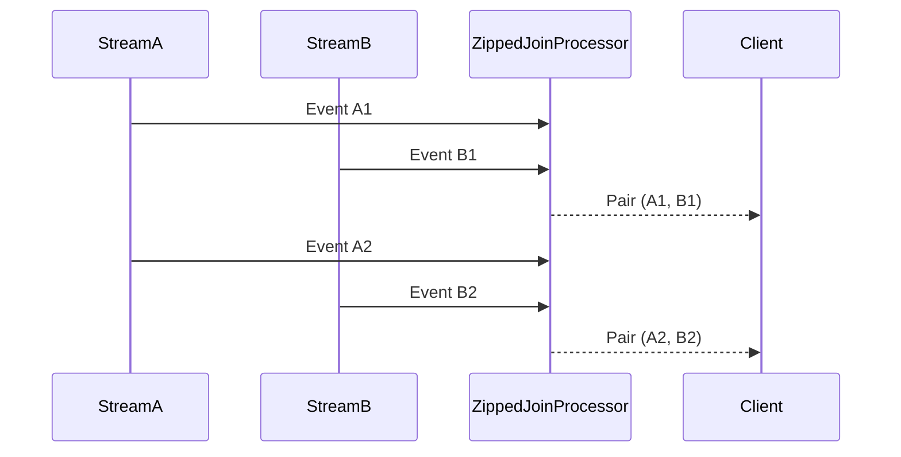

## Introduction

The **Zipped Join** pattern is a stream processing design pattern used to join two data streams that have perfectly aligned events in a one-to-one relationship. This pattern is particularly useful in scenarios where both streams are ordered and every event in one stream corresponds precisely with an event in the other stream. Common applications include scenarios with synchronized input streams, such as sensor data or analytics events like clicks and impressions in online advertising systems.

This pattern, while straightforward in concept, requires careful handling of data ordering and synchronization between streams to ensure accuracy and efficiency.

## Architectural Approach

### Key Concepts

- **Pairing**: Events are paired based on their position and not filtered or grouped by a key. The ith event from Stream A is paired with the ith event from Stream B.
- **Stream Alignment**: Both streams must be ordered and synchronized, meaning the handling system must ensure no drift between the two streams.
- **Deterministic Processing**: Ensures consistent processing outputs by aligning streams deterministically.

### Implementation Steps

1. **Stream Source Definition**: Define sources for both streams ensuring they are synchronized.
2. **Stream Processing Setup**: Use a stream processing framework (e.g., Apache Kafka Streams, Flink) to handle joining logic.
3. **Align and Zip**: Implement buffering or windowing mechanisms if needed to temporal order of events for correctness.
4. **Join Execution**: Apply a zipper logic that pairs events from both streams based on their index.

### Considerations

- Both streams must maintain their order without delays, which can be challenging in distributed or faulty systems.
- The Zipped Join should not be used if there is any possibility of missing events unless there is a strategy for dealing with these (e.g., placeholders).
- Buffering and latency need to be managed, as waiting for the perfect alignment could introduce delay.

## Example Code

```java
// Using Java Streams API as a conceptual example

List<String> streamA = List.of("click1", "click2", "click3");
List<String> streamB = List.of("impression1", "impression2", "impression3");

List<String> zippedJoin = IntStream.range(0, Math.min(streamA.size(), streamB.size()))
        .mapToObj(i -> streamA.get(i) + " with " + streamB.get(i))
        .collect(Collectors.toList());

zippedJoin.forEach(System.out::println);
// Output:
// click1 with impression1
// click2 with impression2
// click3 with impression3
```

## Diagrams

### Zipped Join Process



## Related Patterns

- **Windowed Join**: Used when events are joined based on time windows rather than strict order.
- **Keyed Stream Join**: Joins streams using keys extracted from each event, useful for unordered streams.

## Additional Resources

- [The Apache Kafka Documentation](https://kafka.apache.org/documentation/streams/)
- [Apache Flink Documentation](https://ci.apache.org/projects/flink/flink-docs-stable/)
- [Stream Processing with Apache Spark](https://spark.apache.org/docs/latest/streaming-programming-guide.html)

## Summary

The Zipped Join pattern is instrumental in aligning and processing ordered streams in cases where event order is deterministic and consistent across both streams. By leveraging this pattern, data analysts and engineers can ensure accurate and efficient real-time data analysis when the conditions are met for synchronized stream input. Understanding its limitations and ensuring the reliability of source streams are critical to successfully implementing this pattern.
