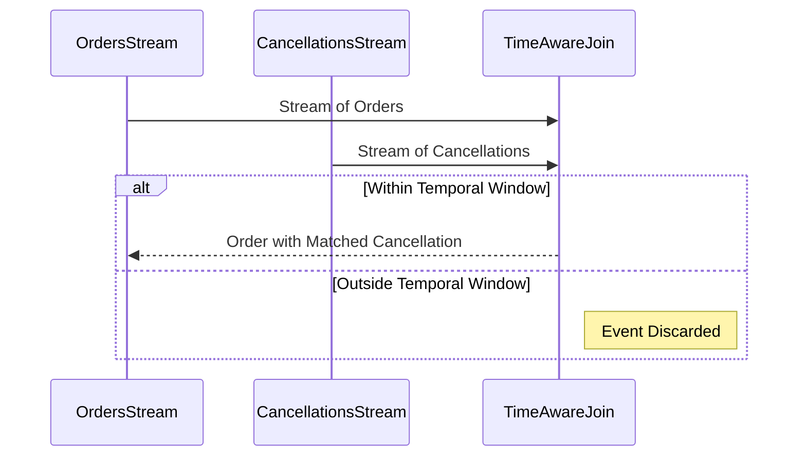

## Introduction

The Time-Aware Join pattern is a crucial design pattern in stream processing, particularly when dealing with time-sensitive data. This pattern ensures that the join logic between streams considers the temporal dimension, thereby ensuring the relevancy and correctness of the data being processed. Through the use of time constraints, Time-Aware Join can filter and link related streams of data that meet specific temporal criteria.

## Detailed Explanation

In typical join operations, two streams or datasets are combined based on some logical condition, most commonly a matching key. Time-Aware Join takes this association a step further by adding a temporal condition that dictates how old the data can be in the joining streams, ensuring relevancy in rapidly changing data environments.

### Core Concepts

- **Temporal Window**: Defines the timeframe within which the join operation should occur. Data records outside of this window are not considered for the join.
- **Event Time vs. Processing Time**: Event time refers to the timestamp of the event itself, while processing time is the timestamp when an event is processed by the system. Time-Aware Join typically operates on event times to ensure accuracy.
- **Watermarks**: In distributed stream processing systems, watermarks are special data markers that indicate that all events up to a certain timestamp have been received in a stream. They help handle late-arriving data.

## Example Code

Let's demonstrate a basic Time-Aware Join using Kafka Streams to associate order cancellations with orders placed within the last hour:

```java
StreamsBuilder builder = new StreamsBuilder();

// Assume we have streams of orders and cancellations
KStream<String, Order> ordersStream = builder.stream("orders");
KStream<String, OrderCancellation> cancellationsStream = builder.stream("order_cancellations");

// Define the join window
JoinWindows window = JoinWindows.of(Duration.ofHours(1));

KStream<String, Tuple2<Order, OrderCancellation>> joinedStream = ordersStream.join(
  cancellationsStream,
  (order, cancellation) -> new Tuple2<>(order, cancellation),
  window,
  StreamJoined.with(Serdes.String(), new OrderSerde(), new OrderCancellationSerde())
);

joinedStream.to("joined_orders_and_cancellations");
```

## Diagrams

### Time-Aware Join Sequence Diagram



## Related Patterns

- **Windowed Join**: Like Time-Aware Join, but more generalized and may not necessitate considerations of event and processing times.
- **Session Window Join**: Specifically targets session patterns where periods of user activity require accurate tracking and analysis.
- **Late Data Handling**: A subset of configurations dealing with late-arriving records that Time-Aware Join might need to address.

## Additional Resources

- Kafka Streams Documentation: [Kafka Streams Join](https://kafka.apache.org/documentation/streams/developer-guide/dsl-api.html#joins)
- "Designing Data-Intensive Applications" by Martin Kleppmann – offers foundational knowledge in stream and batch processing patterns.

## Summary

The Time-Aware Join pattern enhances stream processing systems by providing a mechanism that leverages temporal constraints to ensure the data is not only logically sound but also temporally relevant. This pattern is particularly powerful in contexts where time-sensitive data such as financial transactions, sensor data, or user interactions are involved. By integrating concepts such as event time, processing time, and watermarks, a Time-Aware Join becomes an indispensable tool in orchestrating coherent and timely data processing pipelines in modern data architectures.
