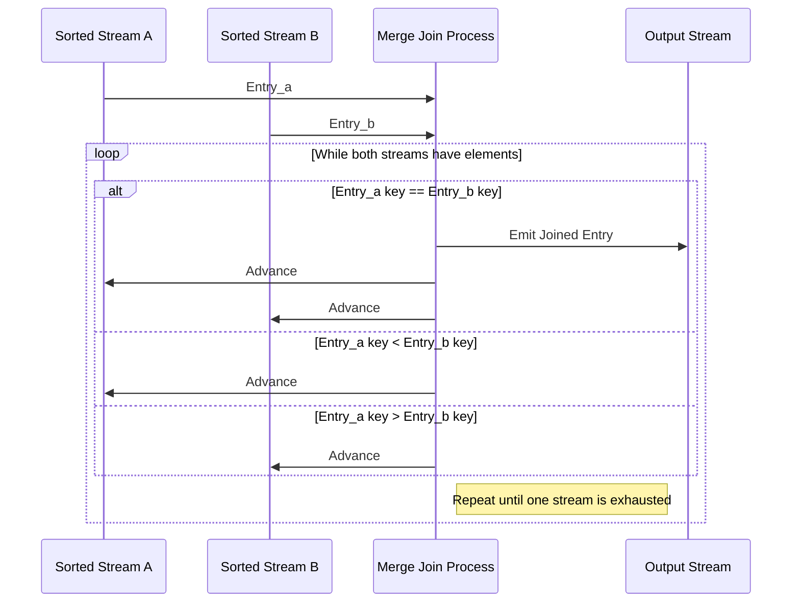

## Merge Join Pattern

### Overview

The Merge Join design pattern is a sophisticated approach used to join two or more sorted streams of data by leveraging their inherent order. This pattern becomes particularly advantageous when dealing with large datasets where streams are already sorted based on a specific key. By sequentially advancing through each stream and performing comparisons, this method efficiently merges data items that satisfy join conditions, such as equality of keys.

### Architectural Approach

The main concept behind the Merge Join pattern is its linear pass through each input stream. Since the streams are sorted, the join operation avoids the necessity of comparing each item with every item from other streams—a computationally prohibitive task for unordered datasets. Instead, only items needed to satisfy the join condition are compared, making this approach highly efficient.

#### Key Steps:
1. **Initialization**: Begin from the start of each sorted stream.
2. **Comparison**: Compare data items from each stream based on the join key.
3. **Advancement**: Move forward in one or both streams depending on the comparison result:
   - If keys match, create a joined result and advance all streams.
   - If keys do not match, advance in the stream with the smaller key to catch up.
4. **Repeat**: Continue comparing and advancing until the end of one or both streams is reached.

### Example

Consider merging two sorted log streams from different microservices based on a common `timestamp`. Each log entry details an event recorded by the system.

```java
public class MergeJoinExample {
    public static void main(String[] args) {
        List<LogEntry> serviceALogs = getSortedLogsFromServiceA();
        List<LogEntry> serviceBLogs = getSortedLogsFromServiceB();
        List<MergedLog> mergedLogs = mergeJoinLogs(serviceALogs, serviceBLogs);
    }

    public static List<MergedLog> mergeJoinLogs(List<LogEntry> logA, List<LogEntry> logB) {
        List<MergedLog> mergedLogs = new ArrayList<>();
        int i = 0, j = 0;

        while (i < logA.size() && j < logB.size()) {
            LogEntry entryA = logA.get(i);
            LogEntry entryB = logB.get(j);

            if (entryA.getTimestamp().equals(entryB.getTimestamp())) {
                MergedLog merged = new MergedLog(entryA, entryB);
                mergedLogs.add(merged);
                i++;
                j++;
            } else if (entryA.getTimestamp().compareTo(entryB.getTimestamp()) < 0) {
                i++;
            } else {
                j++;
            }
        }
        return mergedLogs;
    }
}
```

### Diagram



### Related Patterns

- **Sort-Merge Join**: Similar to Merge Join but operates on initially unsorted datasets by first sorting them.
- **Hash Join**: Useful for unsorted datasets by using hash structures to perform joins, often more efficient when streams are unordered.

### Additional Resources

- *Book*: "Streaming Systems: The What, Where, When, and How of Large-Scale Data Processing" by Tyler Akidau, Slava Chernyak, and Reuven Lax.
- *Article*: "Data Stream Development with Apache Flink and the Merge Join Pattern" on Tech Blogs.

### Summary

The Merge Join pattern emerges as an exceptional solution when dealing with pre-sorted data streams, offering performance advantages over traditional join methods. By strategically advancing through streams and performing minimal comparisons, Merge Join minimizes computation and optimizes data integration processes in environments involving large-scale or real-time data ingestion.
