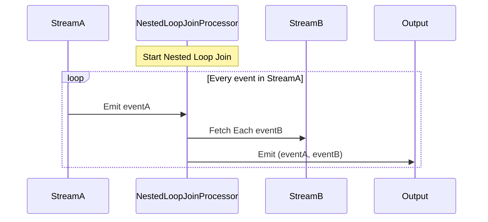

## Nested Loop Join: Overview

In data stream processing, the **Nested Loop Join** is a straightforward method used to join two data streams. It involves comparing every single event from one stream (say, Stream A) with every event from another stream (Stream B). Although this method ensures a thorough comparison -- which can be advantageous in certain scenarios such as feature combinations in A/B testing -- it can become overwhelmingly inefficient with large datasets due to its O(n*m) complexity, where n and m are the numbers of events in the respective streams.

## Use Cases

- **A/B Testing in Feature Combinations**: When testing combinations of features, a Nested Loop Join can help by ensuring that every possible feature pairing is evaluated, allowing precise insights into which combinations deliver the highest performance.
- **Data Collation in ETL Processes**: In scenarios where data richness is more critical than operational efficiency, nested loop joins help combine different streams to create a comprehensive dataset.

## Detailed Explanation and Example Code

In a typical stream processing setup using languages such as Java or Scala with frameworks like Apache Kafka Streams or Flink, a nested loop join implementation might look like the following:

### Java with Apache Flink Example

```java
DataStream<Tuple2<String, Integer>> streamA = /* Initialize Stream A */;
DataStream<Tuple2<String, Integer>> streamB = /* Initialize Stream B */;

DataStream<Tuple2<Tuple2<String, Integer>, Tuple2<String, Integer>>> joinedStream = streamA.flatMap(new FlatMapFunction<Tuple2<String, Integer>, Tuple2<Tuple2<String, Integer>, Tuple2<String, Integer>>>() {
    @Override
    public void flatMap(Tuple2<String, Integer> eventA, Collector<Tuple2<Tuple2<String, Integer>, Tuple2<String, Integer>>> out) {
        for (Tuple2<String, Integer> eventB : streamB) {
            out.collect(new Tuple2<>(eventA, eventB));
        }
    }
});
```

### Explanation

1. **Stream Initialization**: Define two streams, Stream A and Stream B, consisting of Tuple2 of some data types.
2. **FlatMap for Exhaustive Comparison**: Use the `flatMap` function utility of Apache Flink to iterate over events from Stream B for each event from Stream A.
3. **Collector for Outputs**: Emit the paired tuples of events from both streams to create the compounded data output via a collector.

## Diagrams

### UML Sequence Diagram with Mermaid



## Related Patterns

- **Hash Join**: Employs a hash table to quickly match streaming events in constant time which can be far more efficient than nested loop joins, especially with large datasets.
- **Windowed Joins**: Use grouping and specific time windows to limit the number of comparisons, providing efficiency through reduced computation space.

## Additional Resources

- [Flink's DataStream API Documentation](https://nightlies.apache.org/flink/flink-docs-release-1.13/docs/dev/datastream/)
- [Kafka Streams Join Principles](https://kafka.apache.org/24/documentation/streams/developer-guide/dsl-api.html#joining)
- [Stream Processing and Join Algorithms](https://www.oreilly.com/library/view/stream-processing-and/9781491983874/)

## Summary

The Nested Loop Join pattern in stream processing offers a simple but comprehensive way to compare every incident across two data streams. While practical for exhaustive data matching cases like A/B testing, it is computationally expensive and not always suitable for larger datasets. Understanding its utility in relation to its more efficient counterparts, like hash joins or windowed joins, is key to leveraging its strengths effectively in a real-world, large-scale processing environment.
