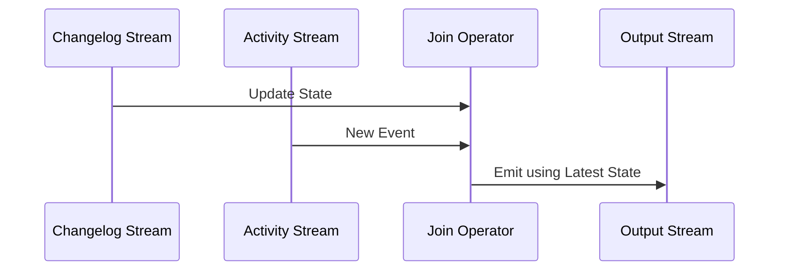

## Changelog Join

### Description
The Changelog Join is a stream processing pattern where multiple data streams are combined, paying particular attention to one stream representing changes to a dataset, often termed as a changelog. This pattern ensures that the latest state is processed and utilized when performing joins, which is crucial for applications requiring real-time data consistency and relevance.

In many real-time streaming applications, one might have a stream (referred to as a *changelog*) reflecting updates to a set of base data. For example, user preferences, account balances, or inventory levels might be continuously updated. The Changelog Join pattern allows applications to merge this changing data with other streams—like transaction logs, user activity events, or system metrics—thus facilitating dynamic and contextually accurate operations.

### Example Scenario
Consider an application where we need to dynamically update user interfaces based on user preferences and their recent activity logs. As users update their preferences, the changes are emitted as a *changelog*. Simultaneously, the user actions (such as clicks or purchases) generate an activity log stream. By employing the Changelog Join pattern, you ensure that any downstream analytics or real-time processing logic reflects the most current state of user preferences when responding to latest user activities.

### Key Components of Changelog Join
- **Changelog Stream**: Represents incremental changes to a dataset. This can be emitted by a database capturing changes (like a WAL – Write Ahead Log) or through explicit update events.
- **Event/Activity Streams**: These streams contain events that need to be interpreted in the context of the latest available state from the changelog.
- **Join Operator**: A processing component that merges the two streams ensuring that operations use the most recent state.

### Architectural Considerations

#### Benefits
- **Real-Time Consistency**: As the stream processing model inherently seeks to provide consistent updates in near-real time, the Changelog Join pattern ensures that merging operations leverage up-to-date state information.
- **Scalability and Decoupling**: Allows for scaling of systems by decoupling state updates from other event processes, making it possible to handle massive volumes of data efficiently.

#### Challenges
- **Latency Concerns**: Managing the state becomes crucial as one needs to ensure minimal update and response latencies.
- **State Management**: Efficient management of state for the join operation can be complex depending on the data volume and variation frequencies involved.

### Example Code

Here's an example using Apache Kafka Streams to implement a changelog join:

```java
StreamsBuilder builder = new StreamsBuilder();

// A stream that contains updates to user preferences
KTable<String, UserPreference> userPreferences = builder.table("user-preferences-topic");

// A stream representing user activity
KStream<String, UserActivity> userActivities = builder.stream("user-activities-topic");

// Joining streams using the changelog
KStream<String, EnrichedActivity> enrichedActivities = userActivities.join(
    userPreferences,
    (activity, preference) -> new EnrichedActivity(activity, preference),
    Joined.with(Serdes.String(), Serdes.serdeFrom(UserActivity.class), Serdes.serdeFrom(UserPreference.class))
);

enrichedActivities.to("enriched-activities-topic");

KafkaStreams streams = new KafkaStreams(builder.build(), streamsConfig);
streams.start();
```

### Diagrams

Below is a high-level sequence diagram illustrating the Changelog Join concept:



### Related Patterns
- **Snapshot Join**: Joins a snapshot of a dataset taken at fixed intervals with real-time event streams.
- **State Store Pattern**: Utilizes consistent state storage for updating and joining streams efficiently.

### Additional Resources
- [Kafka Streams Documentation](https://kafka.apache.org/documentation/streams/)
- [Enterprise Integration Patterns - EIP](https://www.enterpriseintegrationpatterns.com/)
- [Stream Processing with Apache Flink](https://nightlies.apache.org/flink/flink-docs-stable/)

### Summary
The Changelog Join pattern addresses the needs of systems requiring real-time data updates by maintaining the up-to-date state during data merging processes. By ensuring that processing operations have access to the latest state information, this pattern is integral for applications where current data accuracy is paramount, such as real-time analytics, dynamic user experiences, and adaptive system responses. Leveraging technologies such as Kafka Streams or similar frameworks, developers can efficiently implement this pattern to build robust, scalable stream processing pipelines.
