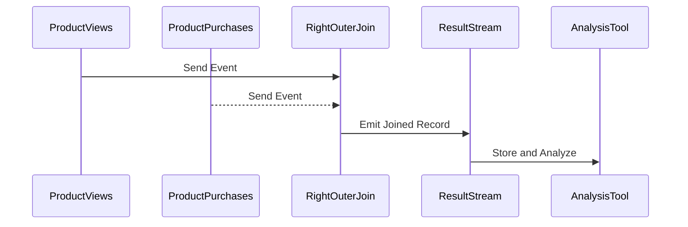

## Detailed Explanation

### Introduction

The Right Outer Join pattern is a vital concept in stream processing systems, allowing you to join two data streams or datasets. In a right outer join, all records from the right stream are incorporated in the result set, while records from the left stream are matched based on a key. If no matching record is found in the left stream, the result will populate with null values for the left side attributes. This pattern is particularly useful in scenarios where maintaining a complete set of results from the right data source is essential, despite incomplete data on the left side.

### Use Case Example

Consider a scenario involving a product e-commerce platform. A business may want to generate insights on products that users have viewed (right stream) but haven't purchased yet (left stream). Using a right outer join, businesses can create a comprehensive list of all viewed products and highlight those that did not convert into a sale, which can be useful for targeted marketing strategies aiming to convert views into purchases.

### Architectural Approach

- **Data Streams**: Establish two streams. The **right stream** will handle product views, and the **left stream** will handle product purchases.
- **Join Key**: Define a common key to join streams, like `ProductID`.
- **Processing Framework**: Utilize stream processing frameworks like Apache Kafka Streams, Apache Flink, or Google Cloud Dataflow to perform the join operation.
- **Result Handling**: Process output to distinguish records where purchase data is missing, using these insights for follow-up actions.

### Example Code

Below is an example of implementing a right outer join using Kafka Streams in Java:

```java
StreamsBuilder builder = new StreamsBuilder();

// Define views and purchases streams
KStream<String, ProductView> productViews = builder.stream("product-views");
KStream<String, ProductPurchase> productPurchases = builder.stream("product-purchases");

// Perform right outer join operation
KStream<String, ProductResult> rightOuterJoinedStream = productPurchases.rightJoin(
    productViews,
    (purchase, view) -> new ProductResult(view, purchase), // ValueJoiner
    JoinWindows.of(Duration.ofMinutes(5)),
    StreamJoined.with(Serdes.String(), purchaseSerde, viewSerde)
);

// Output the right outer join result to a Kafka topic
rightOuterJoinedStream.to("product-view-results", Produced.with(Serdes.String(), productResultSerde));
```

### Diagrams

#### Mermaid UML Sequence Diagram of a Right Outer Join in Stream Processing



### Related Patterns

- **Left Outer Join**: Opposite to right outer join, it ensures all records from the left stream are included.
- **Inner Join**: Only includes records with keys present in both streams.
- **Full Outer Join**: Combines results of both left and right outer joins.

### Additional Resources

- [Kafka Streams Documentation](https://kafka.apache.org/documentation/streams/)
- [Flink's Streaming API](https://ci.apache.org/projects/flink/flink-docs-stable/dev/datastream/)
- [Google Cloud Dataflow SDK](https://cloud.google.com/dataflow/docs/)

## Summary

The Right Outer Join design pattern is an integral part of stream processing, offering a comprehensive view of the right data source alongside any matching records on the left. It plays a critical role when complete acknowledgment of the right stream's records is necessary, even if the left stream's data is partially available. Implementing this pattern efficiently helps uncover insights, such as noting discrepancies between user actions and subsequent business transactions.
