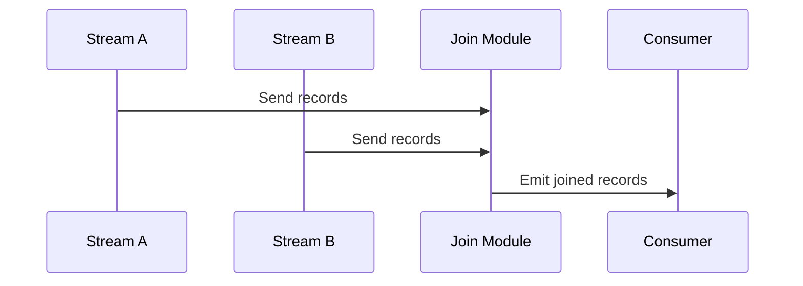

## Overview of Full Outer Join

The Full Outer Join pattern is a data integration technique commonly used in stream processing paradigms. It comprehensively combines two data streams or datasets, ensuring that all records are represented in the output result. Where matches are not found, it fills in the gaps with null values, thus preserving data completeness from both sources and facilitating tasks such as analytics, reporting, and unified data views.

## Architectural Approach

The Full Outer Join is vital in systems dealing with disparate data sources or handling IoT and log aggregation for analytics where completeness over precision is prioritized. Here’s how it fits into the architectural context:

1. **Data Source Integration**: Begins with extracting and ingesting data from two independent streams.
   
2. **Data Transformation**: Normalize the data formats to ensure compatibility between datasets from both streams.

3. **Join Logic Implementation**: Utilizing stream processing frameworks like Apache Kafka Streams, Apache Flink, or AWS Kinesis Data Analytics, implement logic to merge the datasets. Using SQL or a dedicated API, define the join keys upon which the match criteria are applied.

4. **Handling Missing Data**: Where no corresponding entry exists in either stream, null values are inserted to maintain record structure integrity.

5. **Maintaining State**: Cache intermediate states to manage late-arriving data and out-of-order events. Solutions could include using state stores or backing stores with cloud services like AWS S3 or Google BigQuery.

6. **Output Generation**: Finally, the joined stream is output for further processing or storage, ensuring it is available for end users or downstream systems.

## Example Code

Below, we demonstrate a basic setup using Kafka Streams in Java. It shows how to perform a Full Outer Join with two KStreams.

```java
KStream<String, CustomerRecord> leftStream = builder.stream("left-topic");
KStream<String, CustomerRecord> rightStream = builder.stream("right-topic");

KStream<String, OutputRecord> fullOuterJoinStream = leftStream.outerJoin(
    rightStream,
    (leftValue, rightValue) -> {
        if (leftValue == null) return new OutputRecord(null, rightValue);
        if (rightValue == null) return new OutputRecord(leftValue, null);
        return new OutputRecord(leftValue, rightValue);
    },
    JoinWindows.of(Duration.ofMinutes(5)),
    StreamJoined.with(Serdes.String(), customerRecordSerde, customerRecordSerde)
);

fullOuterJoinStream.to("output-topic");
```

## Diagrams

Using Mermaid for a UML sequence diagram, we illustrate the data flow from ingestion to output.



## Related Patterns

- **Inner Join**: Only includes records with matching keys in both streams.
- **Left Outer Join**: Preserves all records from the left stream with corresponding records from the right stream, filling unmatched right-side entries with nulls.
- **Right Outer Join**: Similar to Left Outer Join but retains all records from the right stream.

## Best Practices

- Choose meaningful join keys to minimize null entries and maximize data relevance.
- Regularly purge or archive state stores to maintain system performance.
- Employ schema evolution and compatibility checks to handle evolving data formats.

## Additional Resources

- [Kafka Streams Documentation](https://kafka.apache.org/documentation/streams/)
- [Apache Flink Join Patterns](https://nightlies.apache.org/flink/flink-docs-stable/dev/stream/operators/joining.html)
- [AWS Kinesis Data Analytics Solutions](https://aws.amazon.com/kinesis/data-analytics/)

## Summary

The Full Outer Join pattern facilitates comprehensive data integration across disparate systems, ensuring no data is lost during merging operations. By maintaining records from both data sources and supplementing unmatched records with nulls, this pattern is invaluable in scenarios requiring exhaustive data capture for analytics, customer profiling, or cross-system reporting.
