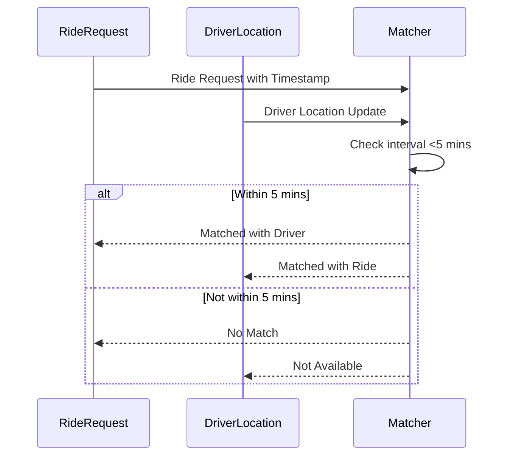

## Introduction

The Interval Join pattern is an advanced technique used in stream processing systems to correlate events that occur within specified time intervals. Unlike traditional joins, which rely on exact key matches, interval joins operate over a range of time, making them ideal for scenarios involving temporal data.

## Problem

In many real-time applications, the relationship between events is determined not by exact timestamp matches but by time intervals. For example, in transportation, ride-sharing requests need to be matched with drivers available within a given timeframe. Traditional joins fall short as they demand an exact timestamp, which might not always be feasible.

## Forces

- **Temporal Correlations**: Events often need to be joined based on their temporal proximity rather than exact moments.
- **Out-of-Order Events**: Stream processing must handle events that may arrive out-of-order while still satisfying the interval condition.
- **Scalability**: Systems must maintain high throughput and low latency even as data volumes increase.

## Solution

The Interval Join pattern addresses these challenges by allowing you to specify a join condition based on a time range. This can be efficiently implemented using modern stream processing frameworks such as Apache Flink or Kafka Streams.

### Example Implementation

Let's consider an Apache Flink implementation where we match ride requests and driver availability within a 5-minute window.

```scala
import org.apache.flink.streaming.api.scala._
import org.apache.flink.table.api.scala._
import org.apache.flink.table.api._

case class RideRequest(rideId: String, timestamp: Long)
case class DriverAvailability(driverId: String, timestamp: Long)

// Define source streams
val rideRequestsStream: DataStream[RideRequest] = ...
val driverAvailabilityStream: DataStream[DriverAvailability] = ...

// Convert DataStream to Table
val requestsTable = tEnv.fromDataStream(rideRequestsStream, 'rideId, 'timestamp.rowtime)
val availabilityTable = tEnv.fromDataStream(driverAvailabilityStream, 'driverId, 'timestamp.rowtime)

// Define the interval join
val resultTable = requestsTable
  .join(availabilityTable)
  .where('rideId === 'driverId)
  .within(Time.minutes(5))
  .select('rideId, 'driverId)

// Convert result Table back to DataStream
val resultStream = resultTable.toAppendStream[(String, String)]

resultStream.print()
```

### Diagram

Here is a simple diagram illustrating the Interval Join process in a ride-sharing application.



## Related Patterns

- **Windowed Join**: Similar to Interval Join, but strictly within window boundaries.
- **Temporal Table Function**: Used for joining changing historical data.
- **Event Time Processing**: Encompasses various techniques for handling event time in streams.

## Best Practices

- **Watermarking**: Use watermarks to handle late-arriving events effectively.
- **State Management**: Efficiently manage the state to prevent memory issues when dealing with large streams.
- **Latency vs. Throughput**: Balance the trade-off between processing latency and throughput by adjusting interval sizes and buffer timings.

## Additional Resources

- [Apache Flink: Interval Joins Documentation](https://nightlies.apache.org/flink/flink-docs-stable/docs/dev/table/streaming/joins/)
- [Kafka Streams Examples: Join Patterns](https://kafka.apache.org/32/documentation/streams/developer-guide/joining.html)
- [Real-Time Stream Processing](https://aws.amazon.com/real-time-streaming/)

## Summary

The Interval Join pattern is crucial for applications that require temporal correlation of events, offering flexibility and efficiency in handling time-based relationships. By leveraging state-of-the-art stream processing frameworks, developers can implement this pattern to build robust and scalable real-time data pipelines.
