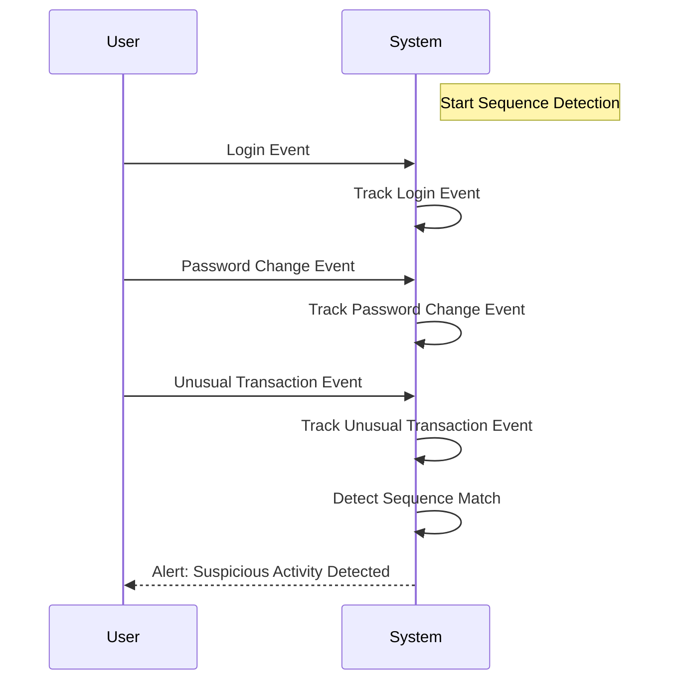

## Sequence Detection: Identifying Predefined Sequences of Events

### Description

Sequence Detection is a stream processing design pattern used to identify predefined sequences of events occurring in a specific order. This pattern is essential in scenarios requiring the detection of complex event patterns from a continuous flow of data. It is widely applied in domains such as fraud detection, monitoring systems, and security event management.

### Architectural Approach

Sequence Detection typically involves examining streams of events and applying pattern matching techniques to identify sequences that meet predefined criteria. Implementing this pattern often requires:

- **Event Stream Ingestion**: Capturing and preprocessing streaming data from sources like IoT devices, application logs, or user actions.
- **Pattern Definition**: Defining the sequence of events that constitute a pattern. This can be done using state machines or complex event processing (CEP) languages.
- **Pattern Matching**: Applying stateful computation to track events as they occur and check if they form the predetermined sequence.
- **Action Triggers**: Initiating actions based on a successful pattern match, such as alert generation or automated intervention.

### Best Practices

- **Efficient State Management**: Implement efficient state management mechanisms to track sequences effectively without incurring high memory costs.
- **Scalability Considerations**: Design the solution to handle high-throughput environments, possibly through parallel execution strategies.
- **Low Latency Patterns**: Aim for low-latency processing to ensure real-time detection, especially in critical applications like fraud detection.
- **Use of CEP Engines**: Leverage existing CEP engines and tools that provide robust pattern detection capabilities and streamline implementation efforts.

### Example Code

Below is an example using Apache Flink, a popular stream processing framework, to detect a sequence of login, password change, and unusual transaction:

```java
import org.apache.flink.api.common.eventtime.WatermarkStrategy;
import org.apache.flink.cep.CEP;
import org.apache.flink.cep.PatternSelectFunction;
import org.apache.flink.cep.PatternStream;
import org.apache.flink.cep.pattern.Pattern;
import org.apache.flink.streaming.api.datastream.DataStream;
import org.apache.flink.streaming.api.environment.StreamExecutionEnvironment;

import java.util.List;
import java.util.Map;

public class SequenceDetectionExample {
    public static void main(String[] args) throws Exception {
        StreamExecutionEnvironment env = StreamExecutionEnvironment.getExecutionEnvironment();
        
        DataStream<Event> inputEventStream = // DataStream source;

        Pattern<Event, ?> pattern = Pattern.<Event>begin("login")
            .where(event -> event.type.equals("LOGIN"))
            .next("passwordChange")
            .where(event -> event.type.equals("PASSWORD_CHANGE"))
            .next("unusualTransaction")
            .where(event -> event.type.equals("UNUSUAL_TRANSACTION"));

        PatternStream<Event> patternStream = CEP.pattern(inputEventStream, pattern);

        DataStream<String> detectedSequences = patternStream.select((PatternSelectFunction<Event, String>) patternMatches -> {
            List<Event> matchedEvents = patternMatches.get("unusualTransaction");
            return "Detected suspicious activity: " + matchedEvents;
        });

        detectedSequences.print();

        env.execute("Sequence Detection Example");
    }
}

class Event {
    public String id;
    public String type;
}
```

### Diagrams



### Related Patterns

- **Event Sourcing**: Maintains history of events, useful for recreating past state to facilitate pattern detection.
- **Complex Event Processing (CEP)**: More advanced framework designed specifically for processing event patterns like sequences.
- **Windowed Join Patterns**: Joining data streams based on time windows to detect correlated events over specific periods.

### Additional Resources

- **Apache Flink CEP Documentation**: [Apache Flink CEP](https://flink.apache.org/doc/cep)
- **Complex Event Processing in Streams**: [Flink Forward Sessions](https://www.flink-forward.org/2022/cep/)

### Summary

Sequence Detection is a vital pattern in stream processing, allowing real-time pattern recognition in a continuous flow of events. It is implemented using tools that support efficient state management and pattern matching. This pattern is significant in applications like fraud detection and security monitoring, providing timely insights and triggering necessary actions based on the detection of suspicious or meaningful event sequences.
