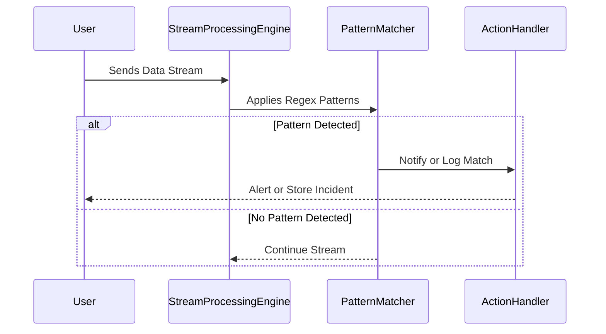

## Introduction

Pattern matching with regular expressions is a powerful technique widely used in the domain of stream processing, enabling the detection of specific patterns within an infinitely flowing data stream. By leveraging regex-like syntax, developers can define templates comprising literals, character sets, quantifications, and more to find matchmaking sequences efficiently. This pattern is essential in operations like data mining, event correlation, and real-time alerting.

## Design Pattern Overview

### Description

The Pattern Matching with Regular Expressions design pattern employs regular expressions to specify the structure of sequences to be detected in streaming data. These can range from simple keyword matching to complex scenarios involving conditional logic and contextual awareness.

### Application Example

Consider a scenario where system logs are being continuously generated and funneled into a stream processing engine. Using pattern matching with regular expressions, you can filter log entries that signify critical errors or exceptions. For instance, matching patterns could include lines containing "ERROR" or "EXCEPTION" followed by particular error codes or trace messages.

### Architectural Approach

- **Pattern Definition**: Specify the regular expressions that will be used to match incoming data. These expressions should be crafted carefully to avoid inefficiency or false positives.
  
- **Stream Parsing**: As the data flows through the system, apply the regex filters to identify matching patterns. This often involves deploying a stream processing engine that supports regex operations, such as Apache Kafka Streams or Apache Flink.

- **Action on Match**: Once a pattern is detected, integrate a mechanism to trigger appropriate actions, such as logging the event, alerting the relevant stakeholders, or storing crucial information for further analysis.

## Best Practices

- **Optimize Regular Expressions**: Ensure the regular expressions are optimized for performance as complex regex patterns can become computationally expensive.

- **Tailor for Scalability**: Use stream processing frameworks that can scale with the volume of incoming data. Distributed computing models help manage heavy loads efficiently.

- **Minimal Regex Use**: Attempt to use as few regex operations as necessary to achieve the desired outcome, trading off granularity for performance and accuracy.

## Example Code

Here's an example using Java and the Apache Flink stream processing library:

```java
DataStream<String> logStream = env.readTextFile("path/to/logs.txt");

Pattern<String, ?> errorPattern = Pattern.<String>begin("error")
    .where(new FilterFunction<String>() {
        @Override
        public boolean filter(String value) throws Exception {
            return value.matches(".*ERROR.*");
        }
    });

PatternStream<String> patternStream = CEP.pattern(logStream, errorPattern);

patternStream.select(new PatternSelectFunction<String, String>() {
    @Override
    public String select(Map<String, List<String>> pattern) throws Exception {
        return pattern.get("error").get(0);
    }
}).print();
```

## Diagram



## Related Patterns

- **Complex Event Processing (CEP)**: Extends pattern matching by contextualizing data and enabling stateful analysis on sequences.
- **Filter Pattern**: Uses conditions to selectively parse events from streams.

## Additional Resources

- [Apache Flink Documentation](https://flink.apache.org)
- [Regular Expressions for Handling Stream Data](https://www.regular-expressions.info)
- [Event Processing with CEP using Patterns](https://docs.confluent.io/current/streams/)

## Summary

Pattern Matching with Regular Expressions provides an indispensable methodology in processing real-time data streams. Its capability to define and detect intricate patterns with clarity and rigorous precision allows businesses to harness meaningful insights quickly. As the data landscape continues to grow, optimizing regex strategies alongside scalable technologies will remain paramount for effective stream processing.
