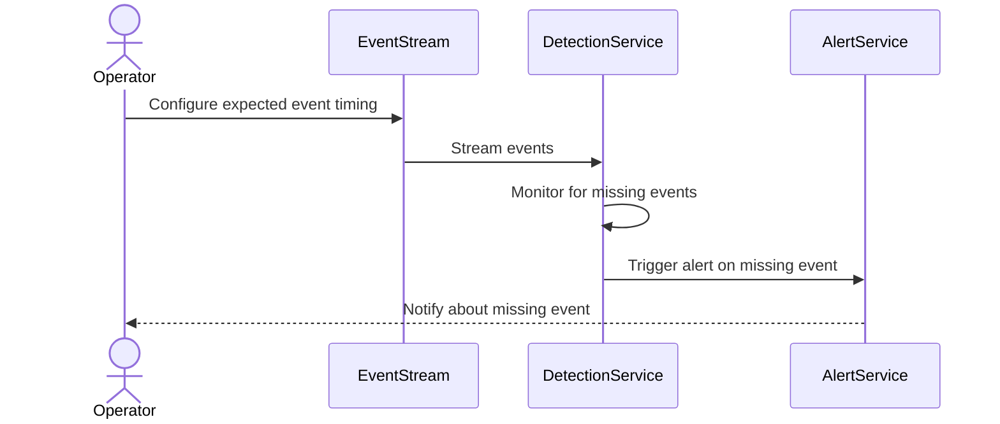

## Description

The Missing Event Detection pattern is designed for systems that need to monitor streams of events and identify any expected events that did not occur within a given timeframe. This pattern is crucial in applications where the absence of an event can signify an exceptional or problematic situation, such as a failure condition or a delay in processing.

## Use Cases

- **Scheduled Jobs**: Monitoring automated processes, like a batch job that runs every night. If it fails to start, an alert can be triggered.
- **Real-time Systems**: In systems like stock trading platforms, the lack of a heartbeat message or update from a data feed can indicate issues that require immediate attention.
- **IoT Devices**: When monitoring sensors or other devices, gaps in expected periodic data submissions can imply malfunctions or connectivity problems.

## Architectural Approach

1. **Event Stream Monitoring**: Continuously listen to the stream of incoming events.
2. **Timing and Expectation Definition**: Define expected time windows for certain events to arrive.
3. **Windowing and State Management**: Use a windowing technique to maintain state over periods to capture absence.
4. **Notification Logic**: If an event fails to occur within the specified window, trigger an alert or take predefined recovery actions.

### Example Code

Here's a simple example using Apache Kafka Streams and Java to detect missing events:

```java
import org.apache.kafka.streams.KafkaStreams;
import org.apache.kafka.streams.StreamsBuilder;
import org.apache.kafka.streams.Topology;
import org.apache.kafka.streams.kstream.KStream;
import java.time.Duration;

public class MissingEventDetectionExample {

    public static void main(String[] args) {
        StreamsBuilder builder = new StreamsBuilder();
        
        KStream<String, String> inputEvents = builder.stream("input-topic");

        inputEvents
            .groupByKey()
            .windowedBy(TimeWindows.of(Duration.ofMinutes(10)))
            .count()
            .toStream()
            .filter((key, count) -> count < 1)
            .mapValues((readOnlyKey, value) -> "Missing event for key: " + readOnlyKey)
            .to("alerts-topic");

        Topology topology = builder.build();
        KafkaStreams streams = new KafkaStreams(topology, getProperties());
        streams.start();
    }

    private static Properties getProperties() {
        Properties props = new Properties();
        props.put("application.id", "missing-event-detection");
        props.put("bootstrap.servers", "localhost:9092");
        return props;
    }
}
```

### Mermaid UML Sequence Diagram



## Best Practices

- **Stateful Processing**: Ensure proper management of state to track expected events over defined intervals.
- **Scalability**: Design for scale by partitioning stream processing tasks.
- **Fault Tolerance**: Implement mechanisms to handle incomplete or delayed event streams without false positives.
- **Alert Configuration**: Tune alert thresholds and notification mechanisms to minimize noise and prioritize critical missing events.

## Related Patterns

- **Heartbeat Detection**: Similar to detecting missing events, this pattern monitors periodic "heartbeat" messages indicating that a system is operational.
- **Temporal Patterns**: Detects patterns based on timing and sequencing of events in a stream.

## Additional Resources

- [Apache Kafka Streams Documentation](https://kafka.apache.org/documentation/streams/)
- [Flink: State Management](https://nightlies.apache.org/flink/flink-docs-stable/docs/concepts/stateful-stream-processing/)
- [Event Processing Patterns by Gregor Hohpe](https://www.enterpriseintegrationpatterns.com/patterns/messaging/)

## Summary

The Missing Event Detection pattern is essential for systems that rely on timely event occurrences for operational integrity. By efficiently monitoring and alerting on missing events, systems can achieve greater reliability and quicker incident responses, thus enhancing overall service quality and user experience.
